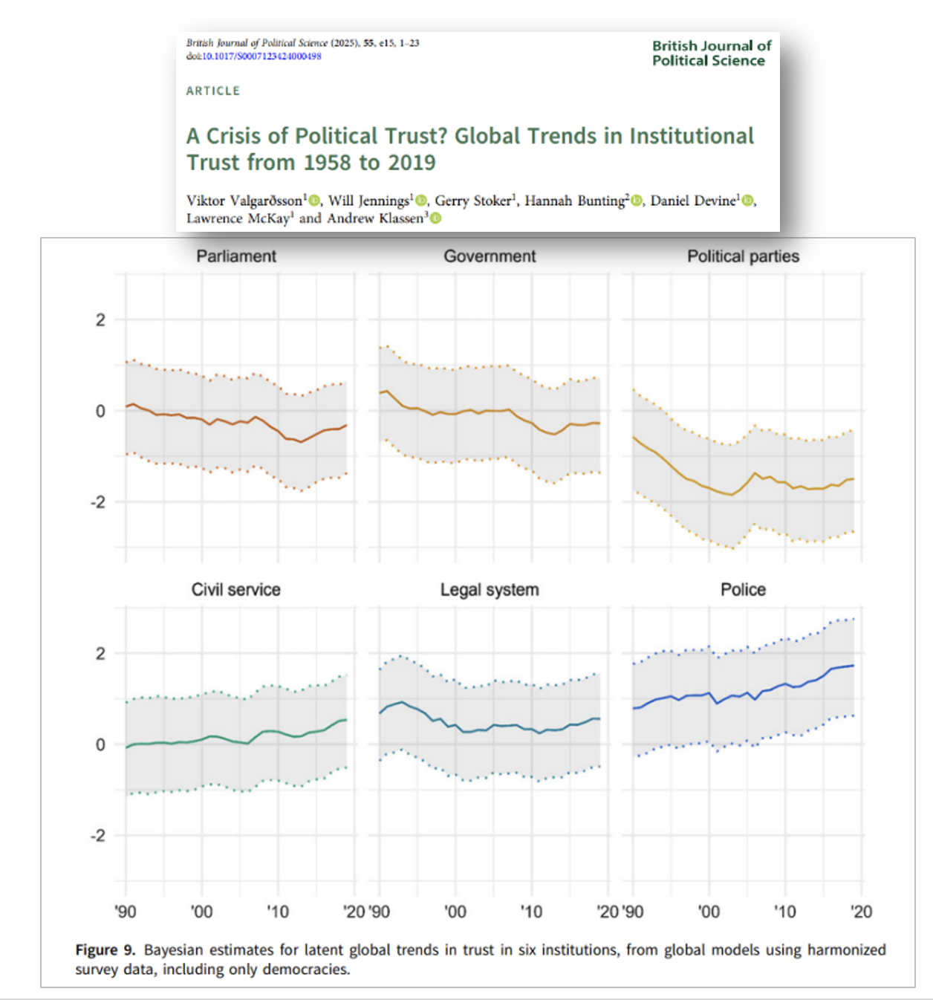

## Motivation

- Political trust is central to democratic legitimacy (Easton, 1975)
  - **Diffuse trust**: faith in system
  - **Specific trust**: trust in current officeholders
- Declining trust across democracies since the 1970s


<font size="4"> 

> Data based on 3,377 surveys conducted by50 projects in 143 countries over the 60 year period (1958-2019), including 89 countries rating as liberal or electoral democracies for a majority of those years

</font>


<!-- notes: Explain why studying reasons for trust matters, and how this project fills a gap. -->

<!--  footer: ASQPS 2025, Melbourne | Osbern Huang | Source: British Journal of Political Science, 55, e15  -->


---


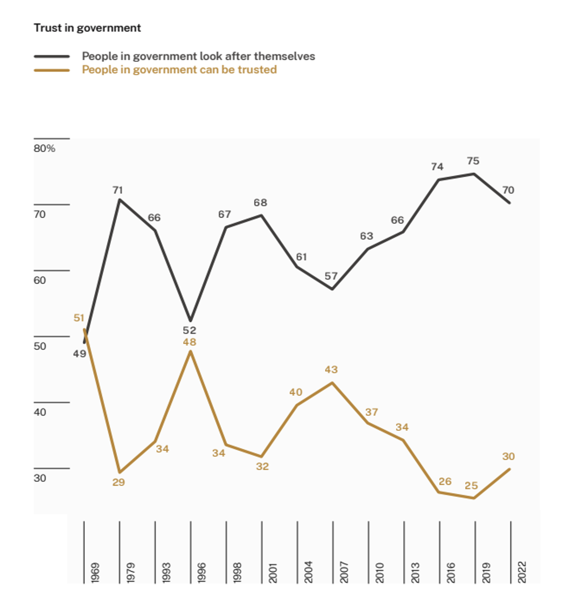

## Motivation

- Declining trust across democracies since the 1970s
- Australia mirrors this trajectory
- Most studies measure and track  **how much** people trust, not **why**

<!-- notes: Explain why studying reasons for trust matters, and how this project fills a gap. -->

<!--  footer: ASQPS 2025, Melbourne | Osbern Huang | Source: AES  -->

---

## Drivers of Political Trust

- Partisanship effects: governing party advantage (Anderson & LoTempio 2002)
- Identity & marginalisation: trust gaps by ethnicity, class (Wilkes 2015)
- Performance feedback: policy and process failure lead to decline of trust (Van Ryzin 2011, McAllister & Cornelissen 2013)
- However...trust as a reservoir and could maintain legitimacy in hard times (Easton 1975) $\Rightarrow$ worth saving / need to be saved


<!-- notes:
reservoir: a baseline faith in the political system. -->


<!--  footer: ASQPS 2025, Melbourne | Osbern Huang  -->


---

## Literature Gap

- Trust research focuses on aggregate levels, rarely on underlying rationales
- Existing measures impose the similar schema (Grimmelikhuijsen & Knies 2017; Hamm et al 2019, Weinberg 2023)
    - ‘ABI model’ dominates (Mayer et al 1995):
        - Ability
        - Benevolence
        - Integrity
- Lack of integration between quantitative trust level and qualitative narratives

<br>

-  Need for ***citizen-centred, inductive*** approaches


<!-- notes: Highlight the limitations in existing trust measurement methodologies. -->

<!--  footer: ASQPS 2025, Melbourne | Osbern Huang  -->


---

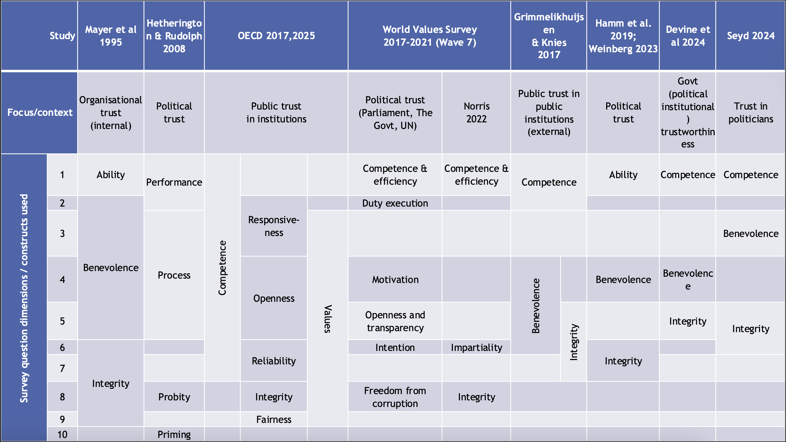


<!--  footer: ASQPS 2025, Melbourne | Osbern Huang | Source: Deem et al.  -->


---

## Why a Bottom-up Approach

**What are the most valid and reliable measures of trust, mistrust and distrust for reform purposes?**

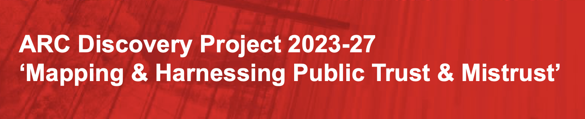

- Closed-ended items constrain meaning (Bertsou 2019)
- Risk of imposing *elite* definitions onto public perceptions
- May conflate intensity with reason (e.g. "how much" trust without "why")
- **Open-ended responses** let people define trust on their terms
     - and reveal richer moral and experiential logics
- Enables inductive thematic discovery


<!--

**RQ1	What are the most valid and reliable measures of trust, mistrust and distrust for reform purposes?**
**RQ2	When and how can positive mistrust (or sceptical trust) be most effectively promoted and harnessed as a value in political institutional designs, as a support to overall public trust?**

-->

<!-- notes: Stress theoretical advantages of using open-ended questions for trust. -->

<!--  footer: ASQPS 2025, Melbourne | Osbern Huang  -->


---

## Data: Australian Constitutional Values Survey 2023

- National sample ($N$=1,200)
    - Stratified national random sample (adults, citizens and permanent residents), postweighted 
    - Computer Assistant Telephone Interviews (CATI) via OmniPoll, October-November 2023
 
- Four trust open-ended questions: *"Can you think of a..."*
<font size="5"> 
  - Politician trusted and why? ($n$=567)
  - Politician distrusted and why? ($n$=943)
  - Agency trusted and why? ($n$=623)
  - Agency distrusted and why? ($n$=649)
</font>


<!-- notes: Describe the importance of respondents selecting their own trust objects. -->

---

## Open-ended Items

- Allows analysis of trust *targets* and *reasons*
- Capture subjective, respondent-supplied language:

> *Cause the body language he uses / the way he looks at you in the eye / shows he is being honest //*


> *Lots of reasons/He has very evasive eyes/He acted in bad faith on referendum/Deliberately spread misinformation and disinformation to win referendum at all costs//*


<!-- notes: Emphasise the breadth of response types captured. -->


---

## Discovering Emergent Trust Dimensions

- Implement a 5-step pipeline to inductively discover trust/distrust themes in open-ended responses
    - (Preparation) $\rightarrow$ Semantic Embedding $\rightarrow$ Clustering the Response Space $\rightarrow$ Label Clusters Using LLM $\rightarrow$ Propose Trust Dimensions $\rightarrow$ 
    - Scoring Responses on Inductive Trust Dimensions:
    <font size="5"> 
        - 4.00 = the response is extremely about this dimension,
        - 3.xx = mostly about this dimension,
        - 2.xx = somewhat about this dimension,
        - 1.xx = slightly about this dimension,
        - 0.00 = not at all about this dimension.
    </font>
- Bottom-up identification of trustworthiness drivers beyond predefined codeframes.


<!-- notes: Introduce the goal of the pipeline — discovering citizen-defined categories of trust reasoning using machine learning and LLM support. 

## Unsupervised Discovery Pipeline

* Step 1: Preprocessing and embeddings (PCA/UMAP)
* Step 2: Clustering (K-means/HDBSCAN)
* Step 3: Topic coherence and similarity analysis
* Step 4: Topic naming


- Combines clustering, semantic embedding, and LLM-assisted interpretation.
-->


---


# Results


---

### Embedding Distribution (PCA + UMAP)

<br>
<br>
<br>
<br>
<br>
<br>
<br>
<br>
<br>
<br>
<br>
<br>
<br>


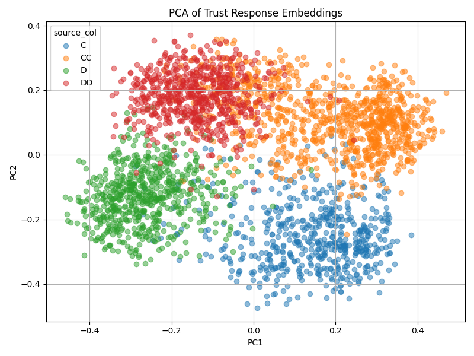
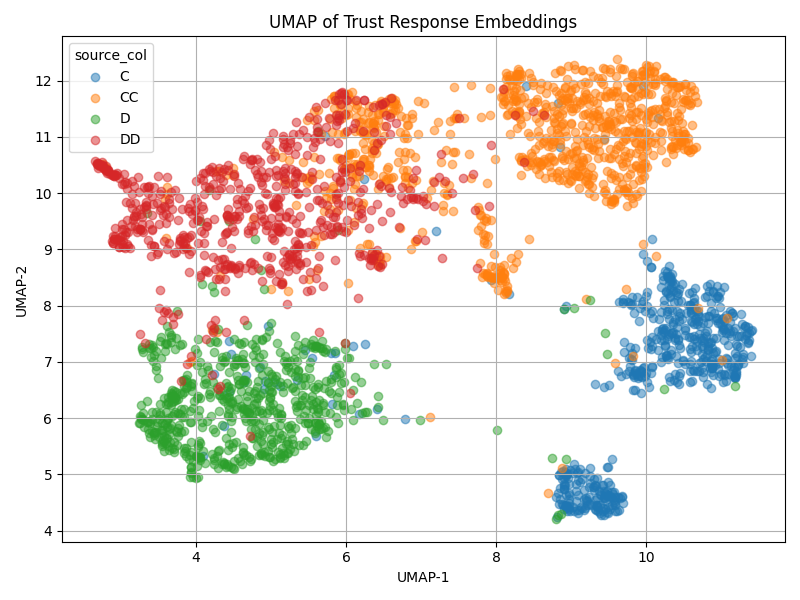


<!--  footer: ASQPS 2025, Melbourne | C: Trust in Politician; CC: Distrust in Politician; D: Trust in Agency; DD:Distrust in Agency  -->


<!--

1. PCA Plot (Principal Component Analysis)

What it shows:

Four groups of open-ended responses — C (trust politicians), CC (distrust politicians), D (trust agencies), DD (distrust agencies) — each occupy relatively distinct areas in a 2D semantic space.

Suggests that respondents articulate different kinds of language depending on whether they are trusting or distrusting, and whether the target is a politician or a government agency.

Implication:

Even a linear projection (PCA) captures systematic differences in response content — confirming that the valence (trust/distrust) and target (politician/agency) meaningfully shape response structure.

2. UMAP Plot (Uniform Manifold Approximation and Projection)

What it shows:

UMAP exaggerates separation and preserves local structure (clusters) rather than global variance.

Clear subgrouping within each source_col:

For example, trust in politicians (blue) seems to cluster into at least two semantically distinct blobs.

Distrust in agencies (red) also shows internal differentiation.

Implication:

Supports the idea that multiple trust dimensions or themes (e.g., competence, honesty) coexist within each valence–target category.

Useful for identifying latent semantic communities to feed into LLM-driven labeling or inductive dimension generation.

| Aspect                      | PCA                                             | UMAP                                               |
| --------------------------- | ----------------------------------------------- | -------------------------------------------------- |
| **Goal**                    | Maximise explained variance (global structure)  | Preserve local neighbourhoods (manifold structure) |
| **Projection Type**         | Linear                                          | Non-linear                                         |
| **Interpretability**        | PC1 and PC2 explain % of total variance         | Axes are not meaningful — only distances matter    |
| **Use Case Fit**            | Good for global overview                        | Best for **visualising clusters** from embeddings  |
| **Dimensional Sensitivity** | May underrepresent curved or disjoint structure | More faithful to embedding geometry                |

PCA confirms that our semantic embeddings capture broad structure across question types.

UMAP reveals fine-grained subgroupings — ideal for pairing with unsupervised clustering and LLM cluster labeling.


-->

---

## Clustering the Response Space

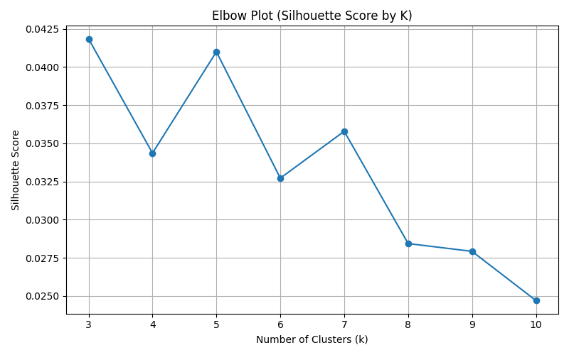

- k = 3 achieves highest separation (score=0.042); k = 5 shows a secondary local peak
- Scores decline after k = 7: over-segmentation
- Scores are modest overall
- A 3 to 6 cluster solution is semantically coherent and parsimonious for dimension building

<!--  footer: ASQPS 2025, Melbourne | Osbern Huang  -->


<!--
What This Shows:

The plot visualises the average silhouette score for KMeans clustering across values of k = 3 to 10.

Silhouette score measures how well-separated and cohesive the clusters are:

+1 = strong, well-defined clusters

0 = overlapping clusters

Negative = incorrect clustering

Key Takeaways from the Plot:

k = 3 yields the highest silhouette score (~0.042), indicating strongest average separation among responses.

A local peak at k = 5 suggests moderately stable structure, consistent with a 5–6 theme solution in inductive labelling.

After k = 7, scores decline steadily — suggesting over-partitioning of semantically similar responses.

Technical Considerations:

Silhouette values are relatively low across the board (~0.025–0.042), which is common in high-dimensional semantic data.

This doesn’t mean clustering failed — it reflects that:

Embeddings capture subtle, gradient meanings

Clusters are fuzzy rather than sharply bounded

Implications for Trust Theme Discovery:

A 3- to 5-cluster solution balances semantic coherence and interpretability.

These clusters can now be labelled inductively (via GPT) and mapped onto higher-order trustworthiness dimensions.

Silhouette is diagnostic, not prescriptive — final k choice can incorporate:

Visual coherence (UMAP)

Thematic clarity (LLM labelling)

Substantive fit with prior theory
-->


---

<font size="5"> 

=== Cluster 1 | Label: **Effective, reliable delivery** === **(Ability in the ABI model)**
Theme: Respondents in this cluster trust institutions and politicians mainly because they see them as competent, effective and delivering on what they promise. They highlight concrete positive experiences: services work smoothly, payments are on time, data is handled securely, regulations are enforced, and projects are completed. People often mention clear rules and processes, careful information-gathering, and accountability as signs that agencies are doing their jobs properly despite limited resources. Trust is frequently grounded in direct personal interactions where agencies were fair, efficient, and helpful, especially in health, tax, defence, education, and local infrastructure.
Proposed Dimension: **performance/reliability**
Sample Responses:
Respondents in this cluster trust institutions and politicians mainly because they see them as competent, effective and delivering on what they promise. They highlight concrete positive experiences: services work smoothly, payments are on time, data is handled securely, regulations are enforced, and projects are completed. People often mention clear rules and processes, careful information-gathering, and accountability as signs that agencies are doing their jobs properly despite limited resources. Trust is frequently grounded in direct personal interactions where agencies were fair, efficient, and helpful, especially in health, tax, defence, education, and local infrastructure.

</font>

---
<font size="5"> 


=== Cluster 2 | Label: **Self‑interest and corruption** === **(Benevolence in the ABI model)?**
Theme: Respondents describe politicians and agencies as self‑serving, captured by big business or "big pharma", and routinely dishonest or deceptive. They highlight lies, broken promises, cover‑ups and corruption, including bribery, nepotism and policy decisions shaped by vested interests rather than the public good. Many also reference concrete failures (bushfires, COVID, potholes, welfare errors, child protection, policing) as evidence that officials don't care about or protect ordinary people, and sometimes actively harm them. Overall, the sense is that the system is rigged in favour of powerful interests and against "little people", making government fundamentally untrustworthy.
Proposed Dimension: **honesty/integrity or corruption**
Sample Responses:
Respondents describe politicians and agencies as self‑serving, captured by big business or "big pharma", and routinely dishonest or deceptive. They highlight lies, broken promises, cover‑ups and corruption, including bribery, nepotism and policy decisions shaped by vested interests rather than the public good. Many also reference concrete failures (bushfires, COVID, potholes, welfare errors, child protection, policing) as evidence that officials don't care about or protect ordinary people, and sometimes actively harm them. Overall, the sense is that the system is rigged in favour of powerful interests and against "little people", making government fundamentally untrustworthy.

</font>

---
<font size="5"> 


=== Cluster 3 | Label: **Honesty, lies and agendas** === **(Integrity in the ABI model)**
Theme: Respondents focus heavily on whether politicians are honest, consistent and transparent, especially around high-profile issues like the Voice referendum and past scandals. Many describe leaders as liars, deceptive, or hiding their true motives, while a minority praise those they see as genuine, straight-talking and keeping promises. There is strong concern about broken election commitments, shifting positions, and withholding information, which are taken as signs of a hidden agenda or self-interest. A few also link (dis)trust to perceived integrity grounded in personal values (e.g. Christian beliefs) or personal encounters, but the dominant theme is truthfulness versus deceit.
Proposed Dimension: **honesty/integrity or corruption**
Sample Responses:
Respondents focus heavily on whether politicians are honest, consistent and transparent, especially around high-profile issues like the Voice referendum and past scandals. Many describe leaders as liars, deceptive, or hiding their true motives, while a minority praise those they see as genuine, straight-talking and keeping promises. There is strong concern about broken election commitments, shifting positions, and withholding information, which are taken as signs of a hidden agenda or self-interest. A few also link (dis)trust to perceived integrity grounded in personal values (e.g. Christian beliefs) or personal encounters, but the dominant theme is truthfulness versus deceit.

</font>

---

## Synthesising Emergent Dimensions

After clustering and labelling, we ask GPT (via API; ```gpt-5-mini``` was used) to:
- Review all labelled clusters
- Group them into parsimonious higher-order dimensions
- Define each dimension and assign relevant clusters

Output: 6 proposed dimensions...inductively derived from common language

---


<font size="3"> 

| # | Dim |
| :--- | :--- |
| 1 | <font color="cranberry"> **Performance & Reliability (A)** </font><br>Trust hinges on institutions delivering services competently, on time, and as promised. It reflects smooth operations, clear processes, secure data handling, and visible project completion or enforcement, grounded in people’s concrete experiences. |
| 2 | <font color="cranberry">**Honesty, Promises & Hidden Agendas (I)** </font><br>This dimension focuses on truthfulness, consistency, and transparency versus deceit, broken promises, or hidden motives. Trust is granted when politicians are straight‑talking and follow through; distrust arises with deliberate deceit, shifting positions, or hidden agendas, especially in major issues. |
| 3 | **Corruption, Capture & Systemic Self-Interest**<br>This dimension assesses whether the political system serves the public interest or is captured by powerful actors and personal gain. Distrust grows with perceptions of bribery, nepotism, cover‑ups, and policy favoring big business or insiders over ordinary citizens, creating a sense that the system is rigged. |
| 4 | <font color="cranberry">**Care, Fairness & Ethical Treatment (B)** </font><br>This dimension assesses whether institutions care about people’s wellbeing, treat them fairly, and avoid harm, especially to vulnerable groups. Trust increases when agencies show empathy, flexibility, and ethical judgement; distrust rises when they appear indifferent, punitive, or capable of causing harm through rigid or unethical practices. |
| 5 | **Accountability & Rule-Bound Governance**<br>This dimension concerns whether institutions operate within clear, lawful rules and are held accountable when things go wrong. Trust is strengthened by transparency, oversight, and consequences for misconduct; distrust grows with scandals suggesting weak accountability or immunity for those in power. |
| 6 | **Values Congruence & Moral Integrity**<br>This dimension concerns alignment between leaders’ motives and citizens’ moral or religious values. Trust is higher when politicians appear principled and sincere; distrust arises when behaviour is seen as morally hollow, opportunistic, or inconsistent with professed values. |

</font>


---


<font size="3"> 

| # | Dim |
| :--- | :--- |
| 1 | <font color="cranberry"> **Performance & Reliability (A)** </font><br>He practiced what he preached / He spent 2 weeks in aboriginal communities to help them/ He did what he said he would do// <br>I think he did a lot for people for example he did a lot for public transport and quality of living for poor/he is kind and genuine |
| 2 | <font color="cranberry">**Honesty, Promises & Hidden Agendas (I)** </font><br>Because he comes across as a liar / and he look after his mates / he does not care for the country what is in it for himself / for example how he carried out the voice referendum / he did not tell anyone about the truth about it / garbage / he is a slimy little rat // |
| 3 | **Corruption, Capture & Systemic Self-Interest**<br>They are for only one reason/ to put money ion their pockets and get a superannuation// <br >they follow their own agenda / for their own personal benefit /They are selling our country and they should be shot// |
| 4 | <font color="cranberry">**Care, Fairness & Ethical Treatment (B)** </font><br>they have always been very efficient and caring / I have had many dealings with them I have a disability and they have always been supportive // they govern my country to the way I like it / they look after the disabled // Because they care for their patrons/They try and facilitate their needs to the job requirements of the individuals who use their service/ |
| 5 | **Accountability & Rule-Bound Governance**<br>there is no accountability/no one that has to take responsibility for anything/its just a pot of money that people are dishonest about and can claim for stuff that they shouldn't be/disabled benefits that shouldn't be granted/a lot of services that get there money from NDIS and they shouldn't get them/its all an automated computerised set up that just doesn't care about the people and pretends that everyone is honest when it doesn't work like that/major concern/we waste money by letting people take it who don't need it// |
| 6 | **Values Congruence & Moral Integrity**<br> I think he has values that I support, I'm confident that overall he's exercising leadership in the best interest of most people in Australia/ his leadership on the voice was positive; the fact that the majority of people in Australia didn't support it; I thought it was the right idea to support and advocate for a voice as a decision for the best interests of Australia// <br> Where he came from, grassroots, upstanding type of person |

</font>


---

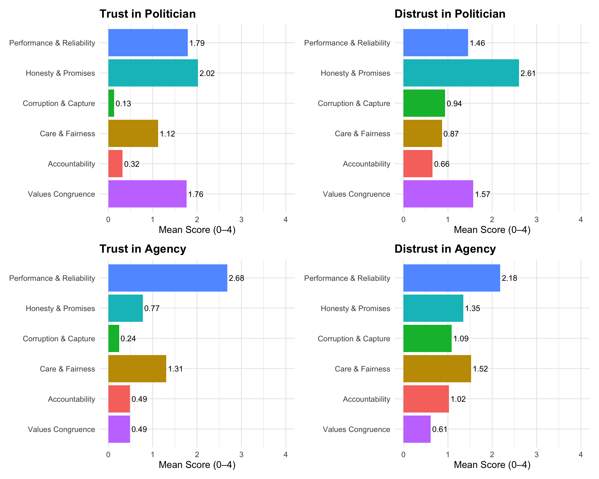

<!--


### Key Observations

- **Trust in Politicians**  
  - Dominated by **Honesty & Promises** (2.02), **Performance & Reliability** (1.79), and **Values Congruence** (1.76).
  - Lesser focus on **Accountability** (0.32) and **Corruption & Capture** (0.13) — suggesting low salience of systemic concerns in positive trust judgments.

- **Distrust in Politicians**  
  - **Honesty & Promises** rises to 2.61 — the most cited driver of distrust.  
  - Followed by **Values Congruence** and **Performance & Reliability**.  
  - Higher emphasis on **Accountability**, **Corruption**, and **Care** compared to the trust counterpart.

- **Trust in Government Agencies**  
  - Extremely high reliance on **Performance & Reliability** (2.68) — operational competence is central.  
  - **Care & Fairness** is more salient (1.31) than honesty or values.

- **Distrust in Government Agencies**  
  - Less steep trust-distrust divergence than with politicians.  
  - **Care & Fairness**, **Performance**, and **Accountability** are top contributors to distrust.

---

### Interpretation

- **Honesty** is a **major fault line** for politicians.  
- **Performance** and **Fairness** dominate perceptions of agencies.  
- **Distrust triggers** are more multi-dimensional than trust drivers.  
- Politician evaluations reflect **moral judgments**; agency evaluations reflect **functional outcomes**.


-->


---


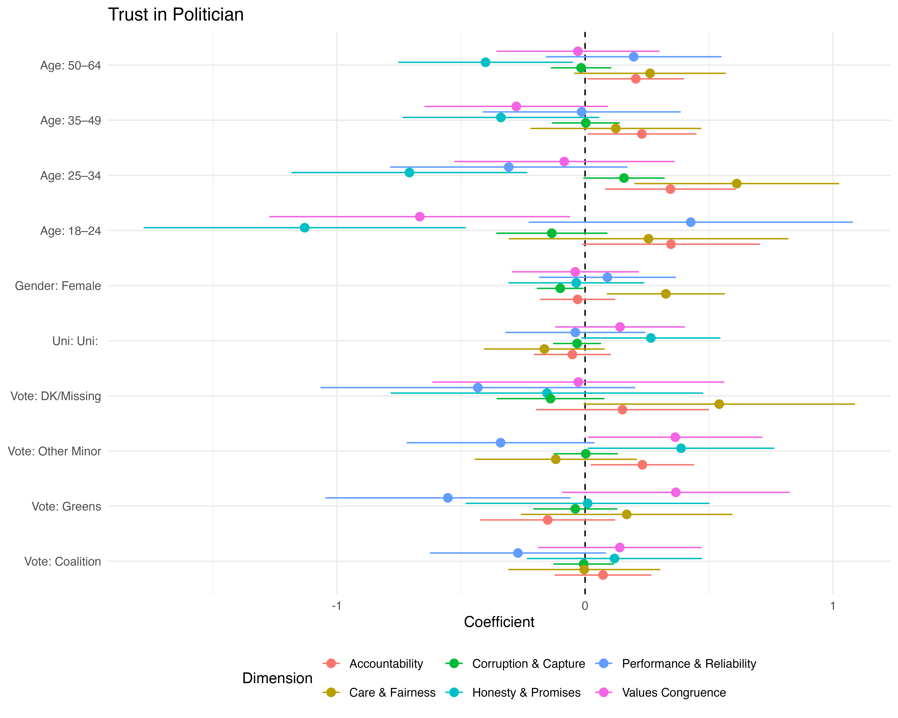

---


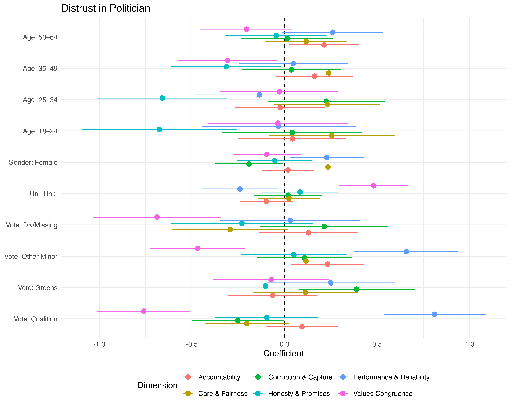


---


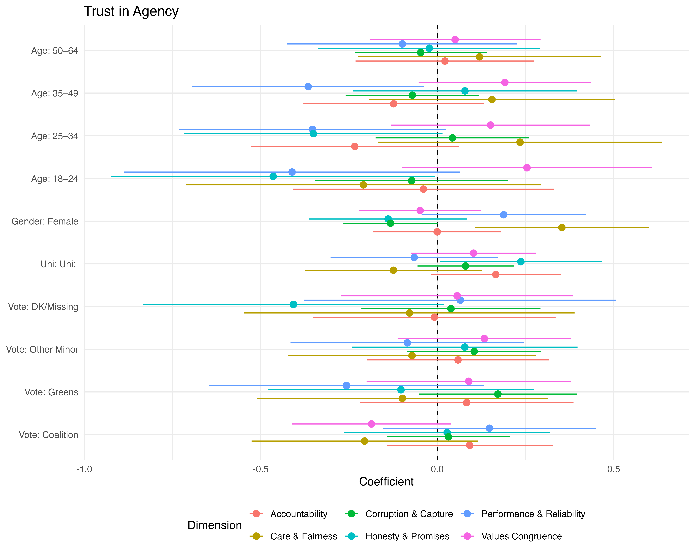

---


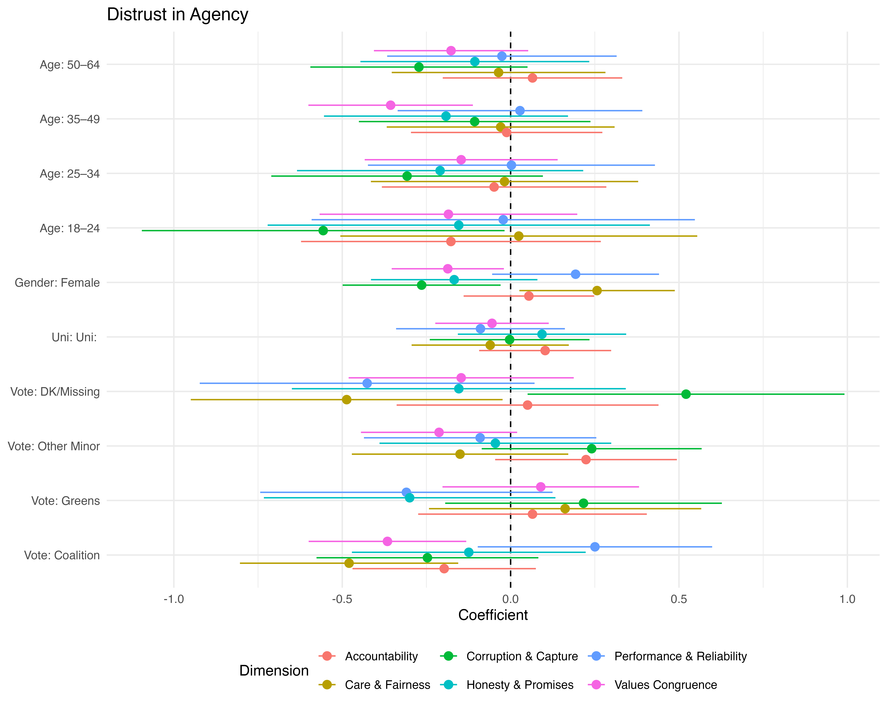


---

## How People Trusts & Distrusts Politicians vs Agencies? (1)

- Agencies vs Politicians:
    - Performance drives trust in agencies more than in politicians.
    - Value matters in trust in politicians

- Younger Australians (18–24) tend to be:
    - Less value (aka partisanship) and honesty and performance

---

## How People Trusts & Distrusts Politicians vs Agencies? (2)


- Gender differences are modest but persistent:
    - Women slightly more concerned with care and fairness


- Partisan identity predicts directional trust:
    - Coalition identifiers show elevated trust in politicians from performance .


- If DK/Missing voters serve as a reference, then all other political alignments diverge sharply: trust is deeply entangled with partisan belonging.


---

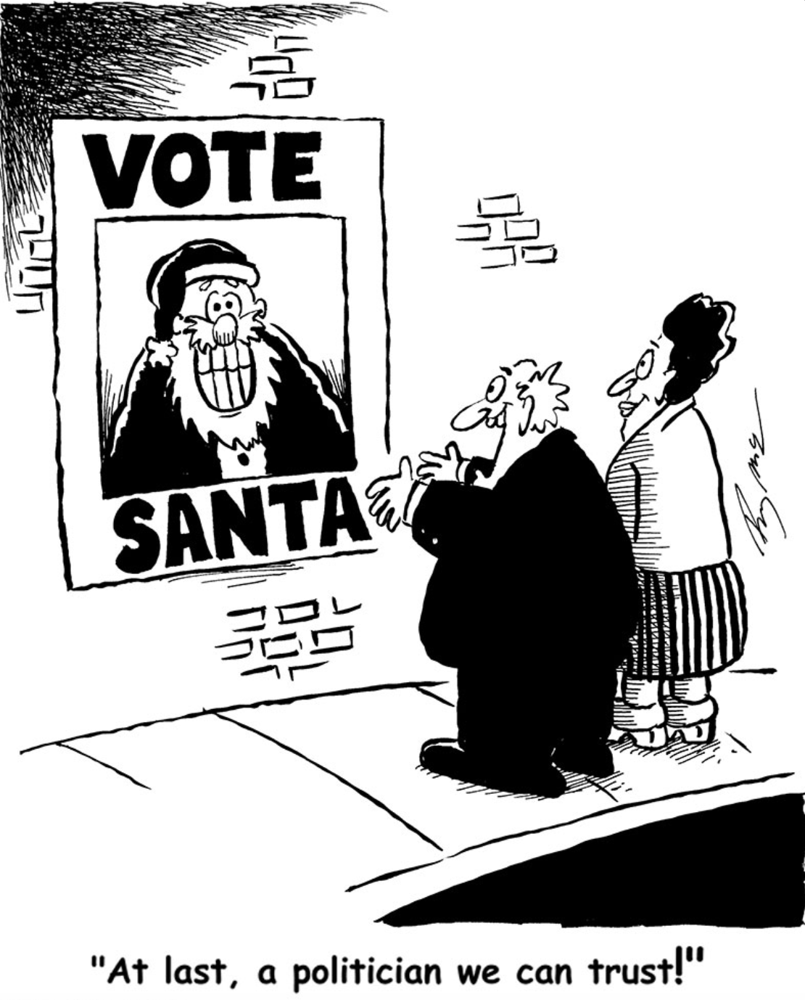

## Implications for Democratic Practice

- **Trust is Multi-Dimensional**  

- **Reform Must Be Targeted**  

- **Public as Diagnostic Analysts**  

- **Civic Education & Messaging**  

<!--

Institutional Trust Is Multifaceted
The analysis shows that citizens’ trust and distrust in political and governmental actors are not driven by a single factor but by a constellation of dimensions (e.g., performance, honesty, accountability). This challenges oversimplified narratives and calls for multidimensional approaches to rebuilding trust.

Tailoring Institutional Reforms
Different dimensions dominate trust versus distrust judgments. For instance, honesty & promises and values congruence are key to trusting politicians, while performance & reliability matters more for trusting agencies. Reform efforts must therefore be audience- and actor-specific.

The Danger of ‘One-Size-Fits-All’ Remedies
Efforts to restore trust by improving only one aspect (e.g., transparency) may miss the mark if citizens' concerns are more about fairness or value alignment. Effective democratic practice should address which trust dimensions are most salient in context.

Citizens as Diagnostic Analysts
Open-ended responses revealed that many citizens can articulate sophisticated, principled justifications for their (dis)trust. This underscores the importance of treating public opinion not merely as attitudinal “noise,” but as a diagnostic tool for democratic feedback.

Bridging the Gap Between Institutions and Expectations
The divergence in trust patterns between politicians and agencies suggests a perceived distance in how different institutions embody democratic values. Strengthening democratic legitimacy may involve clarifying roles, improving performance visibility, and deepening ethical accountability.

Implications for Civic Education and Deliberation
By identifying which dimensions matter to different groups (e.g., younger voters emphasizing care & fairness), civic education initiatives can better engage citizens where their democratic expectations are rooted.

Responsive Communication Matters
Political actors and institutions must not only act in trustworthy ways but communicate their alignment with public values using the very frames (e.g., integrity, care, competence) the public uses to judge trustworthiness.

-->


<!--  footer: ASQPS 2025, Melbourne | Osbern Huang | Cartoon by Randall McIlwaine
 -->

---

## Conclusion

- Trust and Distrust: Not just different sides of the same coin

- Beyond ABI: A More Nuanced Framework
    - Six inductively derived dimensions emerged: *Performance & Reliability, Honesty, Corruption, Care & Fairness, Accountability, Values Congruence*

- Politicians vs Agencies
    - Politicians evaluated more through moral character (honesty, corruption),
    - Agencies judged more through service performance.

- Trust Is Not One-Size-Fits-All
    - Age, gender, education, and partisanship all condition what people value in trustworthiness.


<!--  footer: ASQPS 2025, Melbourne | Osbern Huang  -->


---


# Thanks. <br>
Comments and questions welcome.


---

Scoring Prompt:

```
    prompt = f"""
TASK:
You are a political scientist coding qualitative survey responses from a CATI survey in Australia.
Each response explains WHY a respondent trusts or distrusts a particular politician or government agency.

We have identified the following higher-order dimensions of trust/distrust drivers:

{dim_desc}

For EACH dimension, you must assign a score between 0.00 and 4.00 (two decimal places), where:
- 4.00 = the response is extremely about this dimension,
- 3.xx = mostly about this dimension,
- 2.xx = somewhat about this dimension,
- 1.xx = slightly about this dimension,
- 0.00 = not at all about this dimension.

Important:
- The same response can score highly on multiple dimensions.
- Both trust and distrust reasons are coded on the SAME dimensions. For example, if someone complains about poor performance, this is still strongly about the 'Performance & competence' dimension, just in a negative direction.
- Do NOT infer content that is not mentioned. If a dimension is not clearly present, score it near 0.00.

RESPONSE TEXT:
\"\"\"{response_text}\"\"\"


OUTPUT FORMAT:
Return ONLY valid JSON with this structure:

{{
  "scores": [
    {{
      "name": "dimension name 1",
      "score": 0.00
    }},
    {{
      "name": "dimension name 2",
      "score": 0.00
    }},
    ...
  ],
  "justification": "2–5 sentence explanation summarising how the response reflects each dimension."
}}

Use exactly the same dimension names as listed above.
"""
```


---


Labeling/Synthesising Prompt:

```
Below is a list of clusters discovered from open-ended reasons for trust/distrust
in politicians and government agencies in Australia. Each cluster has a short label,
a suggested higher-order category, and a brief summary.

{chr(10).join(summary_block)}

TASK:
1. Propose a concise, non-overlapping set of higher-order dimensions that best summarise
   these clusters as drivers of trust and distrust.
2. For each proposed dimension:
   - Give a short name,
   - Provide a 2–3 sentence definition,
   - List which clusters (by 'method' and 'cluster_id') you think belong to it.
3. Optionally, note if any cluster seems to be noise or not conceptually useful.

Please respond in clearly structured markdown with a numbered list of dimensions.
"""

    system_prompt = (
        "You are a political scientist synthesising emergent dimensions of trust and distrust "
        "from clustered survey responses. You aim for a parsimonious, theoretically meaningful structure."
    )
```

---


<font size="5">

| Aspect                      | PCA                                             | UMAP                                               |
| --------------------------- | ----------------------------------------------- | -------------------------------------------------- |
| **Goal**                    | Maximise explained variance (global structure)  | Preserve local neighbourhoods (manifold structure) |
| **Projection Type**         | Linear                                          | Non-linear                                         |
| **Interpretability**        | PC1 and PC2 explain % of total variance         | Axes are not meaningful, only distances matter    |
| **Use Case Fit**            | Good for global overview                        | Best for **visualising clusters** from embeddings  |
| **Dimensional Sensitivity** | May underrepresent curved or disjoint structure | More faithful to embedding geometry                |

</font>

PCA confirms that our semantic embeddings capture broad structure across question types.

UMAP reveals fine-grained subgroupings — ideal for pairing with unsupervised clustering and LLM cluster labeling.


---


# More Results?

- Human vs. AI induction

---

We already have this from human coders (including myself)

<font size="2"> 

| **Dimension**    | **Core Meaning**     | **Coding Logic**                               | **Sub-Dimensions (Rationale)**                               |
| ----------------------------------------------- | ------------------------------------------------------------ | ------------------------------------------------------------ | ------------------------------------------------------------ |
| **1. Reliability**                              | Whether the politician/agency can be counted on to do what they say. | Use when respondents emphasise **broken promises**, unreliability, inconsistency, or poor past track record. | • Breaks promises / doesn’t follow through. • Generally unreliable. • Mentions of past behaviour or history showing inconsistency. |
| <font color= cranberry> **2. Honesty & Integrity**   </font>                   | Truthfulness, ethical standards, moral character.            | Use when comments relate to **lying**, corruption, unethical behaviour, or questionable personal character. | • Lies / dishonest behaviour. • Negative character traits (duplicitous, disloyal). • Corruption or corrupt behaviour. • Lack of integrity (with or without details). |
| <font color= cranberry> **3. Benevolence (Duty / Service Orientation)** </font> | Acting in the public interest and treating people fairly.    | Use when respondents mention **self-interest**, fairness, principled behaviour, respect, or how they treat people. | • Puts personal or political interest above community. • Acts in ways contrary to “doing the right thing”. • Treats people badly / disrespectfully. • Unfair treatment of self or others. |
| <font color= cranberry> **4. Competence**   </font>                            | Ability to perform duties effectively and deliver outcomes.  | Use when respondents describe **poor performance**, incompetence, or harmful outcomes. | • Poor performance affecting respondent personally. • Poor performance affecting the broader community. • Poor performance without specifying impact. |
| **5. Transparency**                             | Openness, clarity of motives, visibility of actions.         | Use when comments reference **secrecy**, hidden agendas, lack of openness. | • Not transparent or open. • Has hidden motives / secret agenda. |
| **6. Responsiveness**                           | Willingness to listen, assist, and engage with citizens.     | Use when respondents focus on whether the actor **helps, listens**, or meets their needs. | • Does not help (self or others). • Fails to meet needs / unresponsive. |
| **7. Accountability**                           | Responsibility-taking, rule-following, consequences for actions. | Use when respondents mention **rule-breaking**, refusal to take responsibility, or abuses of power. | • Acts illegally or against rules. • Avoids responsibility / won’t own mistakes. • Abuse of power / lack of recourse. • Lack of oversight/regulation. |
| **8. Alignment / Congruence / Connection**      | Shared values, policy agreement, familiarity, personal experience. | Use when respondents comment on **value congruence**, familiarity, or direct experiences. | • Disagreement with values or policies. • Knowing them or knowing someone who knows them. • Personal negative or positive experience (for trust/distrust). |


</font>


