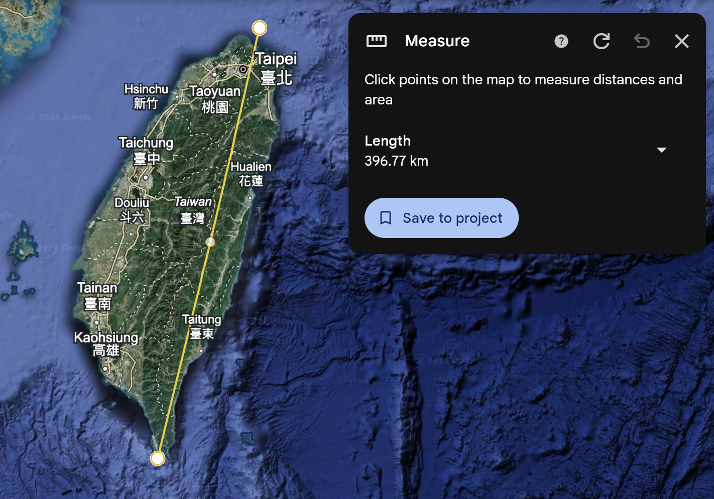
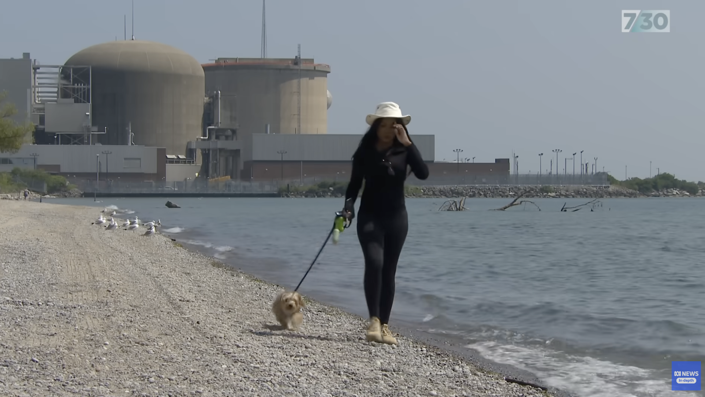
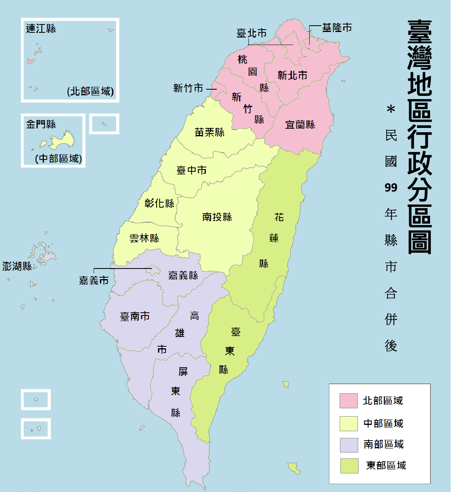
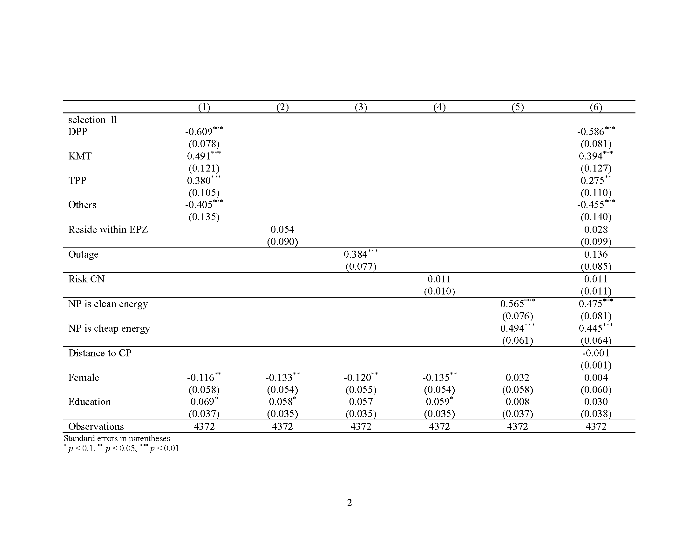
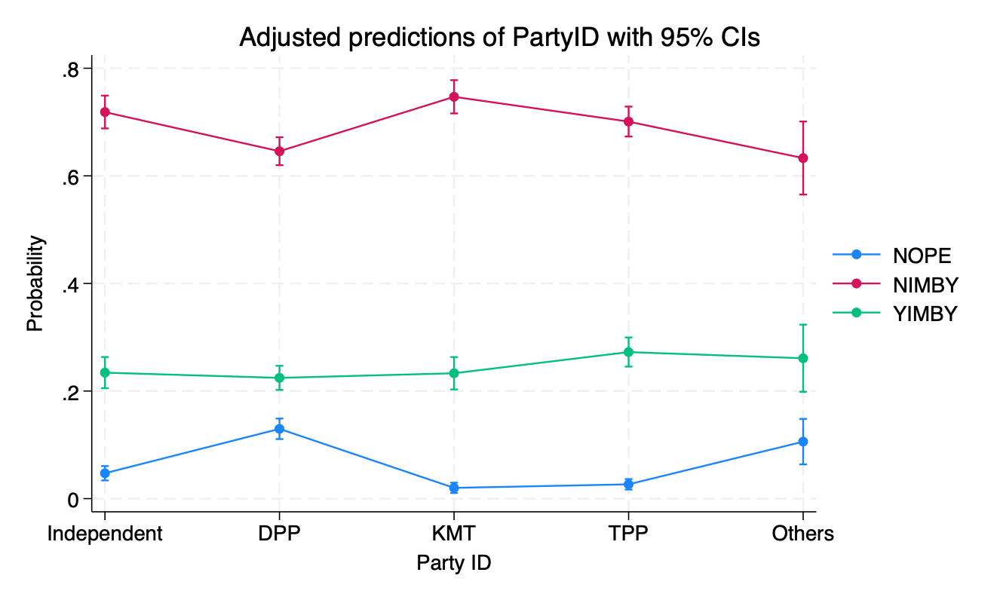
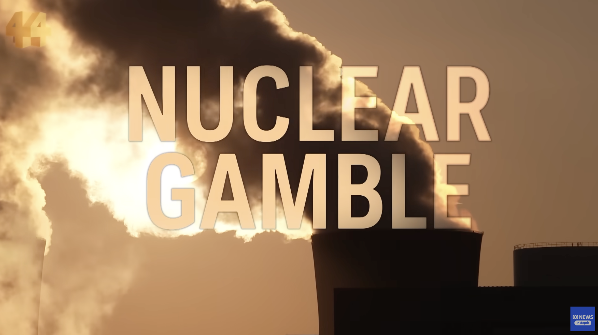

# NIMBY Effect on Nuclear Power Support in Taiwan:
## A Survey Experiment on Public Attitudes and Policy Solutions

#### Osbern Huang$^1$   Yu-tzung Chang$^2$
##### $^1$Research Fellow, Griffith University   $^2$Professor, National Taiwan University

[https://tinyurl.com/ASQPSNZ-9Jan-OH](https://tinyurl.com/ASQPSNZ-9Jan-OH)

<!--  footer: Picture: Osbern Huang   ASQPS Conference 2025, Wellington / Osbern Huang & Yu-tzung Chang -->

<!--

'I begin my presentation today by acknowledging the ---- people, Traditional Custodians of the land on which we gather today, and pay my respects to their elders, past, present and emerging.

-->

---

# Taiwan's Energy Challenges

- Geopolitical Tensions
- Energy Security Concerns
- Environmental Goals

<!--
- Geopolitical Tensions:
Taiwan’s energy supply is vulnerable to potential disruptions due to its reliance on imported LNG and coal, particularly amidst threats of a Chinese blockade in the Taiwan Strait.
- Energy Security Concerns:
With nearly 98% of its energy imported, Taiwan faces critical risks to electricity stability during geopolitical crises.
- Environmental Goals:
Taiwan aims to achieve carbon neutrality by 2050, increasing its reliance on LNG and renewable energy while moving away from coal and nuclear power.
-->

<!--  footer: Picture: China Times -->

---

# Nuclear Power in Taiwan

  - 1970s–1980s: Taiwan embraced nuclear energy with the construction of three active nuclear power plants (NPPs): Jinshan, Kuosheng, and Maanshan.
  - 1990s–2000s: Rising anti-nuclear sentiment led to delays in the construction of the Longmen Nuclear Power Plant (NPP4).
  - 2014: The KMT administration suspended the Longmen (NPP4) project amid growing public opposition.
  - 2016–Present: The DPP committed to phasing out nuclear power by 2025, a policy reinforced after the 2011 Fukushima disaster.

<!--  footer: Source: World Nuclear Industry Status Report; Hsu et al. 2017 -->

---

# Current Status
- Chinshan (NPP1) was decommissioned in 2019, with Kuosheng (NPP2) scheduled for decommissioning by 2023 and Maanshan (NPP3) by 2025.
- Nuclear energy accounts for only about 5% of Taiwan's total electricity generation, down from nearly 20% in the early 2000s.

<!--  footer: Source: World Nuclear Industry Status Report; World Nuclear Association  -->

---

# The Persistent Debate

- Political polarisation
- Power outages in Northern Taiwan (4 times in 2 weeks in early 2024)
- Expansion of high-tech (highest electricity consumption) industries like TSMC
> "Do we need nuclear power?"
"If yes, where should we build them and store all the radioactive waste?"

<!--  footer: Picture: National Museum of Taiwan History: The anti-nuclear march on May 5, 1991 - Anti-nuclear candlelight and father and son -->

<!--
- Events after events:
The debate over nuclear energy has persisted for over four decades, stemming from safety concerns, waste management issues, and environmental risks, especially after events like the Fukushima disaster.
- Political Polarization:
The ruling Democratic Progressive Party (DPP) opposes nuclear energy, advocating for renewable energy and LNG, while opposition parties argue that nuclear power is essential for Taiwan’s energy security.
- Recent Developments:
Northern Taiwan has experienced a series of power outages, raising public concern over electricity shortages a
- Expansion and retention of High-Tech industries
-->

---

# Why NIMBY(Not In My Back Yard)ism? Size matters.

 
 
 
 
 
 
 
 
 
 

<!--  footer: ASQPS Conference 2025, Wellington / Osbern Huang & Yu-tzung Chang -->

---

# NIMBY Phenomenon and Energy Policy

- "NIMBY": opposition to the development of infrastructure projects near one’s place of residence, despite *support* for projects (in principle).

- Unique Challenges with Energy Development:
  - **Safety**: Fear of accidents (e.g. Fukushima disaster) and radioactive waste.
  - **Environmental Impact**: Potential harm to local ecosystems.
  - **Distrust in Authorities**: Skepticism about the government’s ability to manage risks and emergencies.

- NOPEs vs. NIMBYs: While NIMBYism can be mitigated through incentives, ideologically entrenched **"NOPEs" (Not On Planet Earth)** remain a barrier to infrastructure acceptance.

<!--  footer: (Gervers 1987; Dear 1992; Vittes, Pollock, and Lilie 1993; Schreurs and Ohlhorst 2015) -->

<!--
in Energy Policy:
Localised resistance due to perceived risks (health, safety, property value impacts).
Contradiction between general support for a policy and opposition to its implementation locally.
Often arises with projects involving nuclear plants, wind farms, or waste disposal sites.

-->

---

# NIMBYs, YIMBYs, and NOPEs

- NIMBY: Those who support development in principle but oppose local implementation
  - Ignorance, property value/selfishness, risks and distrust to authorities (Dear, 1992; Freudenberg and Pastor 1992; Devine-Wright, 2009; Burningham et. al, 2006)
- YIMBY: Those who actively support local implementation of infrastructure projects
  - Economic reason, environmental gains (Dear, 1992). Sometimes lead to *'reversed-NIMBYism'*(Konisky et al, 2020; Uiji et al, 2021)
- NOPE: Those who oppose infrastructure projects under all circumstances
  - Ideologies and institutional factors (Wolsink, 2000)

- However, there is significant partisan division on nuclear power in Taiwan.

<!--
NIMBY:
Perceived Risks: Environmental damage, health hazards, or safety concerns (Devine-Wright, 2009).
Loss of Property Value: Opposition often stems from fears of reduced home values (Dear, 1992).
Distrust in Authorities: A lack of confidence in government or developers to manage risks effectively (Burningham, Barnett, & Thrush, 2006).
YIMBY:

-->

---

# Ways to Solve "NIMBY Syndrome"

There several approaches being used to address NIMBY syndrome (Frech, 1991; Richmond, 2002; Toke, 2005; Gallo, 2019; Konisky et al, 2020):
- Financial Incentives
- Community Investments
- Public Participation and Transparency
- Institutional Support - claim *limited* significance of NIMBYism (Wolsink, 2000)

<!--  footer: Picture: ABC -->

---

# Key Gaps in the Literature

- Lack of Public Opinion Research:
  - Few studies empirically test NIMBY attitudes and their underlying factors, except for Konisky et al. (2020) and Uiji et al. (2021).
- Regional and Temporal Limitations:
  - Most studies focus on US or West European countries, with limited research on the Asia-Pacific region (except Japan after 2011).
  - Many foundational studies are outdated, failing to address modern geopolitical and energy challenges.
- Limited Evidence for NIMBY Solutions:
  - Minimal empirical evaluation of strategies like financial incentives or community investments, also few insights on mitigating ideological resistance (e.g., NOPEs).

<!--  footer: ASQPS Conference 2025, Wellington / Osbern Huang & Yu-tzung Chang -->

---

# Research Questions & Hypotheses (1)

- **RQ1** In Taiwan, what are the factors contributing to the public attitudes toward nuclear power facilities, which can be classified into NOPEs, NIMBYs, and YIMBYs?

|    | NOPE | NIMBY | YIMBY |
|:--|:--:|:--:|:--:|
| 1. Party ID| DPP+ |  |  |
| 2. Current EPZ (Emergency Planning Zones) residents |  | +  |  |
| 3. Experienced power outage | - |   |   |
| 4. Expect military risk with China | - |   |   |
| 5. Positive attitude to NP | - |   |    

<!--

- H1-1: Political cleavage matters (DPP supporters are NOPEs, while supporters of opposition parties are NIMBYs and YIMBYs).
- H1-2: People living within the "emergency planning zones" (EPZs) of current nuclear plants (within a 20 km radius) may not oppose nuclear power, but are more likely to be NIMBY.
- H1-3: People who have experienced outages may support nuclear power but are less likely to be YIMBY.

-->

---

# Research Questions & Hypotheses (2)

- **RQ2.** What incentives can be employed to address NIMBY and NOPE attitudes?

|    | NOPE | NIMBY | YIMBY |
|:--|:--:|:--:|:--:|
| 1. Transparency (Safety) | X | X | X |
| 2. Financial incentive (Cash) | X | +  | + |
| 3. Community investment (Infrastructure) | X | +  | +  |

<!--

  - **H2-1:** Money talks. Only cash benefits can compensate for the undesirability of nuclear waste. 
  - **H2-2:** However, only NIMBYs and YIMBYs can be influenced by compensation, while NOPEs won't respond to any incentives. 

-->

<!--  footer: ASQPS Conference 2025, Wellington / Osbern Huang & Yu-tzung Chang -->

---

# Data Collection Through Online Survey

- **Implementation Date**: 17 May to 30 June 2024

- **Opt-In Sample**:
  - **Recruitment**: Non-probability panel recruited for academic research (NTUWS)
  - **Sample Size**: n=4,216 (3,577 after quality-check process^)

- **Probability-based Sample**:
  - **Recruitment**: SMS Push-to-web with randomly generated mobile phone numbers
  - **Sample Size**: n = 1,088 (825 after quality-check process)
- 4,402 cases left for analysis; standardized biases calculated for balance check.

<!--  footer: ^Quality check involves dropping cases that are: speeders, inattentive respondents (did not pass attention check), respondents without residential postcode information, and those who select a non-land area in heatmap questions -->

---

# Dependent Variables: Finding NIMBYs From a Map

> 1. What is your preference for the future development of the following power generation methods in Taiwan? [Nuclear Power]

- Immediately increase development (1), Gradually develop (2), Reduce development but remain as part of the power generation mix (3) $\rightarrow$ *Continue to next question* 
- Immediately stop development (4)  $\rightarrow$ *Recoded as "NOPEs"*: $0$ for the distance 

> 2. Assuming that a new nuclear power plant is needed in Taiwan in addition to the existing nuclear power plants in order to ensure an adequate supply of electricity, **where do you think would be the best place to build it? Please click on the following map of Taiwan to find out where you think the best location would be.**^

<!--  footer: ^Please note: Due to the basic principle of high voltage power transmission, the nuclear power plant will be located mainly on the main island, and those who choose an off-island or off-shore location will be regarded as an invalid answer. -->

---

# Dependent Variable

 - Heatmap survey questions with georeferencing
 - Haversine distance calculated from the residential postcode to the selected point.

<!--  footer: ASQPS Conference 2025, Wellington / Osbern Huang & Yu-tzung Chang -->

---

## Model Selection for Q1 & Segmentation of Pre-treatment Preference

  - Hurdle model
  - Grouping respondents to test RQ2: 
    - NOPEs (0)
    - YIMBYs (if same residential "region" selected)
    - NIMBYs (if different "region" selected)

<!--  footer: ASQPS Conference 2025, Wellington / Osbern Huang & Yu-tzung Chang -->

---

# Vignette Experiment

> (Control) In order to dispose of the nuclear waste generated by nuclear power generation, Taiwan needs to build a new storage site. (Safety) It is assumed that the storage site will be buried more than 3,000 metres deep underground and that the ground will be free from radiation. (Financial) At the same time, nearby residents would receive cash subsidies of up to NT$20,000 per month, (Community) and the government would build and maintain public facilities such as parks, schools, hospitals, and nursing homes. **Where do you think would be the best location for a nuclear waste storage site? Please click on the map of Taiwan below to find out where you think the best location is.^**

<!--  footer: ^Same map from the previous question shown to the respondent again following this question. -->

---

# Vignette Experiment

- We did not utilise factorial design due to reduced statistical power ($2^3=8$ group is too many as anticipated experimental effects may be low)
- In the end, the experiment included four arms:
  - Control (X-control)
  - Control + Safety (Safety)
  - Control + Safety + Cash (S+Cash)
  - Control + Safety + Cash + Infrastructure (SC+Infrastructure)

<!--  footer: ASQPS Conference 2025, Wellington / Osbern Huang & Yu-tzung Chang -->

---

# Independent Variables

- Party ID
- Experience of power outage after April 2024
- Expectation of Chinese military action next year
- Reside within EPZ (20 km radius)
- Attitudes toward NP (clean, cheap energy source or not)
- Demographical controls (gender, education, age)

<!--  footer: ASQPS Conference 2025, Wellington / Osbern Huang & Yu-tzung Chang -->

---

# Results

---

---

---

---

# Multinomial Logit Model

 
 
 
 
 
 
 
 
 
- The effect of Party ID and ideology remains, while the effects of others have diminished.

---

# Vignette Experiment: Average Marginal Effect

 
 
 
 
 
 
 
 
 
 
 
 
 

---

---

# Summary of Quantitative Findings

| RQ1 | RQ2 |
|:--|:--|
|  1. Classification matters   2. Partisanship as a key driver   3. Ideology's role   4. Limited impact of power outages   5. Perceived risk from China and YIMBYism   6. NIMBYism among EPZ residents |  1. Transparency and safety claims Are ineffective.   2. Cash benefits are the only effective incentive.   |

<!--
1. The categorization of "NOPE" (Not On Planet Earth), "NIMBY" (Not In My Back Yard), and "YIMBY" (Yes In My Back Yard) is meaningful for understanding public attitudes toward nuclear power in Taiwan.
2. Political partisanship strongly influences nuclear power attitudes, with supporters of the pro-independence DPP significantly more likely to fall into the "NOPE" category.
3. Ideological alignment with nuclear power can shift individuals from "NOPE" to "NIMBY" but is insufficient to move them into the "YIMBY" category.
4. Contrary to expectations, direct experiences with power outages have no significant effect on nuclear power support.
5. Concern about potential disruptions from a Chinese blockade significantly increases YIMBYism, showing geopolitical risks as a key motivator.
6. Residents currently living in Emergency Planning Zones (EPZs) for nuclear power plants exhibit strong NIMBY attitudes, opposing new developments in their vicinity again.

---

1. Efforts to reassure the public with transparency or safety guarantees have no measurable effect in reducing NIMBY attitudes.
2. Direct financial compensation works to mitigate NIMBY attitudes and increase support among "NIMBY" and "YIMBY" groups.

However, NOPEs remain resistant: Ideological opposition in the NOPE group cannot be addressed through cash incentives or other practical benefits.

-->

---

# Implications for Other Countries

1. Nuclear Power as a Cultural and Political Issue: Reflection on Australian Politics.
2. Geopolitical Threats Do Not Guarantee Support: Implication for Europe
3. The Double-Edged Nature of Having Nuclear Power

<!--

1. Public attitudes toward nuclear power can be deeply polarized by partisanship, making it part of broader cultural and political divides.

Similar to Taiwan, nuclear power in Australia remains a divisive issue influenced by political alignments and ideological stances.
Geopolitical Threats Do Not Guarantee Support:

2. Despite Taiwan’s vulnerability to a Chinese military blockade, this threat has not translated into greater public support for nuclear power as a solution for energy self-reliance.

European countries under similar threats from Russia (e.g., energy crises due to gas cutoffs) should consider that geopolitical pressures alone may not foster public acceptance of nuclear energy.
The Double-Edged Nature of Nuclear Power:

3. Nuclear facilities can be both an asset and a liability during conflicts.
Example: The Zaporizhzhya Nuclear Power Plant in Ukraine demonstrates how nuclear infrastructure can become a strategic and humanitarian risk during military escalations.
Nations need to weigh the risks of nuclear plants becoming targets or liabilities in geopolitical conflicts.
-->

<!--  footer: Picture: ABC   ASQPS Conference 2025, Wellington / Osbern Huang & Yu-tzung Chang -->

---

# Methodology Implications

1. Heatmap Surveys with Georeferencing
  - Interactive maps capture spatial preferences. 
  - Enables precise analysis of concept like NIMBYism using distance metrics.

2. Segmented Analysis of Policy Effects
- Classifies respondents as NOPEs, NIMBYs, or YIMBYs before survey experiment.
- Reveals policy effect like cash benefits work for NIMBYs but fail to shift NOPEs.

<!--  footer: ASQPS Conference 2025, Wellington / Osbern Huang & Yu-tzung Chang -->

---

<!--
_color: 
-->

# Thanks for having us!

<!--  footer: Picture: Osbern Huang   ASQPS Conference 2025, Wellington / Osbern Huang & Yu-tzung Chang -->

---

>In the case of at least two twentieth-century inventions—plastics and nuclear fission—there are attempts to disinvent them because it’s now clear they are harming the planet. Progress doesn’t necessarily involve going forward at all costs. I’ve asked for my luminous blackboard to be returned to me.

Umberto Eco, *Chronicles of a Liquid Society*

<!--  footer: ASQPS Conference 2025, Wellington / Osbern Huang & Yu-tzung Chang -->