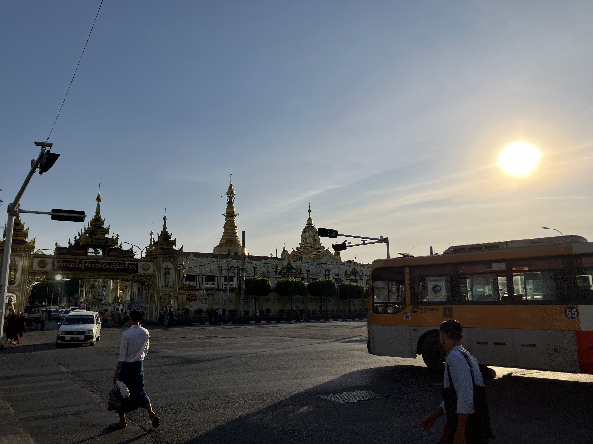
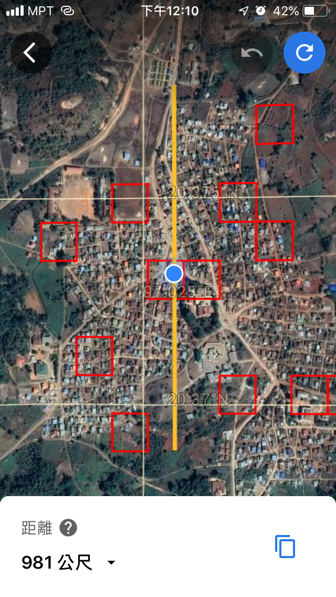
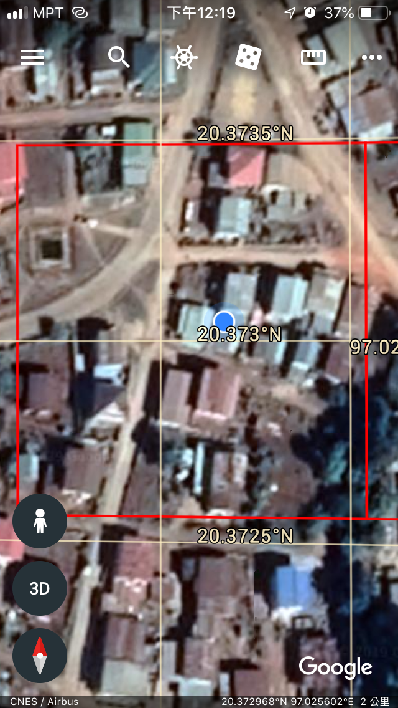
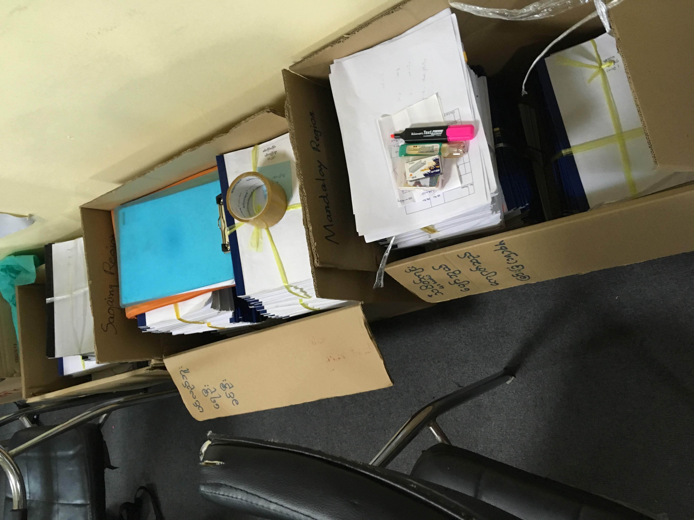
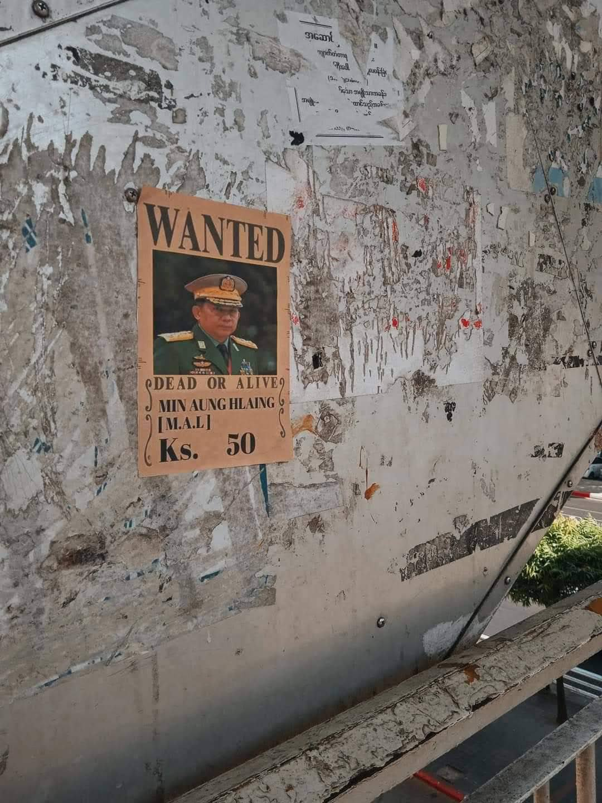
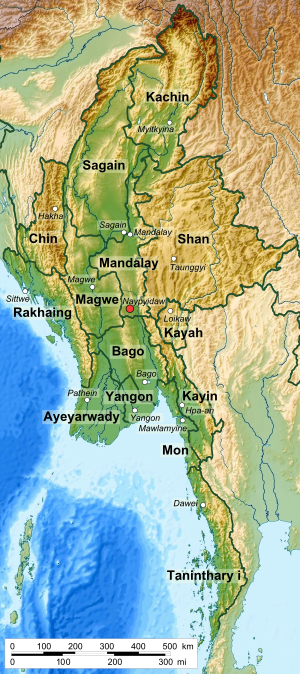
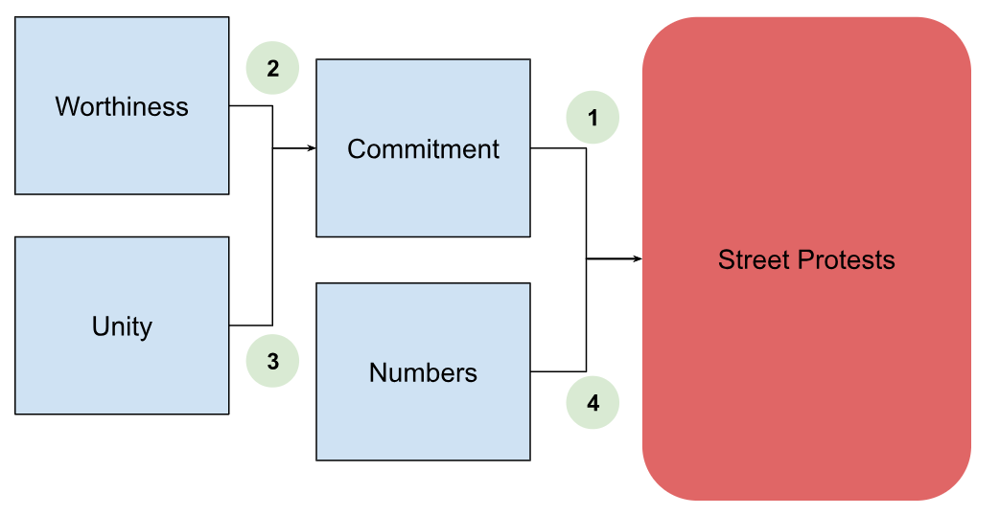
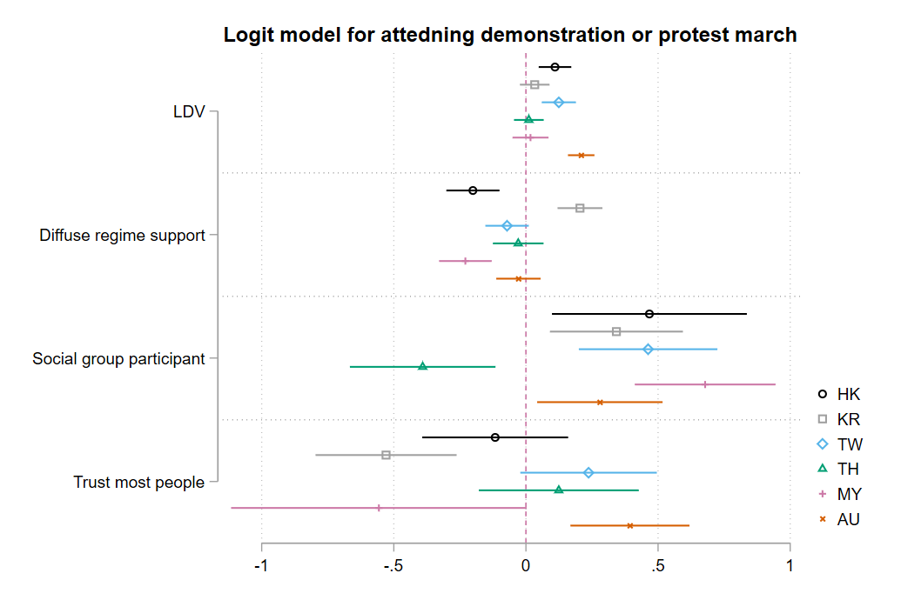

# From Willingness to Street Demonstrations:   Unpacking the Role of WUNC Elements in Myanmar's Anti-Coup Mobilization

## Osbern Huang

#### Visiting Fellow, Centre for Social Research & Methods, ANU   Associate Research Fellow, Asian Barometer Survey, NTU

<!--  footer: CSRM Seminar / Osbern Huang -->

<!--

'I begin today by acknowledging the Ngunnawal people, Traditional Custodians of the land on which we gather today, and pay my respects to their Elders past and present.

-->

---

# Firstly, there are some light-hearted parts.

---

## That's me, I was in Myanmar!     ...in 2019

---

---

---

---

---

---

# Now, here's the serious part.

---

---

# Background

- Myanmar's political shift on February 1, 2021
- Seizure of power by the Tatmadaw, end of democratic transition since 2011

- Swift backlash from the public and emergence of anti-coup mobilization

---

# The Unprecedented Social Mobilization in Myanmar

### Social Response to Coup

- Massive public outrage against military coup
- Public demonstrations, protests, civil disobedience, general strikes
- Shared goal: restore democratic governance
 - Unity across diverse segments of society, including ethnic and religion

### Resilience and Determination
- Despite dangers and uncertainties, movements persist
 - Deep resentment against military regime
 - Shared aspiration for democracy

---

# Historical Precursors of Democracy Struggles

### Historical Movements

- 8888 Uprising (1988) against military dictatorship
     - Emergence of Aung San Suu Kyi and her significance
- Saffron Revolution (2007) led by Buddhist monks
    - Broader struggle for political freedom

### Violence and Resilience

 - Military regime's violent responses
 - International condemnation and casualties
 - Creation of underground civil society, repertoire of contention, and democratic values

---

# Unprecedented Unity and Continuation in Anti-Coup Mobilization 

(Dunford, 2023)
   - Broader cross-section of society uniting against military regime
   - Cross-Ethnic and Cross-Religious Unity
   - Persistent and Ongoing Struggle: CDM and NUG/EAO Alliance

---

---

### Understanding mobilization 

- Resources mobilization theory and collective behaviour theory
- WUNC framework (Worthiness, Unity, Numbers, Commitment) (Tilly 2004, 2006)
- WUNC attributes link to more public sympathy, media attention, and higher chance of movement success

<!--
collective behaviour theory, which views social movements as irrational and deviant responses to grievances and strains (Imhonopi et al., 2013). Instead, resource mobilization theory sees social movements as rational and organized actors that operate within a political and social context.

- "WUNC" as a valuable framework for analysis
-->

---

# Understanding Social Movements with *WUNC* 

- Worthiness
    - Demonstration of righteous and virtuous cause
    - Convincing power holders and the public of movement's merit
 - Unity
    - Shared identity, solidarity, and mass mobilization
    - Strengthening the cause and its appeal
 - Numbers
    - Power in mass mobilization in reflection of broad support
 - Commitment
    - Willingness to endure risks and costs
    - Persistence in the face of repression or opposition

---

# Commitment and Risk-taking: Driver for Mobilization

- Commitment as a Decisive Element
    - Dedication of the movement and its participants
    - Role of commitment in energizing participants to take action
- Assessing Commitment
    - Participants' dedication and willingness to endure hardships
    - Personal risk-taking and consideration of potential consequences
 - Risk and Deliberation
    - Weighing risks before participating in street protests
    - Implications of political prisons, societal suffering, and oppressive regime from pre-reform era

<!--
Given the notoriously harsh conditions of political prisons in Myanmar, coupled with widespread societal suffering under an oppressive political regime and a distrustful civil society (Fink, 2011; Larkin, 2005), individuals must weigh the risks before participating in street protests. 

This deliberation is informed by lessons from decades of democratic struggles. The decision to participate in such protests not only signifies personal risk-taking but also reveals an understanding of the potential ramifications for their families and communities. 

Given these implications, the importance of commitment in social movements is further emphasized. Thus, we posit that people's commitment to social protest and their disregard for the associated risks will be positively correlated with the frequency of street protests following the coup 

-->

---

# Worthiness, Unity, and Numbers: Catalysts for Anti-Coup Mobilization

- Worthiness and Democratic Aspirations
    - Worthiness reflecting citizens' aspirations for democracy
    - Resistance against military rule and alignment with democratic values
 - Unity and Social Capital
    - Unity measured by social capital and trust within society
    - Cohesiveness and harmony enabling effective collective action
 - Numbers and Reference Points
    - Numbers aspect tied to anticipated participation size 
    - Influence of previous demonstrations and similar political views

---

# Hypotheses

1. Positive correlation between **commitment** and **frequency of street protests**
2. Positive correlation between perceived **worthiness** and **commitment**
3. Positive correlation between **unity** and **commitment**
4. Positive correlation between **past protest numbers** and **future street protests**

---

---

# Data - Individual Level

- Individual level survey data for public sentiment assessment (2019):

- Snapshot into Burmese populace's perspectives pre-coup
 - Constructing WUC Indices
    - Worthiness, Unity, and Commitment indices derived from survey responses
 - Control Variables
    - Sociodemographic factors: generation, gender, ethnicity, Buddhism affiliation
    - Influence of religion and ethnicity in Myanmar's politics and society

---

# Operationalization of WUNC constructs

- Worthiness
    - Liberal Democratic Values
    - Diffuse Regime Support
    - NLD supporter
- Unity
    - Social Group Participant
    - Trust Most People
- Commitment
    - Will go or have already attended a demonstration or protest march
    - Will take or have already taken risky action for a political cause

---

# Data - State / Region Level

- Main DV: demonstrations from February 1, 2021, to April 30, 2023

- Focus on political violence, protest events, and **demonstrations** in Myanmar
 - Aggregating events by periods and state/region
- Dividing events from 2010 to February 1, 2021, into three periods for hypothesis testing: Pre-reform / Thein-Shein administration / NLD administration

---

# Findings

---

# Linking Pre-Coup Commitment to Post-Coup Demonstrations

- Pearson correlation coefficients computed across all states/regions  
    - Strong correlation between two types of commitment
    - Significant correlation between commitment to demonstrations and post-coup protests in each state/region
    - Observation: More pre-coup demonstrations lead to higher post-coup demonstrations
    - Alignment with the fourth hypothesis and WUNC theory's 'numbers' element

<!--
relationship between people's pre-coup commitment to demonstrations or taking action despite risks and the number of post-coup street demonstrations across various time periods. 

Pre-coup commitments are aggregated by state/region to align with the similarly aggregated ACLED indicators. Subsequently, Pearson correlation coefficients are computed between each pair of variables, spanning all states/regions in Myanmar.
-->

---

<!--
While the two types of commitment vary in degree, they are strongly correlated. Furthermore, our findings suggest that citizens’ commitment to demonstrations in 2019 did not correlate with the number of demonstrations during the previous Thein Sein Era or the subsequent NLD administration period. However, there is a significant correlation with the number of protests in each state/region after the coup . In contrast, the commitment to more aggressive actions shows no correlation with the number of demonstrations. 

-->

---

<!--
Scatter plots with fitted lines are presented in Figures 1 and 2; the letter markings denote anonymized codes for different states/regions. Given a small sample estimate with only 15 observations, such a level of significance is relatively uncommon. As a result, our macro-level findings partially validate the assumptions of our first hypothesis.

-->

---

<!--
Model 1 employs a fixed-effect logit regression to gauge willingness to attend a demonstration, while Model 2 assesses the inclination to take action for a political cause, even if it poses personal risks.
-->

---

<!--
In the first model, we discovered that the variables capturing elements of "Worthiness" – specifically "LDV," "Diffuse regime support," and "NLD supporter" – are all significant. These variables, which represent people's attitudes toward democratic governance and the legitimacy of the incumbent NLD administration, act as positive predictors for attending a demonstration or protest march.

In the second model, which concerns the willingness to take action for a political cause regardless of the associated risks, both "LDV" and "NLD supporter" remain significant. However, "Diffuse regime support" does not significantly predict the dependent variable in this model. This suggests that public support for Myanmar's semi-democratic political system isn't robust enough to drive their willingness to take political actions despite potential risks.

The variables "Social group participant" and "Trust most people" represent the "Unity" element of the WUNC concept in both models. Both are significant predictors for attending demonstrations and taking risky actions for a political cause. This suggests that individuals who are more socially involved and have a greater trust in others are more inclined to participate in collective political actions.

Regarding the control variables, factors such as age, ethnicity, and religion influence the dependent variables to varying extents. In the second model, Buddhism emerges as a significant predictor (coefficient 0.661, p<0.05), implying that Buddhists might be more likely to take risky actions for a political cause. This is consistent with observations of increased riots against the military rule after the coup, especially in the Burmese heartland (Pedersen, 2023).

-->

---

---

# Findings from the multilevel logit model

- Importance of democratic values and NLD support in galvanizing social resistance
- Empirical support for social capital's role in fostering civic engagement

##  Summary of Findings

- Worthiness and Unity's positive effects on Commitment validated
- Commitment and Numbers matter in predicting future demonstrations

<!--
However, our study reveals that support for Myanmar's semi-democratic political system is insufficient to sustain the public's willingness to undertake risky political actions, as evidenced by the lack of significant predictive power of 'diffuse regime support' in our second model (Roman & Holliday, 2018). This finding accentuates the intricate dynamics fuelling social mobilizations in Myanmar against military rule, emphasizing the necessity for a nuanced understanding of the multifaceted factors at play.

Moreover, our findings echo prior research, suggesting that social movements are more likely to succeed when they can mobilize broad-based support and maintain unity among participants (McAdam et al., 2001), and when they can persuasively communicate the worthiness of their cause to the broader public (Gamson, 1992). These findings resonate with recent developments, such as the alliance between the Civil Disobedience Movement (CDM) and Ethnic Resistance Organizations (EROs) in their contestation of land and political authority with the Tatmadaw (Dunford, 2023; Jolliffe, 2023). Such alliances may foster the potential for a successful revolution that incorporates more diverse voices across the country and promotes more democratic forms of governance.

-->

---

# Limitations, Future Directions, and Conclusion

- Study Limitations
    - Constraints in measuring "Numbers" on individual-level
    - Reliance on cross-sectional and aggregate data, limiting causal inferences
 - Future Directions
    - Longitudinal studies for establishing causal relationships
    - Potential for comprehensive survey data to enhance analysis
 - Policy Insights
    - Strengthening citizens' **democratic consciousness** and **community connections** (Dahl 1989, Norris 2022)before democracy breakdown 

<!--
Despite its insightful contributions, our study has notable limitations. First, due to constraints in the available data, we were unable to directly measure certain WUNC elements—specifically, Numbers and Commitment—at the individual level. 

Second, our study relied on cross-sectional data, which limits our ability to establish causal relationships. Employing longitudinal data that tracks changes in the WUNC elements and participation in social mobilizations over time would address this issue more effectively. 

Nevertheless, even amidst this bleak period for civil liberties, we are optimistic that future research could still significantly benefit from more comprehensive survey data, including measures of WUNC elements. Based on our analysis of the Myanmar people’s unwavering opposition to the military regime, we maintain that survey research, including longitudinal studies, will continue to be viable in Myanmar's future landscape.

-->

---

---

---

---

# Thanks for having me!
