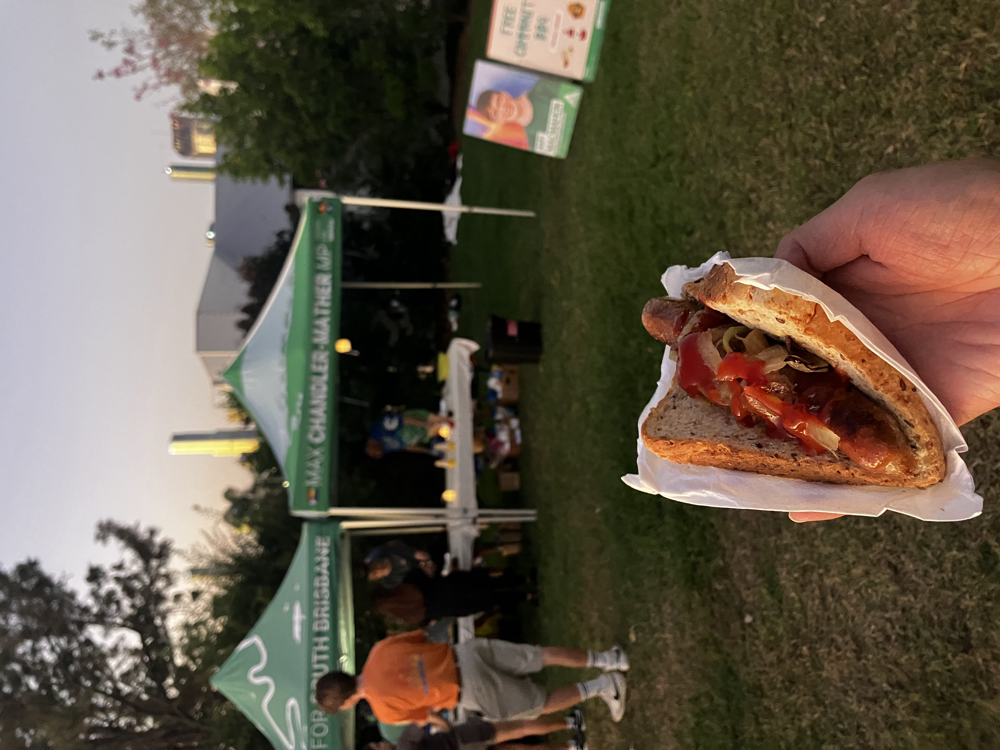
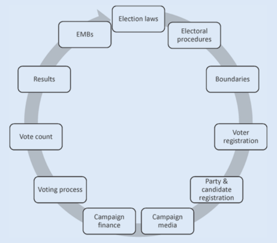
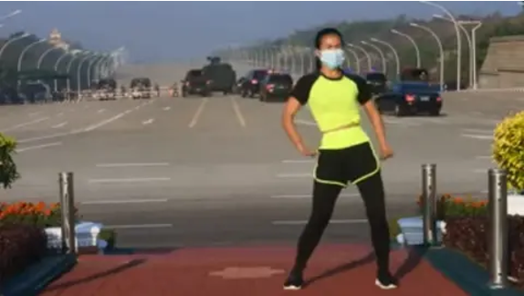
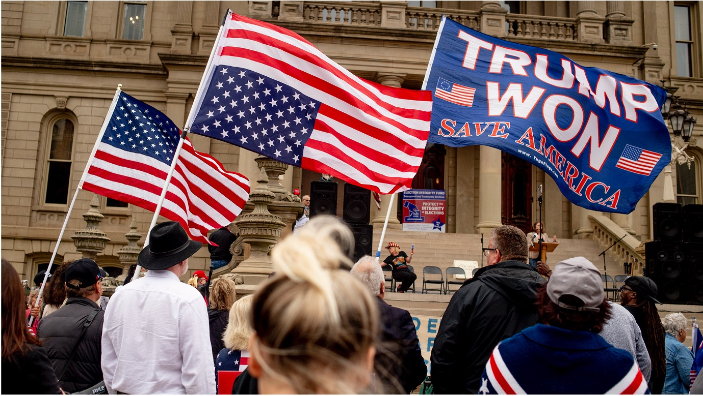
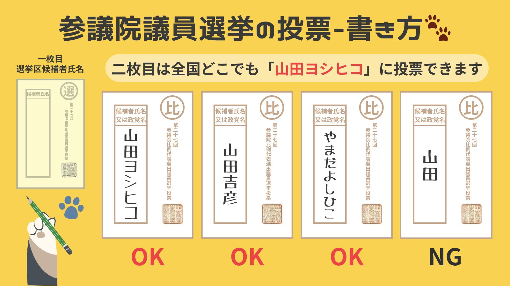
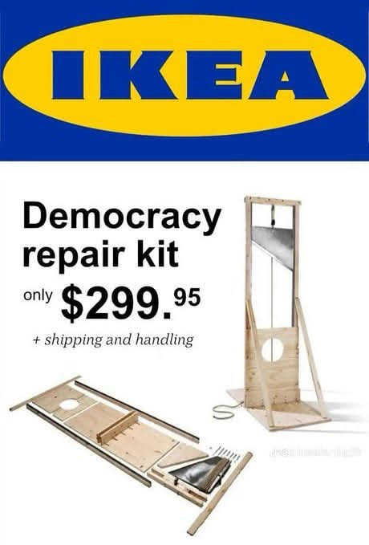
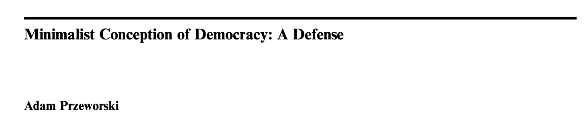
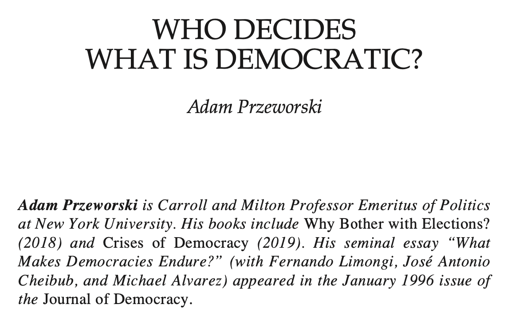
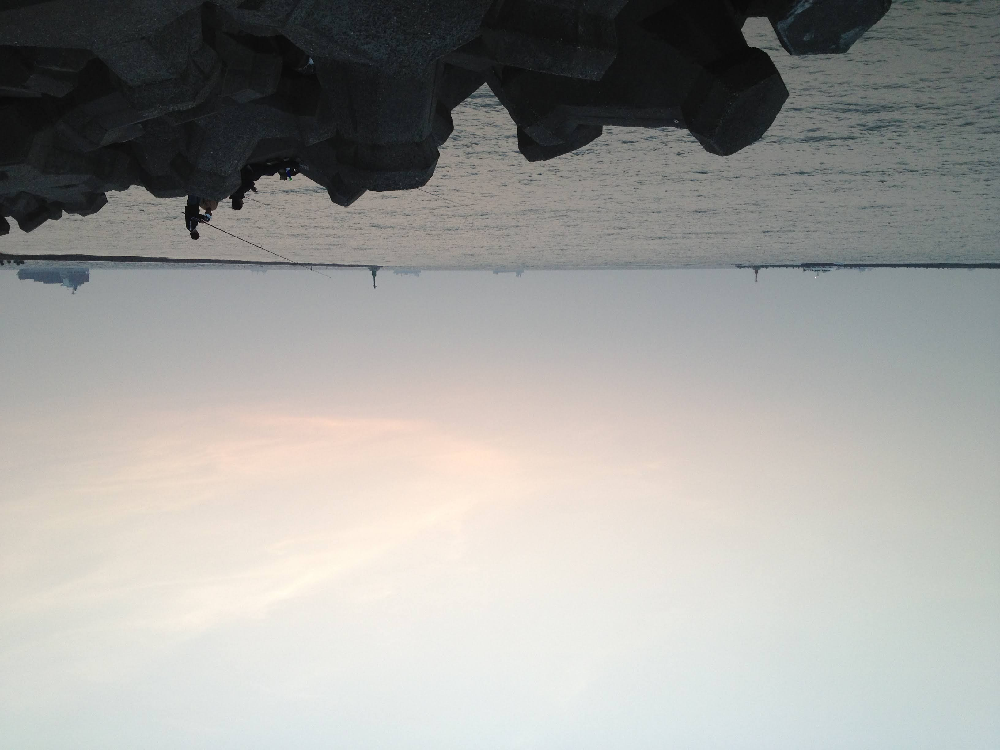

# Ideals and Challenges of Democracy

## Dr Osbern Huang

###### Research Fellow,   School of Government and International Relations   Griffith University

<!-- 

Outline

Modern democracy carries a lot of hopes and dreams (freedom/liberty, equality, justice) but in practice it often falls short. Adam Przeworski offers a “minimalist” conception of democracy, essentially democracy as elections. 

We’ll discuss those democratic ideals (Part 1), then Przeworski’s minimalist perspective (Part 2), and finally the challenges democracies face today with backsliding, and why, despite flaws, democracy is worth defending (Part 3).

- **Part 1:** Ideals of Democracy: the "normative" vision of democracy, and traditional forms (direct vs representative).  
- **Part 2:** Przeworski’s minimalist conception – democracy as free elections, a regulated conflict.  
- **Part 3:** Democratic backsliding and current dilemmas – why democracy, though flawed, is worth defending and improving.

-->

<!--  footer: Parties, Campaigns and Elections: Ideals and Challenges of Democracy | Osbern Huang -->

---

# What do you understand by democracy? 

# What is your ideal? 

<!--  footer: Parties, Campaigns and Elections: Ideals and Challenges of Democracy | Osbern Huang | Picture: Osbern -->

---

## The ideal of democracy/ types of democracy

Democracy is about… (these are from my former students...)
1. "Clean elections."
2. "Freedom of movement, association, protection of property. "
3. "The many prevail over the few. "
4. "All voices should be heard."
5. "Direct rule and active participation of citizens."
6. "Informed, respect and reason-based decisions."
7. "Equal capacity to influence policy decision." 

...there are more

<!--  footer: Parties, Campaigns and Elections: Ideals and Challenges of Democracy | Osbern Huang -->

---

## Democratic Ideals (Maximalist View)

- Democracy is often expected to realize lofty values: freedom, justice, equality, participation, accountability, dignity... etc.
- **Maximalist conceptions:** Insist that democracy must **embody certain ideals or outcomes** (e.g. social justice or equality) to count as "real" democracy.
- The more ideals we attach, the harder true democracy is to achieve, and different groups prize different ideals, leading to debate over what democracy *should* be.

$\Rightarrow$ Lead to **dissatisfaction with democracy** from inequality, ineffective participation, *mal-government*...

---

## Direct vs Representative (and maybe more) Democracy

- **Direct democracy:** Citizens directly deliberate and decide on laws or policies

- **Representative democracy:** Citizens freely elect legislators to make decisions on their behalf. *"...laws are adopted by legislatures, not voters*".
- Modern democracies often blend forms (e.g. occasional referenda within representative systems), but ***free (and fair) elections*** remain the core mechanism for collective choice.

---

## Przeworski’s Minimalist Definition

**"Institutionalised uncertainty"**
- If we judge contemporary democracies by the ideals of self-government, equality and liberty, democracy is *not*  what it was dreamt to be

- Przeworski criticises the idea of democracy as an altar on which everyone hangs his/her favourite ex-voto.

- **Intrinsic value:** Democracy’s importance is *procedural*. It lies in citizens’ collective capacity to pick their rulers. Not in any guarantee of particular policies or values.

---

- **Democracy as elections:** means nothing more (and less) than a system where ***people choose and remove governments in free, competitive elections***:

     - Ex ante uncertainty
     - Ex post irreversibility 
     - Repeated election 

<!--  footer: Parties, Campaigns and Elections: Ideals and Challenges of Democracy | Osbern Huang | Picture: International IDEA -->

---

## Elections as  "Regulated Conflict" 

- **Peaceful contest:** Democratic elections turn power struggles into a regulated competition. They are *“the only way to manage conflicts without recourse to violence.”* Rules and institutions replace bullets with ballots.
- **Losers live to fight** ***another day:*** In a democracy, political defeats aren’t permanen. *“Democracy survives when the winners do not abuse their power but also when the losers are willing to wait.”* This willingness to accept temporary loss is the **“magic”** that keeps the cycle of peaceful alternation going.

<!--  footer: Parties, Campaigns and Elections: Ideals and Challenges of Democracy | Osbern Huang  -->

---

## Democracy as Elections: Too Little or Not So Minimal After All?

- Even this “minimal” democracy requires enabling conditions. Free elections *aren’t just* a vote but also depend on *civil liberties and rule of law. Neutral electoral machinery, freedom of speech and association, and a stable legal order* are all needed for real competition.
- Thus, a minimalist **“elections-only”** view (sometimes dubbed *“electoralism”*) isn’t trivial. Democracy can't function if basic rights or fairness are absent. The electoral process must be genuine, or the system’s democratic character is in question.

<!--

Crucial break with the classical tradition: the acceptance that nobody and no body can represent the (general) will of the people (Kelsen, Schumpeter, Bobbio, Dahl, Downs). 

Political parties represent distinct interests. There is no a general common interest that goes beyond the interests of the groups  

“The will of the majority is the will of the majority, and not the will of “the people”” so, the principle of democracy merely means that “the reins of government should be handed to those who command more support than do any of the competing individuals or teams” (Schumpeter)

-->

---

## Democracy...

 
 
 
 
 
 
 
 
 

“…is (still) the worst form of government, except for all the others”?

<!--
Difficult to sustain, easy to slip away…
-->

<!--  footer: Parties, Campaigns and Elections: Ideals and Challenges of Democracy | Osbern Huang | Picture: BBC -->

---

## Is Democracy Worth Defending?

- Przeworski argued that even if democracy doesn’t achieve all our ideals, it is *inherently valuable*. In 1999 he wrote that his point was:
> ...not that democracy can be, needs to be, improved, but that it would be worth defending even if it could not be.”

- In other words, *even an imperfect, "minimal" democracy – one that falls short of maximalist aspirations – is better than no democracy at all*. The right of people to choose their leaders peacefully has its own worth, regardless of outcomes.

<!--  footer: Parties, Campaigns and Elections: Ideals and Challenges of Democracy | Osbern Huang -->

---

## Democratic Backsliding & Dilemmas

- **New threats:** Today, we see elected leaders subverting democratic rules, a phenomenon known as ***"democratic backsliding.”*** Incumbents may undermine free elections and entrench themselves in power, betraying the democratic bargain.
- **A house divided:** Defending democracy is complicated by disagreements over its meaning. Citizens opposed to authoritarians often **splinter because they prioritise different democratic ideals**. Przeworski notes that maximalist values can divide the opposition, whereas a focus on the minimalist core (free elections) can unite disparate groups against a regime.
- How can we save democracy?

---

## How?

 
 
 
 
 
 
 
 
 
 
 
 

<!--  footer: Parties, Campaigns and Elections: Ideals and Challenges of Democracy | Osbern Huang | Picture: Twitter (yoshihiko_umi) & Memedriod.com -->

---

## Defend It, Improve It

- **Holding the line:** Even in crisis, preserving the basic mechanism of democracy (again, **free, fair, competitive elections**) is paramount.
- **Looking forward:** To restore faith in democracy, Przeworski argues, defenders must

> “...offer a forward-looking perspective that seeks to improve representative institutions.”

- Addressing democracy’s weaknesses (inequality, corruption, some of the "maximalist" stuff, etc.) are crucial to prevent future backsliding.

<!--

Democracy may be messy and imperfect, but it remains the only system that lets societies resolve conflicts peacefully and hold leaders accountable.

"It's not perfect, but it's fine, it's mine."

-->

<!--  footer: Parties, Campaigns and Elections: Ideals and Challenges of Democracy | Osbern Huang -->

---

|  |  |
|:--|:--|
| Przeworski, Adam. “Minimalist Conception of Democracy: A Defense.” In *Democracy’s Value.* Cambridge: Cambridge UP, 1999. | Przeworski, Adam. "Who Decides What Is Democratic?" *Journal of Democracy* 35, no. 3 (2024): 5-16.

---

# Thanks for having me!

<!--  footer: Picture: Osbern Huang; 26 Jan 2012 -->

