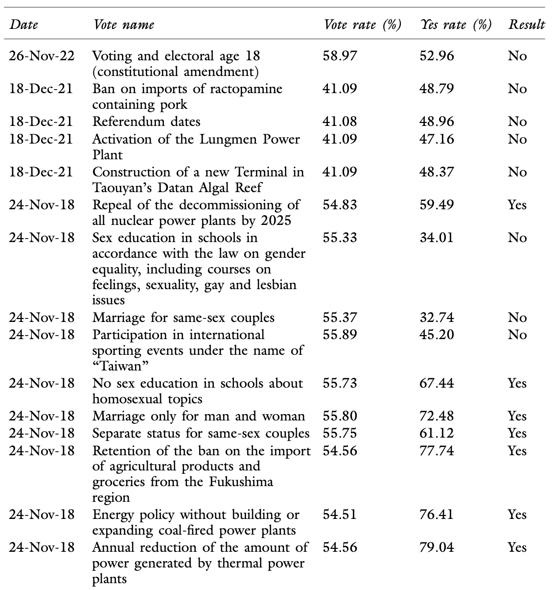

# Direct Democracy in Taiwan and Effects of Referendum Participation

### Osbern Huang
###### Research Fellow, Griffith University

<!--  footer: ERRN Electoral Regulation Forum, Melbourne / Osbern Huang   Images from CNA -->

<!--

'I begin my speech today by acknowledging the ---- people, Traditional Custodians of the land on which we gather today, and pay my respects to their elders, past, present and emerging.

-->

---

# Latest national referendems in the world since 2020:

| Country    | Binding referendum on demand                                           | Threshold to be binding                        | Last referendum |
|------------|-----------------------------------------------------------------------|-------------------------------------------------------|-----------------|
| Australia  | No                                                                    | Double majority                                       | 2023            |
| Poland     | No                                                                    | 50%                                                   | 2023            |
| Slovakia   | Yes (350,000 voters needed)  | 50%                                                   | 2023            |
| Hungary    | Yes (200,000 voters needed)                              | 50%                                                   | 2022            |
| Italy      | Yes (500,000 voters or 5 Regional Councils needed)       | 50%                                                   | 2022            |
| **Taiwan**     | **Yes (1.5% of registered voters needed)**   | **Simple majority with at least 25% of registered voters in favour** | **2022   2021**   |

- Tools for the people to exercise democracy, or tools for politicians to secure power?

<!--  footer: ERRN Electoral Regulation Forum, Melbourne / Osbern Huang -->

---

<!--  footer: Source: Huang, O., Qvortrup, M. (2024). Referendums in Asia. In: Qvortrup, M. (eds) Referendums Around the World.  -->

<!--

- Azerbaijan's High Referendum Activity highlights the constitutional referendum in 2016 with 29 individual amendments aimed at extending President Ilham Aliyev’s term and enhancing his powers.
- Freedom House Ratings indicate that most Asian countries holding referendums are rated as "partly free" or "not free," suggesting these referendums often serve to legitimize authoritarian rulers.
- Taiwan as an Exception stands out as the most democratic country in Asia, holding the highest number of referendums on a broad range of issues, with further details on its referendum operations and outcomes to be discussed later.

-->

---

# Referendums in Asia

- Many referendums in Asia are **controlled exercises ensuring outcomes that favor existing power structures**:
  - In nations like **Myanmar and Azerbaijan**, autocrats frequently use referendums to legitimize their governance.
- Varied but reserved use of referendum in Asian democracies
  - In **Japan and South Korea**, referendums are primarily reserved for constitutional changes, though local referendums address domestic issues.
  - In contrast, **Taiwan** uses referendums as tools for *direct democracy and enhancing citizen participation.*

<!--

# One country stands out: Taiwan 

- "Democratic" referendum in a democratic country

Here's a summarized bullet point version of the conclusion section:

Varied Usage in Asia: Referendums have been employed differently across Asian countries, reflecting the region's political diversity.
Autocratic Utilization: In countries with limited political freedom like Myanmar and Azerbaijan, referendums have often been used by autocrats to legitimize their rule.
Democratic Mechanism: In contrast, Taiwan uses referendums as tools for direct democracy and enhancing citizen participation.
Reserved Use in Democracies: In established democracies like Japan and South Korea, national referendums are primarily reserved for constitutional changes and are infrequent, though local referendums are common for addressing domestic issues.
Predetermined Outcomes: Generally, many referendums in Asia are seen as controlled exercises with predetermined outcomes favoring existing power structures, limiting genuine citizen impact.
Positive Examples: Despite challenges, examples from Japan and Taiwan show how referendums can empower citizens to address community issues and influence major policy decisions, providing useful models for other emerging democracies.

-->

---

<iframe src="my_plot.html" height="1400px" width="100%" frameBorder="0"></iframe>

<!--

events = [
    ("1945", "(1945) End of Japanese rule, Taiwan under Chinese governance"),
    ("1946", "(1946) Adoption of ROC Constitution"),
    ("1949", "(1949) KMT retreat to Taiwan, start of martial law"),
    ("1987", "(1987) Martial law lifted, beginning of democratization"),
    ("1995", "(1995) Initial referendum act proposals stall"),
    ("2000", "(2000) First transition of power to DPP"),
    ("2003", "(2003) Enactment of the Referendum Act"),
    ("2004", "(2004) First referendums fail due to high thresholds"),
    ("2008", "(2008) Four referendums with presidential elections, all fail"),
    ("2017", "(2017) Major amendments to Referendum Act, lowering thresholds"),
    ("2018", "(2018) Surge in referendum activity, ten cases filed"),
    ("2019", "(2019) Law revised, referendums separated from general elections"),
    ("2021", "(2021) First independent Referendum Day")
]

-->

---

## Referendum boom in Taiwan
- **Proposal Threshold**: 0.01% of national voters.
- **Binding**: Signatures from 1.5% of voters.
- **Passing**: Simple majority with at least 25% of eligible voters.
- **Voting Age**: Lowered to 18 y.o.
- **Referendum Day**: Separated from general elections; scheduled every two years on the fourth Saturday of August since *2021*.

<!--

Energy policy,
Food safety,
LGBTQ+ rights,
Enviroment protection,
EVEN referendum itself!

-->

---

# Direct Democracy: Is All That Glitters Not Gold?

**Criticism of Referendum:**
- **Societal Division**: Referendums can polarize communities, highlighting deep societal divides.
- **Political Tool**: Often used by politicians to compete and mobilize supporters, potentially exacerbating political strife.

<!--  footer: Source: Commonwealth Magazine, The Sydney Morning Herald, New Lens   ERRN Electoral Regulation Forum, Melbourne / Osbern Huang -->

---

# Questions Afloat

1. Is referendum a crucial part of Taiwan's democracy?
2. Is referendum good for Taiwan's democracy?
3. Does participation in the referendum enhance people's positive perception of democracy?

<!--  footer: Source: Liberty Times   ERRN Electoral Regulation Forum, Melbourne / Osbern Huang -->

---

# Data & Method

### Two Online Surveys

- **Opt-In Survey**: Features open-ended questions and ranking question.
  - **Implementation Date**: October 2022
  - **Sample Size**: \( n = 2,092 \)
  - Text analysis and weighted average

- **Survey with National Demographic Quota Control**
  - **Implementation Date**: February 2023
  - **Sample Size**: \( n = 1,068 \)
  - Multiple regression

<!--  footer: ERRN Electoral Regulation Forum, Melbourne / Osbern Huang -->

---

# Characteristics of Taiwanese Democracy

> Q: For you, what do you think are the characteristics of Taiwan's democracy?

- "Freedom of speech", "liberty", "vote and election" and "diversity" are the top responses.
- "Referendum" had been mentioned by 37 over 2,092 respondents (1.8%).

---

# Characteristics of Taiwanese Democracy: Weighted Ranking

---

# Evaluating the Impact of Referendums

| In your opinion, how effective is the referendum on Taiwan's political system? | Do you think the referendum system has brought good or bad influence on Taiwan's democracy? |
|---|---|
|  |   |

---

# Participation Effects on Democratic Satisfaction

## Dependent variables
1. Generally speaking, are you satisfied with the implementation of democracy in your country? (Performance)
2. If 1 stands for totally undemocratic and 10 stands for totally democratic, the smaller the score the more undemocratic it is, and the larger the score the more democratic it is. To which degree do you think Taiwan currently belongs? (Democracy Score)

## Independent variables
- Vote in 2021 referendum - first "independent" referendum from general election
- Demographical and partisan/"winning camp" control variables included

---

---

# Summary of Quantitative Findings

1. **Importance of Referendums in Taiwan's Democracy**: Quantitative evidence confirms that referendums are an essential component of Taiwan's democratic framework.
2. **Impact of Referendums on Taiwan's Democracy**: Referendums have a positive effect on Taiwan's democracy, though their impact may not be immediately apparent.
3. **Enhancement of Democratic Perception Through Participation**: Participation in referendums positively enhances public perception of democracy, even after controlling for partisanship and demographic variables.
---

# What will be in 2025 referendum?

- 'Ban on "Mountain Pig Hanging"'

- 'Ban on racing pigeons at sea'

### The "normalisation" and "depoliticisation" of referendums?

---

# Conclusion and Takeaways

1. **Core Role in Democracy**: Referendums are integral to Taiwan's democratic framework.
2. **Gradual Positive Impact**: While the benefits for Taiwan's democracy may not be immediate, referendums contribute positively over time.
3. **Perception Enhancement**: Participation in referendums significantly enhances public perception of democracy.
4. **Broader Democratic Relevance**: Despite complexities and external influences, Taiwan's experience demonstrates that while direct democracy can be chaotic, it effectively boosts citizens' democratic engagement and efficacy.

---

<!--
_color: 
-->

# Thanks for having me!

<!--  footer: Photo: Taken by the Speaker   ERRN Electoral Regulation Forum, Melbourne / Osbern Huang -->
