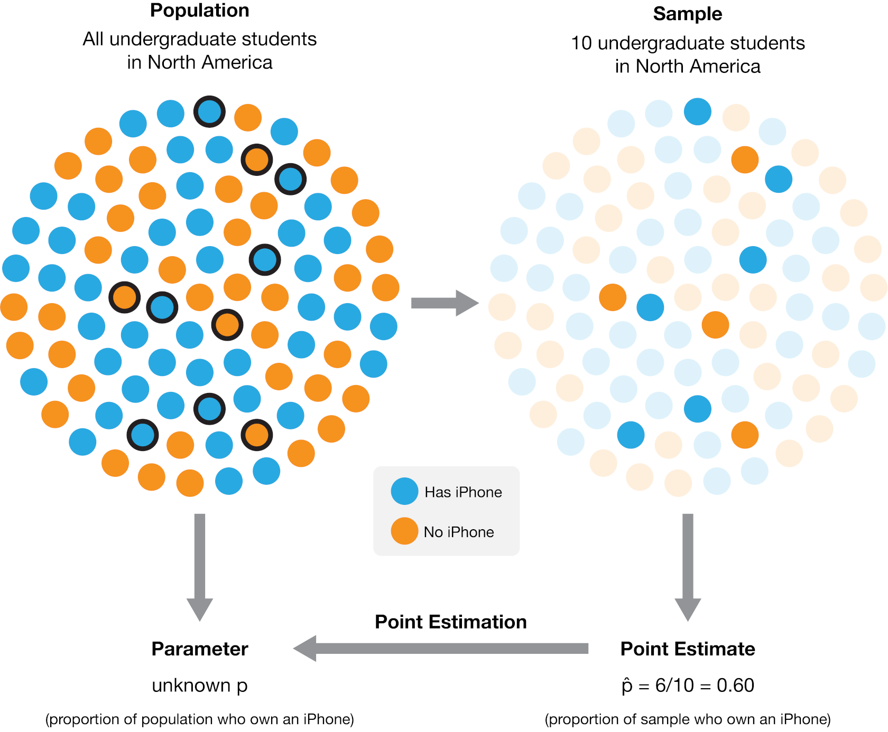
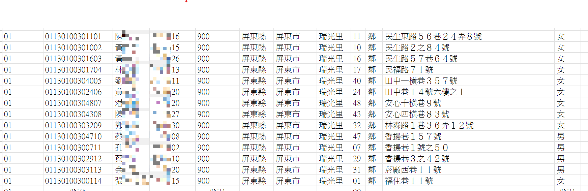
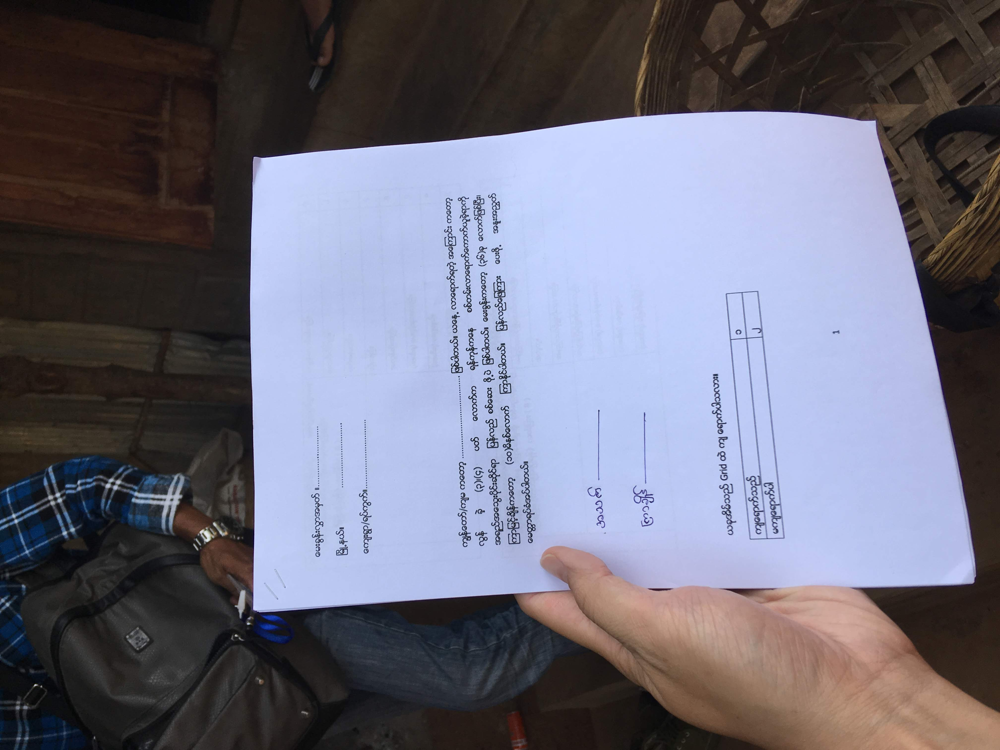
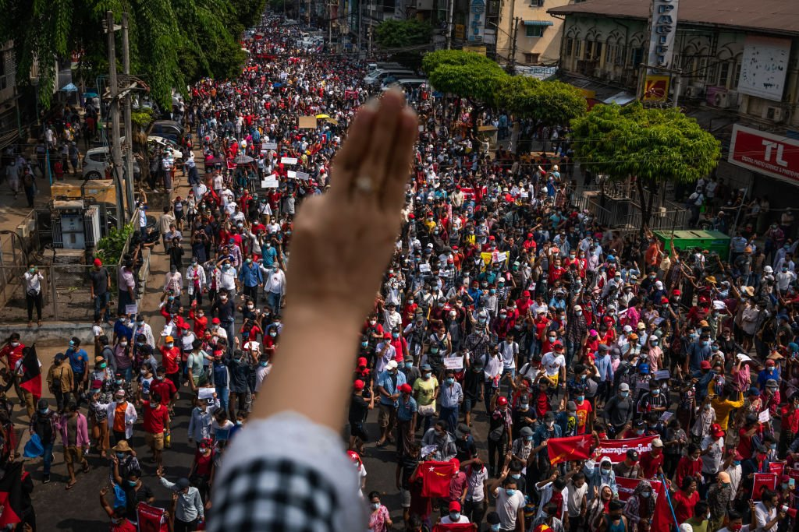

# 從抽樣理論到應用GIS/GPS克服跨國調查中的抽樣挑戰


## 黃忠偉

###### 助研究員 <br> 胡佛東亞民主研究中心 | 亞洲民主動態調查 <br> 國立臺灣大學

<!--  footer: Presentation for NCNU DPPA, 18th Apr 2024 | Osbern Huang -->


<!--

中文主題：從抽樣理論到應用GIS/GPS科技克服跨國調查中的抽樣挑戰
英文主題：Understanding Myanmar Through the Lens of the Asian Barometer Survey: Exploring Democratic Norms and Protest Participation


'I begin my speech today by acknowledging the Ngunnawal people, Traditional Custodians of the land on which we gather today, and pay my respects to their elders, past, present and emerging.

-->

---


# 調查？抽樣？抽樣調查！？


- 調查研究(Survey Research)：敘述或解釋目標群體的特徵
  - 選舉預測、市場開發、估算族群大小、流行病影響程度
- 為何要抽樣？
  - "Sampling is done because you usually <font color="FFCC00">***cannot gather data from the entire population*** </font>. Even in relatively small populations, the data may be needed <font color="FFCC00">***urgently*** </font>, and including everyone in the population in your data collection may take too long." (London School of Hygiene and Tropical Medicine, 2009)
- 如何做抽樣？


<!--  footer: Figures are from: Peter Lance, John Spencer, Aiko Hattori (2014) GIS and Sampling, USAID, PEPFAR, MEASURE Evaluation. -->

---




<!--  footer: Figures are from: Tiffany Timbers, Trevor Campbell, Melissa Lee, Joel Ostblom, Lindsey Heagy (2022) Data Science: A First Introduction (Python Edition). -->

---

# 如何抽樣？


- [街頭民調](https://www.aweb.tpin.idv.tw/president2024/index.php) v.s. [傳統民調](https://zh.wikipedia.org/zh-tw/2024%E5%B9%B4%E4%B8%AD%E8%8F%AF%E6%B0%91%E5%9C%8B%E7%B8%BD%E7%B5%B1%E9%81%B8%E8%88%89%E6%B0%91%E6%84%8F%E8%AA%BF%E6%9F%A5#%E6%B0%91%E8%AA%BF%E8%AA%A4%E5%B7%AE)

- 評估抽樣過程的兩個指標：
  - 公正性
  - 代表性


<!--

- 以「機率抽樣」(probability sampling)來得到母體參數的不偏估計(unbiased estimation)
  - Every member of the population has a ***positive probability*** of random selection (i.e., they have at least some chance of being selected)
  - Their probability of selection is ***known***.

-->

<!--  footer: Presentation for NCNU DPPA, 18th Apr 2024 | Osbern Huang -->

---

# 簡單隨機抽樣：色球比例的推估

> 設想一盒不同顏色的十顆球，其中紅白兩色分別有7、3顆。所以我們決定抽出$n$顆球來**推論**各色球所佔的比例。現令我們抽出的紅、白球球數分別為$x$和$n-x$（抽出不放回），此時：

- 抽出球數的經驗資料可讓我們推估出：
  - $P(紅球=x;n)=\frac{x}{n}$; $P(白球=n-x;n)=1-\frac{x}{n}$
- 但以邏輯推論（排列組合）的觀點，不同抽出球數之下紅白球數的比例為：
  - $P(紅球=x;n)=\frac{C^{7}_{x}C^{3}_{n-x}}{\sum\limits_{i=0}^n C^{7}_{i}C^{3}_{n-i}}$; $P(白球=n-x;n)=1-\frac{C^{7}_{x}C^{3}_{n-x}}{\sum\limits_{i=0}^n C^{7}_{i}C^{3}_{n-i}}$

---

# 簡單隨機抽樣的公正性

- 以下是把所有抽出球數$n$和抽中紅球數$x$帶入上述公式的結果：


- 公正性=期望值 $E[X]=x_{1}p_{1}+x_{2}p_{2}+...+x_{k}p_{k}$

<!--

1: (0*0.3+1*0.7)/1=0.7
2: (0*3/45+1*21/45+2*21/45)/2=0.7

-->

---

# 簡單隨機抽樣的代表性

- 抽出**一**球中紅球數值和的機率：$x=0(\frac{3}{10}), 1(\frac{7}{10})$
- 抽出**兩**球中紅球數值和的機率：$x=0(\frac{3}{45}), 1(\frac{21}{45}), 2(\frac{21}{45})$
- 抽出**三**球中紅球數值和的機率：$x=0(\frac{1}{120}), 1(\frac{21}{120}), 2(\frac{63}{120}), 3(\frac{35}{120})$
$...$
- 抽出**十**球中紅球數值和的機率：$x=7(\frac{1}{1})$
- 樣本數增加，代表性提升？[利用均方差(mean squared error)來計算吧](https://docs.google.com/spreadsheets/d/1N6zXY-Y8xwcnBRt1qnpZ7qI1CoxgSwvIKkDJkLJBzxI/edit?usp=sharing)！


---

# 如何求得不偏母體參數：理想與實務

- 以「機率抽樣」(probability sampling)來得到母體參數的不偏估計(unbiased estimation)
  - 母體內每一個體被隨機選出的機率**大於0**（至少有機會被抽到）
  - 被選到的機率**已知**（知道每一個人被抽到的機率）
- 好抽樣清冊(sampling frame)做好調查
  - 窮盡來自母體所有抽樣單位的「名單」，確保每一個抽樣單位都有大於零的中選機會
  - 從該清單抽出樣本時可以確保每個抽樣單位的中選機率為已知


---

# 大型面訪調查的機率抽樣：probability proportional to size [(pps) sampling](https://docs.google.com/spreadsheets/d/1OUvhyf-1hrFKV40IBRvGwqvUyU5tUsMybYaQoExivQs/edit?usp=sharing)


<!--  footer: Figures are from: Peter Lance, John Spencer, Aiko Hattori (2014) GIS and Sampling, USAID, PEPFAR, MEASURE Evaluation. -->

---


- 2001 第一波: 8國 $\Rightarrow$ 2021 第五波: 17國
- [PPS的操作範例](https://docs.google.com/spreadsheets/d/1OUvhyf-1hrFKV40IBRvGwqvUyU5tUsMybYaQoExivQs/edit?usp=sharing):

| 中國大陸 | 台灣 |
|----------------------------|---------------------|
| PSU: 省市 (125) <br> SSU: 縣市 (2) <br> TSU: 鄉鎮街道 <br> 個人：地址做戶中選樣* |  PSU: 選區 (28) <br> SSU: 村里 (3) <br> 個人- 戶口資料 |

  $^{*}$利用Kish表進行戶中選樣


<!--  footer: Presentation for NCNU DPPA, 18th Apr 2024 | Osbern Huang -->

---

# Good old days would be like...



<!--  footer: Presentation for NCNU DPPA, 18th Apr 2024 | Osbern Huang -->


---


# Difficulties Surfacing...

- In most places, **electoral registers and postcode addresses** were used as sampling frames (Lynn & Taylor, 1995).
- However, people **moves** (Landry & Shen, 2005; Chen et al., 2018)
    - Migrants, temporary or seasonal workers, students, etc.
- Even worse, sometimes government officials are **reluctant to share household registration data**.
    - Or, they simply **don't have it**.


<!--
In the first model, we discovered that the variables capturing elements of "Worthiness" – specifically "LDV," "Diffuse regime support," and "NLD supporter" – are all significant. These variables, which represent people's attitudes toward democratic governance and the legitimacy of the incumbent NLD administration, act as positive predictors for attending a demonstration or protest march.

In the second model, which concerns the willingness to take action for a political cause regardless of the associated risks, both "LDV" and "NLD supporter" remain significant. However, "Diffuse regime support" does not significantly predict the dependent variable in this model. This suggests that public support for Myanmar's semi-democratic political system isn't robust enough to drive their willingness to take political actions despite potential risks.

The variables "Social group participant" and "Trust most people" represent the "Unity" element of the WUNC concept in both models. Both are significant predictors for attending demonstrations and taking risky actions for a political cause. This suggests that individuals who are more socially involved and have a greater trust in others are more inclined to participate in collective political actions.

Regarding the control variables, factors such as age, ethnicity, and religion influence the dependent variables to varying extents. In the second model, Buddhism emerges as a significant predictor (coefficient 0.661, p<0.05), implying that Buddhists might be more likely to take risky actions for a political cause. This is consistent with observations of increased riots against the military rule after the coup, especially in the Burmese heartland (Pedersen, 2023).

-->

---

# Objective of the "Mission""

- Emergency problem-solving-oriented project.
- **Without...**
    - Electoral/household registers and postcode addresses in **China and Myanmar**.
    - Long-term guarantee for the survey permission from the GAD or government officials.
 - ***No reliable sampling frame*** for the last stage of the PPS sampling.
 - With emerging resources of GIS data, we have a chance to utilize it for survey sampling.


---

# Referencing Existing GIS/GPS Sampling Method

<center>


</center>

- (Landry & Shen, 2005): Had been used in waves of nationwide surveys in China.
- PSU: Province/City
- SSU: Town/County
- TSU: Half-minute grid (about 900m $\times$ 900m) or $\frac{1}{8}$ minute grid (225m $\times$ 225m)
- (QSU: Small grid (about 90m $\times$ 90m) )
- Collect *all adresses* within small grids - SRS for households
- Within household selection with Kish table


---

# Shortfalls of the Existing Method:


 - Sampling must be performed **manually** and manual exclusion of empty grids leads to increased time and cost.
 - The **need to gather country-specific data** is cumbersome; a universal solution is desired.
 - The **assumption of equal population density of eligible grids** is questionable


---

# Our Goals

- Conduct PPS **directly** using geo-information of population distribution.
- **Automate** the calculation and exclusion processes through programming.
- Develop an easy-to-use program utilizing **FREE** resources - now everyone can cook!


---

# Resources we were utilizing...

- Employed OSM Boundaries (OpenStreetMap) for sourcing```.shp files```


---

# Resources we were utilizing

- Employed **WorldPop** 100 m x 100 m gridded population data for sourcing gridded population data.


---


# Work Flow

1. Manually download UN-adjusted gridded population estimates from Worldpop.
2. Batch download administrative boundary ```.shp``` files using ```curl``` from OSM boundaries.
3. Utilize the administrative boundary as a frame and apply the ```GDAL``` function in QGIS to segment Worldpop estimates into sub-administrative files.
4. Grid the sub-administrative population file and compute the population count within each half-minute grid.
5. Repeat the process to produce corresponding smaller grids (100m x 100m).
6. Review and verify the results.

---


Using ```QGIS``` to calculate population within small grids over certain district.
- Illustration with Beijing-Fentai country


---

Finish the sampling precedure with ```Linux shell``` scripts, automatically.


---


<video src="抽樣程式說明.mp4" controls width="100%"></video>


---

# Fieldwork Supplies for Supervisors/Interviwers

In every TSU, our fieldwork supervisors and interviewers will be provided with:


---

# Tools Utilized On-Site


- GPS devices (basic smartphone works!) for precise location tracking.
- Google Earth/Maps for navigational guidance.
- Pen and paper for documentation.

---


# Finally, we put everything together in China (2018) & Myanmar (2019).


---


---


---


---





---


<!--

---

# Sample Representativeness and Weighting

- Raking procedure applied to our data, adjusting the weights based on three key variables: gender, age, and geographical distribution.
- Goodness-of-fit tests with Stata module```mgof```


-->


---


# Sample Representativeness


---

##  China
  - Education: Highlighting those with College education and above.

|    |  Sample |  Population |   |
|:---:|:---:|:---:|:---:|
| No college degree   | 81.48 | 81 | P>.05
| College $\Uparrow$ | 18.52 | 19 |

  - Party membership status

|    |  Sample |  Population |   |
|:---:|:---:|:---:|:---:|
| CCP member  | 11.58 | 9 |  <font color = "cranberry"> P<.01 </font> |
| Not CCP member| 88.42 | 91 |

---


##  Myanmar
  - Education: Highlighting those with College education and above.

|    |  Sample |  Population |   |
|:---:|:---:|:---:|:---:|
| No college degree  | 90.17 | 90 | P>.05
| College $\Uparrow$ | 9.83 | 10 |

  - Buddhism Religion

|    |  Sample |  Population |   |
|:---:|:---:|:---:|:---:|
| Buddhism  | 86.78 | 88 | P>.05
| Not Buddhism | 13.22 | 12 |


<!--


# Discussion and Conclusion

- **Feasibility in Developing Countries**:
  - GIS and GPS-assisted sampling emerges as a potent and feasible solution for conducting face-to-face surveys in developing nations.

- **Credible Sample Frame**:
  - One of the fundamental advantages is its ability to provide a credible and robust sampling frame, particularly in places where traditional means might fall short.

---


# Discussion and Conclusion (Cont'd)

- **Automation Through Programming**:
  - The integration of this method with programming languages facilitates easy automation, making the entire process efficient and scalable.

- **Ensuring Sample Representativeness**:
  - Drawing from our experience with the Asian Barometer Survey (ABS), we affirm that this approach doesn't just simplify the sampling process but also significantly aids in achieving a representative sample.

-->

---


# Understanding Myanmar Through the Lens of the Asian Barometer Survey: 

### Democratic Norms and Protest Participation


## Osbern Huang

###### Assistant Research Fellow, <br> Asian Barometer Survey / Hu Fu Centre for East Asian Democracy <br> National Taiwan University

<!--  footer: Presentation for NCNU DPPA, 18th Apr 2024 / Osbern Huang -->


<!--

中文主題：從抽樣理論到應用GIS/GPS科技克服跨國調查中的抽樣挑戰
英文主題：Understanding Myanmar Through the Lens of the Asian Barometer Survey: Exploring Democratic Norms and Protest Participation


'I begin my speech today by acknowledging the Ngunnawal people, Traditional Custodians of the land on which we gather today, and pay my respects to their elders, past, present and emerging.

-->

---


# 
#
#
#
#
#
## &emsp;&emsp;2007 &emsp;&emsp;&emsp;&emsp;&emsp; 2010 &emsp;&emsp;&emsp;&emsp;&emsp; 2015 &emsp;&emsp;&emsp;&emsp;&emsp; 2020


<!--  footer: Images from (left to right): The Guardian/Bangkok Post/AsiaSociety/The Conversation-->


<!--

Before I dive into numbers and digits, I believe it would be quite helpful for me to give some background briefing the distressful political history.

2007
Saffron Revolution: Widespread protests led by monks against the military regime, named for the color of the monks' robes.
2010
General Election: The first elections in two decades; the military-backed Union Solidarity and Development Party (USDP) wins amid allegations of fraud and voting irregularities.
Aung San Suu Kyi's Release: The pro-democracy leader and Nobel Peace Prize laureate is released from house arrest.
2011
Transition to Civilian Government: Thein Sein, a former general, becomes president in a move towards a civilian government.
Economic and Political Reforms: Initiatives to open up the economy and increase political freedoms begin.
2015
General Election: Aung San Suu Kyi's National League for Democracy (NLD) wins a landslide victory, leading to the first non-military president since the 1962 coup.
2017
Rohingya Crisis: Military operations against the Rohingya minority in Rakhine State lead to accusations of ethnic cleansing and a major humanitarian crisis.
2020
General Election: The NLD wins again, but the military disputes the results, alleging electoral fraud.

-->


---

# Questions

1. Under the NLD intellectual government, **have the people of Myanmar become more inclined towards a democratic system?** 
2. Is there enough **political culture/democratic values** to support democratic transition?


<!--  footer: Presentation for NCNU DPPA, 18th Apr 2024 / Osbern Huang -->


---

# Indicators We Used To Understand Democratic Support in Myanmar


### Support for the current *democratic* regime
- Regime Performance
- Trust in Political Institution
- Regime Support
### Recognition of the *values of liberal democracy*
- Detach From Authoritarian Alternatives
- Liberal Democratic Values


<!--
After 2015, the NLD civilian 

-->

<!--  footer: Presentation for NCNU DPPA, 18th Apr 2024 / Osbern Huang -->

<!--

---


| Regime Performance |
| --- |
| All citizens from different ethnic communities in Myanmar are treated equally by the government. | |
| Rich and poor people are treated equally by the government. | |
| How would you rate the overall economic condition of our country today? | |
| How well do you think the government responds to what people want? | |
| How satisfied or dissatisfied are you with the ruling government? | |


---

| Trust in Political Institution |
| --- | 
| Trust in the president/prime minister | |
| Trust in the national government | |
| Trust in the political parties | |
| Trust in the parliament | |
| Trust in the civil service | |
| Trust in the military | |
| Trust in the police | |

---

| Regime Support |
| --- | 
| Over the long run, our system of government is capable of solving the problems our country faces | |
| Thinking in general, I am proud of our system of government. | |
| A system like ours, even if it runs into problems, deserves the people's support. | |
| I would rather live under our system of government than any other that I can think of | |


---

| Detach From Authoritarian Alternatives |
| --- | 
| We should get rid of parliament and elections and have a strong leader decide things. | |
| Only one political party should be allowed to stand for election and hold office. | |
| The army (military) should come in to govern the country. | |

---

| Liberal Democratic Values |
| --- |
| Liberal Democratic Values (Average Agreement Rate) | |
| Women should not be involved in politics as much as men. | |
| The government should consult religious authorities when interpreting the laws. | |
| People with little or no education should have as much say in politics as highly-educated people. | |
| Government leaders are like the head of a family; we should all follow their decisions. | |
| The government should decide whether certain ideas should be allowed to be discussed in society. | |
| Harmony of the community will be disrupted if people organize lots of groups. | |
| When judges decide important cases, they should accept the view of the executive branch. | |
| If the government is constantly checked by the legislature, it cannot possibly accomplish great things. | |
| If we have political leaders who are morally upright, we can let them decide everything. | |
| If people have too many different ways of thinking, society will be chaotic. | |

-->


---


# Support for the current democratic regime
- Regime Performance
- Trust in Political Institution
- Regime Support


---


---


---


---


# Recognition of the values of liberal democracy
- Detach From Authoritarian Alternatives
- Liberal Democratic Values

---


---


---

# Quick Summary to 2015/2019 Comparison

1. Trust in government institutions has greatly risen under a "well-performing" regime, reinforcing support for the current political system.

2. However, individual democratic values, including liberal-democratic ideals and a shift away from authoritarian alternatives, have not notably improved. Instead, the patriarchal concept of political values has been reinforced.

<!--

1. Under the premise of a "well-performing" regime, **trust in government institutions has significantly increased while simultaneously strengthening support for the existing political system**.
2. 
3. However, **individual democratic values (reflected in liberal-democratic values and detachment from authoritarian alternatives) have not significantly improved**; instead, the patriarchal concept of political values has been reinforced.


-->

<!--

However, that is not the full story for today. 

-->


---




# 2021: The end of democratic experiment

> On February 1, the military detains Aung San Suu Kyi and other NLD leaders, seizing power and sparking international condemnation and widespread protests (Civil Disobedience Movement, CDM).

<!--  footer: Image from GettyImages -->


<!--
2021
Military Coup: On February 1, the military detains Aung San Suu Kyi and other NLD leaders, seizing power and sparking widespread protests and international condemnation.
Civil Disobedience Movement: Mass protests and strikes against the military coup ensue.
-->

---


### The Unprecedented Social Mobilization in Myanmar

- Massive public outrage against military coup
- Public demonstrations, protests, civil disobedience, general strikes
 - Unity across diverse segments of society, including ethnic and religion
- Despite dangers and uncertainties, movements persist
 - Shared aspiration for democracy

<!--  footer: Image from ANU Myanmar Research Centre -->


---

# Historical Precursors of Democracy Struggles

### Historical Movements

- 8888 Uprising (1988) against military dictatorship
     - Emergence of Aung San Suu Kyi and her significance
- Saffron Revolution (2007) led by Buddhist monks
    - Broader struggle for political freedom

### Violence and Resilience

 - Military regime's violent responses
 - International condemnation and casualties
 - Creation of underground civil society

<!--  footer: Presentation for NCNU DPPA, 18th Apr 2024 / Osbern Huang -->


---


<!--  footer: Source: ACLED -->


---


### Understanding Social Movements with *WUNC* framework


- **Worthiness**
    - Demonstration of righteous and virtuous cause
    - Convincing power holders and the public of movement's merit
 - **Unity**
    - Shared identity, solidarity, and mass mobilization
    - Strengthening the cause and its appeal

<!--
collective behaviour theory, which views social movements as irrational and deviant responses to grievances and strains (Imhonopi et al., 2013). Instead, resource mobilization theory sees social movements as rational and organized actors that operate within a political and social context.

- "WUNC" as a valuable framework for analysis
-->

<!--  footer: Image from ANU Myanmar Research Centre -->


---


# Understanding Social Movements with *WUNC* framework


 - **Numbers**
    - Power in mass mobilization in reflection of broad support
 - **Commitment**
    - Willingness to endure risks and costs
    - Persistence in the face of repression or opposition


<!--
collective behaviour theory, which views social movements as irrational and deviant responses to grievances and strains (Imhonopi et al., 2013). Instead, resource mobilization theory sees social movements as rational and organized actors that operate within a political and social context.

- "WUNC" as a valuable framework for analysis
-->

<!--  footer: Presentation for NCNU DPPA, 18th Apr 2024 / Osbern Huang -->

---

# "Commitment" and Risk-taking: Driver for Mobilization

- Commitment as a Decisive Element
    - Dedication of the movement and its participants
    - Role of commitment in energizing participants to take action
- Assessing Commitment
    - Participants' dedication and willingness to endure hardships
    - Personal risk-taking and consideration of potential consequences
 - Risk and Deliberation
    - Weighing risks before participating in street protests
    - Implications of political prisons, societal suffering, and oppressive regime from pre-reform era

<!--
Given the notoriously harsh conditions of political prisons in Myanmar, coupled with widespread societal suffering under an oppressive political regime and a distrustful civil society (Fink, 2011; Larkin, 2005), individuals must weigh the risks before participating in street protests. 

This deliberation is informed by lessons from decades of democratic struggles. The decision to participate in such protests not only signifies personal risk-taking but also reveals an understanding of the potential ramifications for their families and communities. 

Given these implications, the importance of commitment in social movements is further emphasized. Thus, we posit that people's commitment to social protest and their disregard for the associated risks will be positively correlated with the frequency of street protests following the coup 

-->


---

# Worthiness, Unity, and Numbers: Catalysts for Anti-Coup Mobilization

- Worthiness and Democratic Aspirations
    - Worthiness reflecting citizens' aspirations for democracy
    - Resistance against military rule and alignment with democratic values
 - Unity and Social Capital
    - Unity measured by social capital and trust within society
    - Cohesiveness and harmony enabling effective collective action
 - Numbers and Reference Points
    - Numbers aspect tied to anticipated participation size 
    - Influence of previous demonstrations and similar political views


<!--  footer: Presentation for NCNU DPPA, 18th Apr 2024 / Osbern Huang -->


---


<!--
# Hypotheses

1. Positive correlation between **commitment** and **frequency of street protests**
2. Positive correlation between perceived **worthiness** and **commitment**
3. Positive correlation between **unity** and **commitment**
4. Positive correlation between **past protest numbers** and **future street protests**

-->

<!--

---

# Operationalization of WUNC constructs

- Worthiness
    - Liberal Democratic Values
    - Diffuse Regime Support
    - NLD supporter
- Unity
    - Social Group Participant
    - Trust Most People
- Commitment
    - Will go or have already attended a demonstration or protest march
    - Will take or have already taken risky action for a political cause

---

# Data - State / Region Level

- Main DV: demonstrations from February 1, 2021, to April 30, 2023


- Focus on political violence, protest events, and **demonstrations** in Myanmar
 - Aggregating events by periods and state/region
- Dividing events from 2010 to February 1, 2021, into three periods for hypothesis testing: Pre-reform / Thein-Shein administration / NLD administration
- 
-->

---


# Findings


---


<!--
relationship between people's pre-coup commitment to demonstrations or taking action despite risks and the number of post-coup street demonstrations across various time periods. 

Pre-coup commitments are aggregated by state/region to align with the similarly aggregated ACLED indicators. Subsequently, Pearson correlation coefficients are computed between each pair of variables, spanning all states/regions in Myanmar.

While the two types of commitment vary in degree, they are strongly correlated. Furthermore, our findings suggest that citizens’ commitment to demonstrations in 2019 did not correlate with the number of demonstrations during the previous Thein Sein Era or the subsequent NLD administration period. However, there is a significant correlation with the number of protests in each state/region after the coup . In contrast, the commitment to more aggressive actions shows no correlation with the number of demonstrations. 

Scatter plots with fitted lines are presented in Figures 1 and 2; the letter markings denote anonymized codes for different states/regions. Given a small sample estimate with only 15 observations, such a level of significance is relatively uncommon. As a result, our macro-level findings partially validate the assumptions of our first hypothesis.

-->

---


<!--
Model 1 employs a fixed-effect logit regression to gauge willingness to attend a demonstration, while Model 2 assesses the inclination to take action for a political cause, even if it poses personal risks.

In the first model, we discovered that the variables capturing elements of "Worthiness" – specifically "LDV," "Diffuse regime support," and "NLD supporter" – are all significant. These variables, which represent people's attitudes toward democratic governance and the legitimacy of the incumbent NLD administration, act as positive predictors for attending a demonstration or protest march.

In the second model, which concerns the willingness to take action for a political cause regardless of the associated risks, both "LDV" and "NLD supporter" remain significant. However, "Diffuse regime support" does not significantly predict the dependent variable in this model. This suggests that public support for Myanmar's semi-democratic political system isn't robust enough to drive their willingness to take political actions despite potential risks.

The variables "Social group participant" and "Trust most people" represent the "Unity" element of the WUNC concept in both models. Both are significant predictors for attending demonstrations and taking risky actions for a political cause. This suggests that individuals who are more socially involved and have a greater trust in others are more inclined to participate in collective political actions.

Regarding the control variables, factors such as age, ethnicity, and religion influence the dependent variables to varying extents. In the second model, Buddhism emerges as a significant predictor (coefficient 0.661, p<0.05), implying that Buddhists might be more likely to take risky actions for a political cause. This is consistent with observations of increased riots against the military rule after the coup, especially in the Burmese heartland (Pedersen, 2023).

-->


---


---


# Discussion and Conclusion

- **Towards Reform Consolidation Without a Cultural Shift:**
  - During the NLD government's tenure, public support for the semi-democratic system grew significantly. However, the political culture did not shift towards greater liberalism and democracy.

- **"The Toxicity of "National Religion" to Democratic Values**:
  - The concept of a "national religion" or religious-based distinctions in national identity or even citizenship hampers Myanmar's democratic transition.

<!--

  - Under the NLD government's leadership, the most notable change in public sentiment was the robust backing for the existing semi-democratic system. Nonetheless, the political culture itself did not undergo a shift towards greater liberalism and democracy.

  - The presence of a "national religion" or the use of religious-based distinctions in national identity or citizenship is harmful to Myanmar's democratic transition.


-->


---


# Discussion and Conclusion (Cont'd)

- **A Long Road Ahead for a Liberal and Inclusive Democracy (if still attainable)**:
  - Myanmar's political climate makes achieving a peaceful democratic transition difficult. The success of movements like NUG or CDM could be key to establishing a more inclusive democracy, shaping Myanmar's democratic future.

- **Democratic aspiration inflames people's commitment to continuing protest**:
  - Importance of democratic values and NLD support in galvanizing social resistance
  - Empirical support for social capital's role in fostering civic engagement
  - Commitment and Numbers matter in predicting future demonstrations


<!--

  - However, the significant disparities between regions are challenging to explain through national surveys or statistical models alone. It requires a deeper understanding of local knowledge to interpret the regional differences behind the numbers.

  - In the current political environment in Myanmar, achieving a peaceful democratic transition has become quite challenging. However, the success of new resistance movements like the NUG or CDM may be pivotal in establishing a more inclusive democratic system in the future, ultimately determining the success of Myanmar's democratic transition.

However, our study reveals that support for Myanmar's semi-democratic political system is insufficient to sustain the public's willingness to undertake risky political actions, as evidenced by the lack of significant predictive power of 'diffuse regime support' in our second model (Roman & Holliday, 2018). This finding accentuates the intricate dynamics fuelling social mobilizations in Myanmar against military rule, emphasizing the necessity for a nuanced understanding of the multifaceted factors at play.

Moreover, our findings echo prior research, suggesting that social movements are more likely to succeed when they can mobilize broad-based support and maintain unity among participants (McAdam et al., 2001), and when they can persuasively communicate the worthiness of their cause to the broader public (Gamson, 1992). These findings resonate with recent developments, such as the alliance between the Civil Disobedience Movement (CDM) and Ethnic Resistance Organizations (EROs) in their contestation of land and political authority with the Tatmadaw (Dunford, 2023; Jolliffe, 2023). Such alliances may foster the potential for a successful revolution that incorporates more diverse voices across the country and promotes more democratic forms of governance.

-->


---


# Thanks for having me!

#### Contact:
[osberntw.github.io](https://osberntw.github.io/)
[osbern@gmail.com](mailto:osbern@gmail.com)


