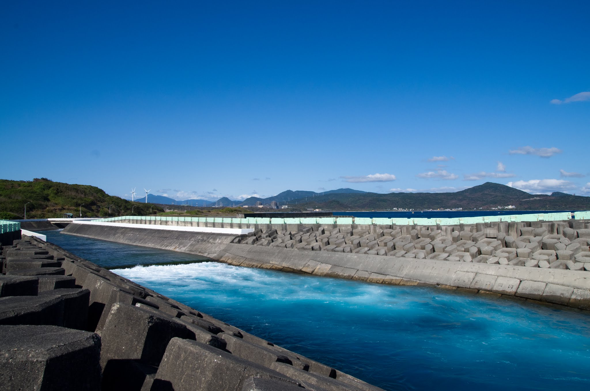

# Beyond NIMBY: Segmented Public Attitudes and Incentive Effects for Nuclear Facilities in Taiwan

#### Osbern Huang$^1$   Yu-tzung Chang$^2$
##### $^1$Research Fellow, Griffith University   $^2$Professor, National Taiwan University

<!--
[https://tinyurl.com/ASQPSNZ-9Jan-OH](https://tinyurl.com/ASQPSNZ-9Jan-OH)
-->

<!--  footer: Picture: Osbern Huang; Reactor coolant (sea water) discharge trench outside of Maanshan nuclear plant -->

<!--

'I begin my presentation today by acknowledging the ---- people, Traditional Custodians of the land on which we gather today, and pay my respects to their elders, past, present and emerging.

-->

---

>In the case of at least two twentieth-century inventions— plastics and nuclear fission—there are attempts to disinvent them because it’s now clear they are harming the planet. Progress doesn’t necessarily involve going forward at all costs. I’ve asked for my luminous blackboard to be returned to me.

In *Chronicles of a Liquid Society* by Umberto Eco, 2016

<!--  footer: SGIR Seminar Jul 2025 / Osbern Huang -->

<!--

Let me begin with a provocative quote from Eco's, almost his last, collection of quirky and wise essays.

This framing captures the tension at the heart of today’s talk.
Nuclear power, like plastics, was once a hallmark of scientific achievement. But its entanglement with environmental risks, political symbolism, and public fear has made it one of the most polarising technologies of our time.

In Taiwan, nuclear energy is not just a question of kilowatts. It's a battleground for ideology, identity, and entangled with national security and energy resilience."

If doing democratic research is professional, then doing this "side" nuclear research is personal. They are soul-searching questions.

-->

---

# Nuclear Power in Taiwan

  - 1970s–1980s: Taiwan embraced nuclear energy with the construction of **three nuclear power plants (NPPs): Jinshan, Kuosheng, and Maanshan.**
  - 1990s–2000s: After Chernobyl and democratisation, rising anti-nuclear sentiment led to delays in the construction of the Longmen Nuclear Power Plant (NPP4).

#### After the 2011 Fukushima nuclear accident...

- 2014: The KMT administration suspended the NPP4 project amid growing public opposition because of similar seismic risks.
- 2016–Present: The DPP committed to phasing out nuclear power by 2025

<!--  footer: Source: World Nuclear Industry Status Report; Hsu et al. 2017 -->

<!--

Taiwan’s nuclear journey began in the 1970s and ‘80s with the construction of three major nuclear plants: Jinshan, Kuosheng, and Maanshan. During this period, nuclear power was promoted as part of the island’s modernisation and industrialisation drive. Aslo, by then, Taiwan is still the age of Kuomintang's autocratic rules. There is no much opposition except for limited, local oppositions.

The 1990s and early 2000s saw mounting opposition, especially surrounding the Longmen or 'Fourth' Nuclear Power Plant. Anti-nuclear activism intensified following global incidents like Chernobyl and, later, Fukushima.

The Fukushima incident has triggered a comprehensive review of Taiwan's nuclear energy policy from top to bottom.

By 2014, even under the traditionally pro-nuclear KMT government, the Longmen project was suspended. And since 2016, the Democratic Progressive Party (DPP) has made a full phase-out of nuclear power by 2025 official policy, reaffirming this stance in the wake of the Fukushima disaster.

-->

---

# Current Status
- Chinshan (NPP1) was decommissioned in 2019, with Kuosheng (NPP2) scheduled for decommissioning by 2023 and Maanshan (NPP3) by 2025.
- Nuclear energy accounts for only about 5% of Taiwan's total electricity generation, down from nearly 20% in the early 2000s. (Since Jun 2025: 0%)

<!--  footer: Source: World Nuclear Industry Status Report; World Nuclear Association  -->

<!--
So where are we now?

Chinshan was decommissioned in 2019. Kuosheng followed in 2023. And Maanshan—Taiwan’s last operating plant—is scheduled to shut down this year, in 2025.

As a result, nuclear energy now accounts for zero percent of electricity generation, down from nearly 20% in the early 2000s. That shift has placed enormous pressure on LNG and renewable alternatives. But public attitudes toward a nuclear comeback remain divided—often not because of facts, but because of who’s speaking, and where the proposed plant might be built.

-->

---

# The Persistent Debate

- Political polarisation
- Power outages in Northern Taiwan (4 times in 2 weeks in early 2024)
- Expansion of high-tech/energy-intensive industries (TSMC: used up 9% of national electricity generation in 2023)

<!--  footer: Picture: National Museum of Taiwan History: The anti-nuclear march on May 5, 1991 - Anti-nuclear candlelight and father and son -->

<!--
- Events after events:
The debate over nuclear energy has persisted for over four decades, stemming from safety concerns, waste management issues, and environmental risks, especially after events like the Fukushima disaster.
- Political Polarization:

It is shaped by political polarisation—where nuclear energy has become associated with the KMT opposition, and opposition to it has become almost doctrinal within the DPP base.

The ruling Democratic Progressive Party (DPP) opposes nuclear energy, advocating for renewable energy and LNG, while opposition parties argue that nuclear power is essential for Taiwan’s energy security.

- Recent Developments:
Power outages, especially those that occurred four times in two weeks in Northern Taiwan in early 2024, have re-ignited public anxiety about energy security.

In a meantime, 

And as Taiwan deepens its position as a global semiconductor hub, led by energy-intensive giants like TSMC, the pressure on a stable electricity supply will only grow.

-->

---

# Taiwan's Energy Challenges

- Geopolitical Tensions
- Energy Security Concerns
- Environmental Goals

> If Taiwan reconsiders nuclear power, who is actually willing to host it?

<!--

However, even with all the controversy, the issue of nuclear energy has been discussed continuously, and it's even the only issue in the regular referendum in August this year. This controversy are deeply interwined to the island's three-level energy challenges:

First, geopolitical tensions. Taiwan’s energy supply is highly vulnerable to maritime disruptions. More than 97% of its energy is imported, largely via sea routes that could be blockaded by China during a military crisis.

Second, energy security. The margin for error is slim. Public frustration grows when outages occur—yet that frustration does not always translate into support for nuclear solutions.

Third, environmental goals. Taiwan has pledged carbon neutrality by 2050. But with nuclear out of the mix, this requires an extremely ambitious scale-up of renewables and LNG, which themselves raise environmental and logistical issues.

In this context, we ask: if Taiwan reconsiders nuclear power, who is actually willing to host it?"

-->

<!--  footer: Picture: China Times -->

---

# <s>Research</s> Questions

> "Do we really need nuclear power? Who the **** are supporting them?"

> "If we have no alternative, where should we build them and store all the radioactive waste?"

> "How can we/them persuade these people to accept these nuclear facilities?"

<!--
NPP3 is located in the heart of Taiwan's famous tropical beach resort and is close to an ecologically diverse National Park.
-->

<!--  footer: SGIR Seminar Jul 2025 / Osbern Huang -->

---

# Why NIMBY(Not In My Back Yard)ism? Size matters.

 
 
 
 
 
 
 
 
 
 

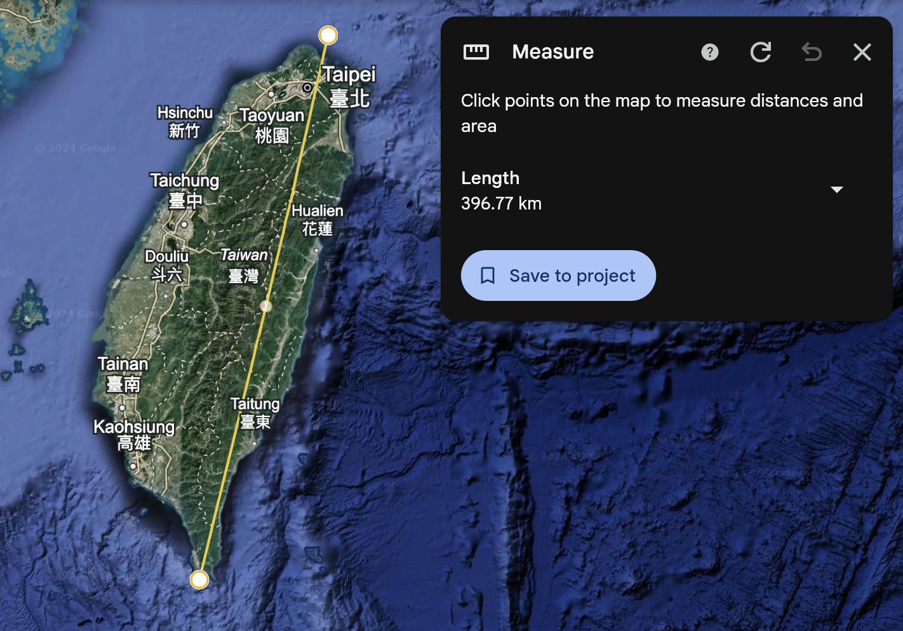
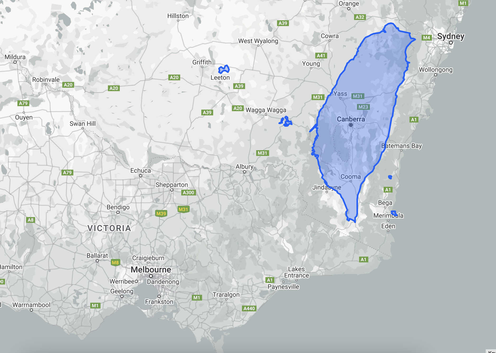
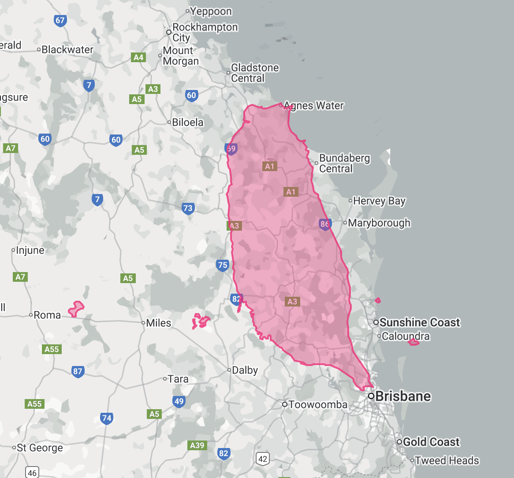

<!--  footer: thetruesize.com -->

<!--
Now let’s take a step back and think about why NIMBYism is especially pronounced in Taiwan’s nuclear debate.

At first glance, the concept of NIMBY—“Not In My Back Yard”—might sound like a universal psychological or political reaction to risk. But in Taiwan, the “back yard” is often not very far away. This is where size becomes a critical factor. Taiwan’s total land area is just over 35,000 square kilometres—comparable to the Netherlands—and much smaller than Australian states like New South Wales or Queensland. What that means in practice is that almost anywhere a new nuclear facility is proposed will be within close proximity to densely populated areas.

So the psychological distance between “support in principle” and “support in practice” collapses. Even if people agree with nuclear energy as a concept—because of its role in decarbonisation or energy security—they often draw the line at hosting it near their home or community. That’s the classic NIMBY dilemma. But in a compact democracy like Taiwan, nearly every location can plausibly be seen as someone’s back yard.

northernmost point to southernmost point

-->

---

# NIMBY phenomenon and Energy Policy

- "NIMBY": opposition to the development of infrastructure projects near one’s place of residence, despite *support* for projects (in principle).

- Unique challenges with energy development:
  - **Safety**: Fear of accidents (e.g. Fukushima disaster) and radioactive waste.
  - **Environmental impact**: Potential harm to local ecosystems.
  - **Distrust in authorities**: Skepticism about the government’s ability to manage risks and emergencies.

- NOPEs vs. NIMBYs: While NIMBYism can be mitigated through incentives, ideologically entrenched **"NOPEs" (Not On Planet Earth)** remain a barrier to infrastructure acceptance.

<!--  footer: (Gervers 1987; Dear 1992; Vittes, Pollock, and Lilie 1993; Schreurs and Ohlhorst 2015) -->

<!--
in Energy Policy:

Localised resistance due to perceived risks (health, safety, property value impacts).

Contradiction between general support for a policy and opposition to its implementation locally.

Often arises with projects involving nuclear plants, wind farms, or nuclear waste disposal sites.

Reactor coolant (sea water) discharge trench

-->

---

# NIMBYs, YIMBYs, and NOPEs

- NIMBY: Those who support development in principle but oppose local implementation
  - Ignorance, property value/selfishness, risks and distrust to authorities (Dear, 1992; Freudenberg and Pastor 1992; Devine-Wright, 2009; Burningham et. al, 2006)
- YIMBY: Those who actively support local implementation of infrastructure projects
  - Economic reason, environmental gains (Dear, 1992). Sometimes lead to *'reversed-NIMBYism'*(Konisky et al, 2020; Uiji et al, 2021)
- NOPE: Those who oppose infrastructure projects under all circumstances
  - Ideologies and institutional factors (Wolsink, 2000), like deep partisan division on nuclear power in Taiwan.

<!--
NIMBY:
Perceived Risks: Environmental damage, health hazards, or safety concerns (Devine-Wright, 2009).
Loss of Property Value: Opposition often stems from fears of reduced home values (Dear, 1992).
Distrust in Authorities: A lack of confidence in government or developers to manage risks effectively (Burningham, Barnett, & Thrush, 2006).
YIMBY:

-->

<!--  footer: SGIR Seminar Jul 2025 / Osbern Huang -->

---

# Research Questions

- **RQ1.** What specific factors influence Taiwanese citizens to identification as NOPE, NIMBY, or YIMBY regarding nuclear energy?

- **RQ2.** How responsive are these distinct groups to policy interventions aimed at mitigating local resistance to nuclear power infrastructure?

---

# Key Gaps in the Literature

- Lack of "national" public opinion research:
  - Few studies empirically test NIMBY attitudes and their underlying factors *nationally*, except for Konisky et al. (2020) and Uiji et al. (2021).
- Regional and temporal limitations:
  - Most studies focus on the US or West European countries, with limited research on the Asia-Pacific region (except for Japan after 2011).
  - Many foundational studies are outdated, failing to address modern geopolitical and energy challenges.
- Limited evidence for policy tools on other segments:
  - Minimal empirical evaluation of strategies like financial incentives or community investments on mitigating ideological resistance (i.e. NOPEs).

<!--  footer: SGIR Seminar Jul 2025 / Osbern Huang -->

---

# Research Questions & Hypotheses (1)

- **RQ1** What specific factors influence Taiwanese citizens to identification as NOPE, NIMBY, or YIMBY regarding nuclear energy?

|    | NOPE | NIMBY | YIMBY |
|:--|:--:|:--:|:--:|
| 1. Party ID (DPP) | + |  |  |
| 2. Current EPZ (Emergency Planning Zones) residents |  | +  | - |
| 3. Experienced power outage | - |   |   |
| 4. Expect military risk with China | - |   |   |
| 5. Positive attitude to NP | - | + |  + | 

<!--

- H1-1: Political cleavage matters (DPP supporters are NOPEs, while supporters of opposition parties are NIMBYs and YIMBYs).
- H1-2: People living within the "emergency planning zones" (EPZs) of current nuclear plants (within a 20 km radius) may not oppose nuclear power, but are more likely to be NIMBY.
- H1-3: People who have experienced outages may support nuclear power but are less likely to be YIMBY.

-->

---

# Data Collection Through Online Survey

- **Implementation Date**: 17 May to 30 June 2024

  - **Recruitment**: Non-probability panel recruited for academic research (NTUWS) with demographic quota controls
  - **Sample Size**: n= 5,304 (4,402 after quality-check process)
    - Cases dropped if: speeders, inattentive respondents (did not pass attention check), respondents without residential postcode information, and those who select a non-land area in heatmap questions

<!--  footer:  -->

---

# RQ1: Finding NOPEs, NIMBYs, and YIMBYs

#### Step 1: Identifying NOPEs

1. *What is your preference for the future development of the following power generation methods in Taiwan? [Nuclear Power]*

- Immediately increase development (1), Gradually develop (2), Reduce development but remain as part of the power generation mix (3) $\rightarrow$ *Continue to next question* 
- Immediately stop development (4)  $\rightarrow$ *Recoded as "NOPEs"*: $0$ for the distance 

---

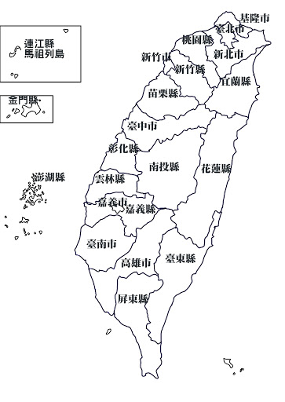

#### Step 2: Differentiating NIMBYs and YIMBYs via *Siting Preferences*

2. Assuming that a new nuclear power plant is needed in Taiwan in addition to the existing nuclear power plants in order to ensure an adequate supply of electricity:

*Where do you think would be the best place to build it? Please click on the following map of Taiwan to find out where you think the best location would be.^*

<!--  footer: ^Please note: Due to the basic principle of high voltage power transmission, the nuclear power plant will be located mainly on the main island, and those who choose an off-island or off-shore location will be regarded as an invalid answer. -->

---

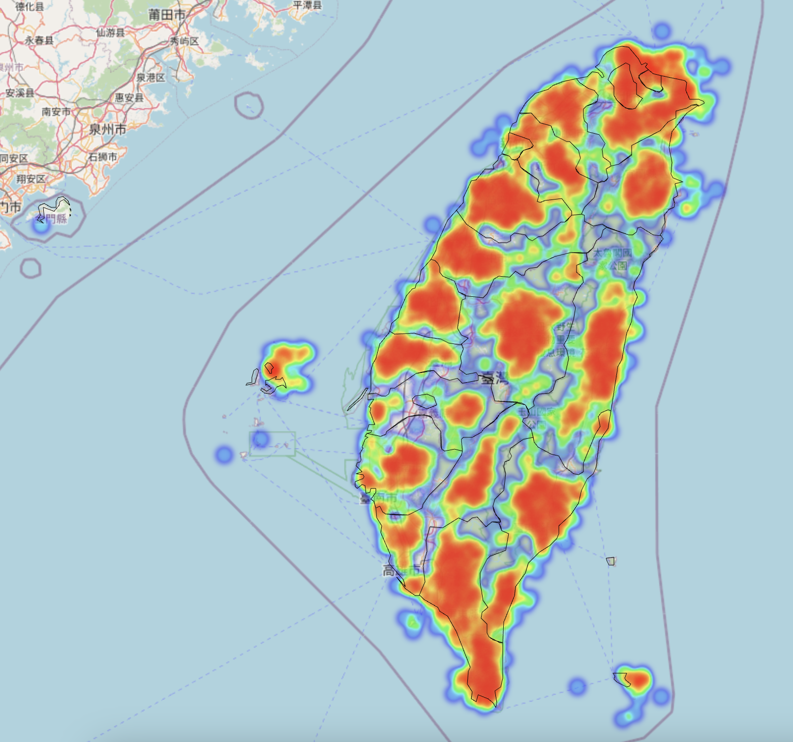
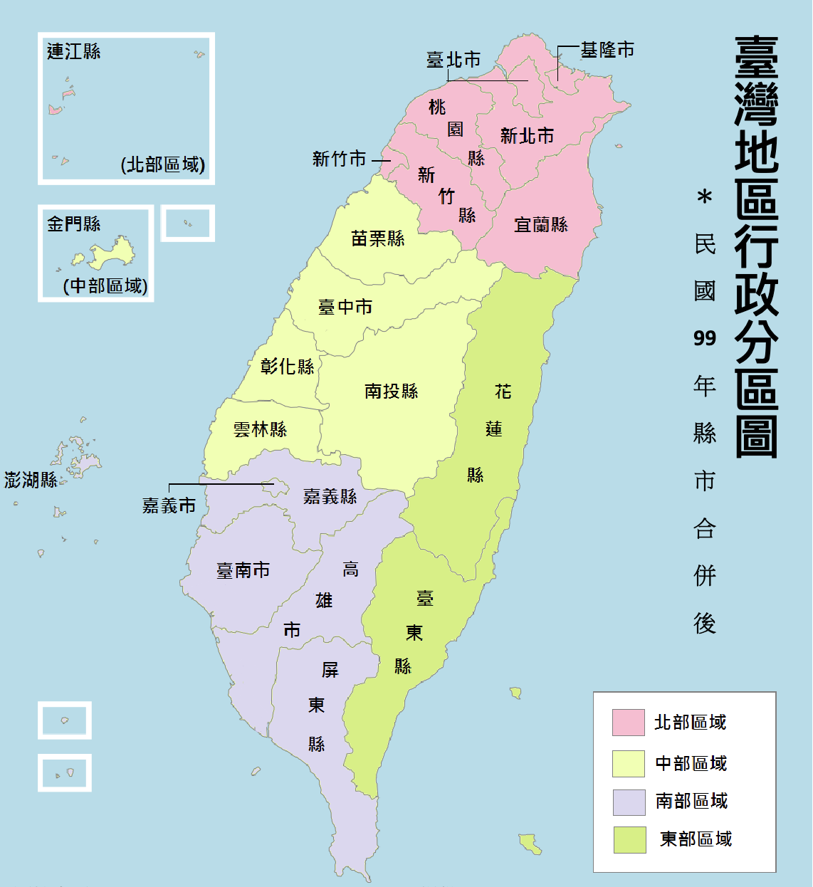

## Dependent Variables: Heatmap question with georeferencing

1. Haversine distance calculated from the residential postcode to the preferred site (KM).
2. Categories:
- NOPEs: Respondents select "Immediately stop development" for Nuclear Power.
- NIMBYs: Respondents pick a nuclear facility site outside the "region" where they reside.
- YIMBYs: Respondents pick a nuclear facility site within the "region" where they reside.

<!--  footer: SGIR Seminar Jul 2025 / Osbern Huang -->

---

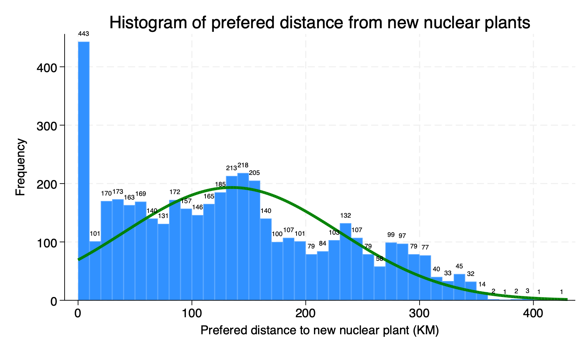

## Model Selection for Q1 & Segmentation of Pre-treatment Preference

  - Hurdle model for Haversine distance (NOPEs as $0$)
  - Multinomial logit model for categorisation: 
    - NOPE
    - YIMBY
    - NIMBY

<!--  footer: SGIR Seminar Jul 2025 / Osbern Huang -->

---

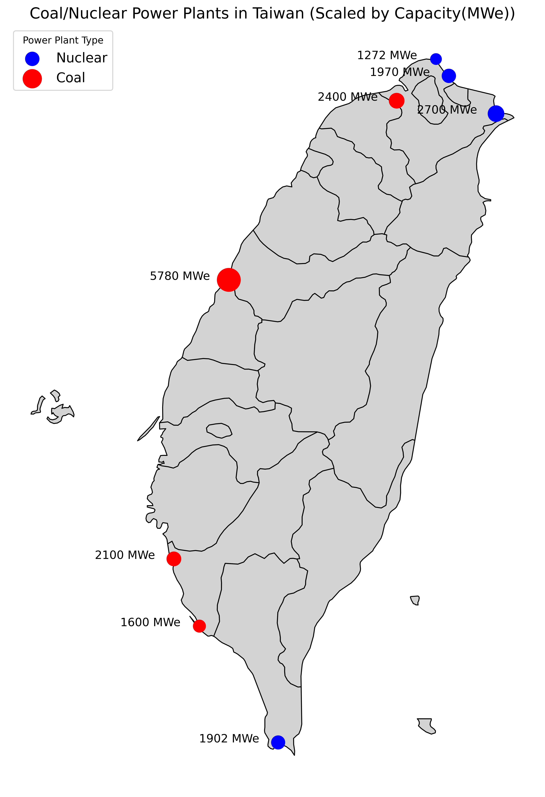

# Independent Variables

- Party ID
- Experience of power outage after April 2024
- Expectation of Chinese military action next year
- Reside within current EPZ (20 km radius)
- Attitudes toward nuclear power (clean, cheap energy source or not)
- Demographical controls (gender, education, age)

<!--  footer: SGIR Seminar Jul 2025 / Osbern Huang -->

---

# Results: RQ1

---

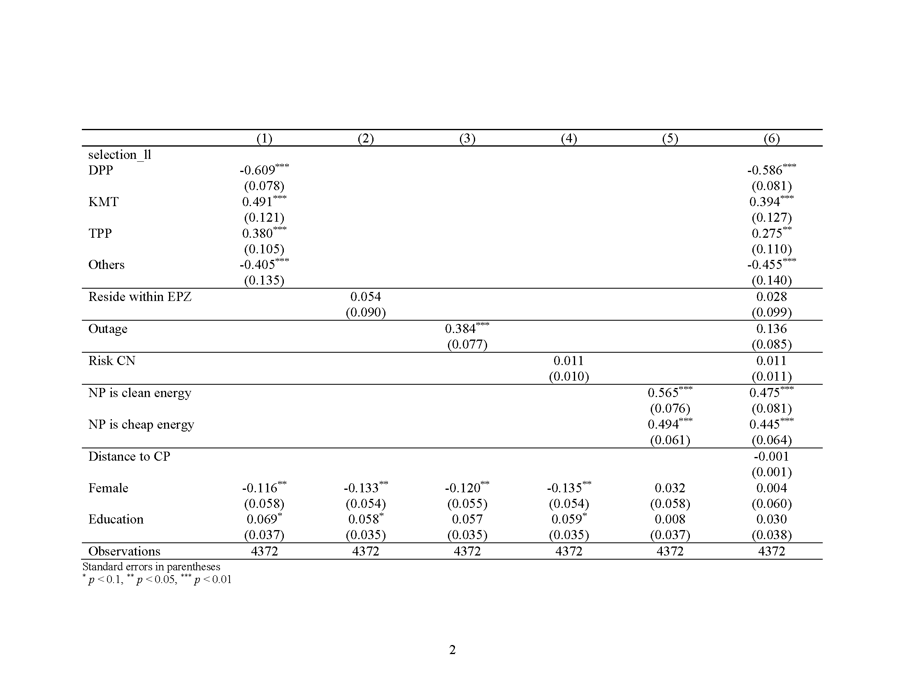

---

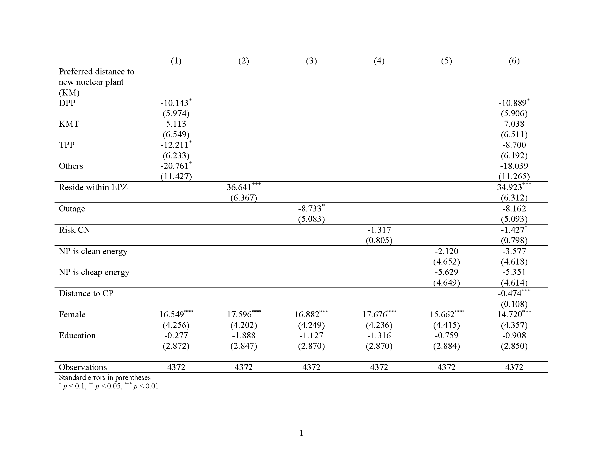

---

# Multinomial Logit Model for Three Categories

 
 
 
 
 
 
 
 
 
- The effect of Party ID and ideology (nuclear attitudes) remains, while the effects of others have diminished.

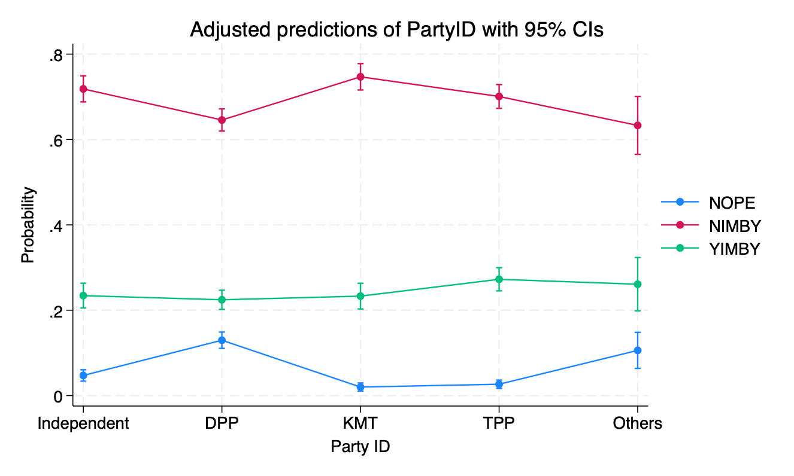
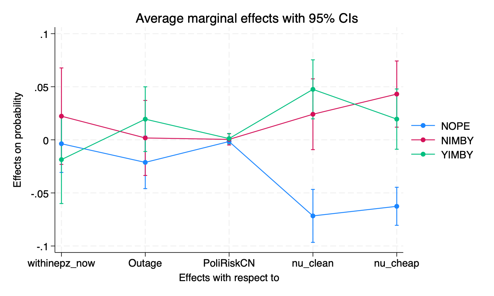

---

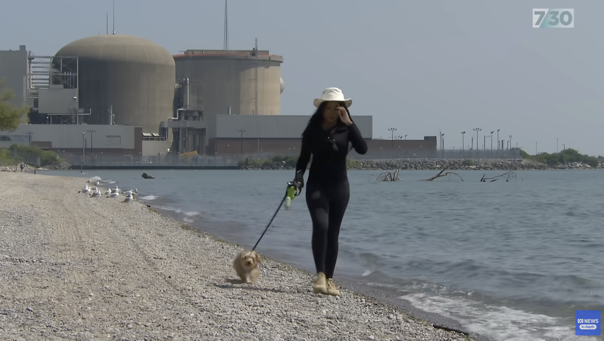

# Ways to Solve "NIMBY Syndrome"

There several approaches being used to address NIMBY syndrome :
- Financial Incentives
- Community Investments
- Public Participation and Transparency

<!--  footer: (Frech, 1991; Richmond, 2002; Toke, 2005; Gallo, 2019; Konisky et al, 2020; Wolsink, 2000); Picture: ABC -->

---

# Research Questions & Hypotheses (2)

- **RQ2.** How responsive are these distinct groups to policy interventions aimed at mitigating local resistance to nuclear power infrastructure?

|    | NOPE | NIMBY | YIMBY |
|:--|:--:|:--:|:--:|
| 1. Transparency (Safety) | X | + | + |
| 2. Financial incentive (Cash) | X | +  | + |
| 3. Community investment (Infrastructure) | X | +  | +  |

<!--

  - **H2-1:** Money talks. Only cash benefits can compensate for the undesirability of nuclear waste. 
  - **H2-2:** However, only NIMBYs and YIMBYs can be influenced by compensation, while NOPEs won't respond to any incentives. 

-->

<!--  footer: SGIR Seminar Jul 2025 / Osbern Huang -->

---

# RQ2: Vignette Experiment

- The experiment included four arms to reflect three policy tools:
  - Control (X-control)
  - Control + Safety (S)
  - Control + Safety + Cash (S+C)
  - Control + Safety + Cash + Infrastructure (S+C+I)
- We did not utilise factorial design due to reduced statistical power ($2^3=8$ group is too many as anticipated treatment effects may be super low)
- We can no longer use NPP as a dependent variable content (because existance of NOPEs completely exclude their construction in theory), we instead use another nuclear energy construction — waste storage site — to measure the policy's effect.

<!--  footer: SGIR Seminar Jul 2025 / Osbern Huang -->

---

# RQ2: Vignette Experiment

> (Control) In order to dispose of the nuclear waste generated by nuclear power generation, Taiwan needs to build a new storage site. (Safety) It is assumed that the storage site will be buried more than 3,000 metres deep underground and that the ground will be free from radiation. (Financial) At the same time, nearby residents would receive cash subsidies of up to **NT$20,000 (AUD 1,000) per month**, (Community) and the government would build and maintain public facilities such as parks, schools, hospitals, and nursing homes. 

**Where do you think would be the best location for a nuclear waste storage site? Please click on the map of Taiwan below to find out where you think the best location is.^**

<!--  footer: ^Same map from the previous question shown to the respondent again following this question. -->

---

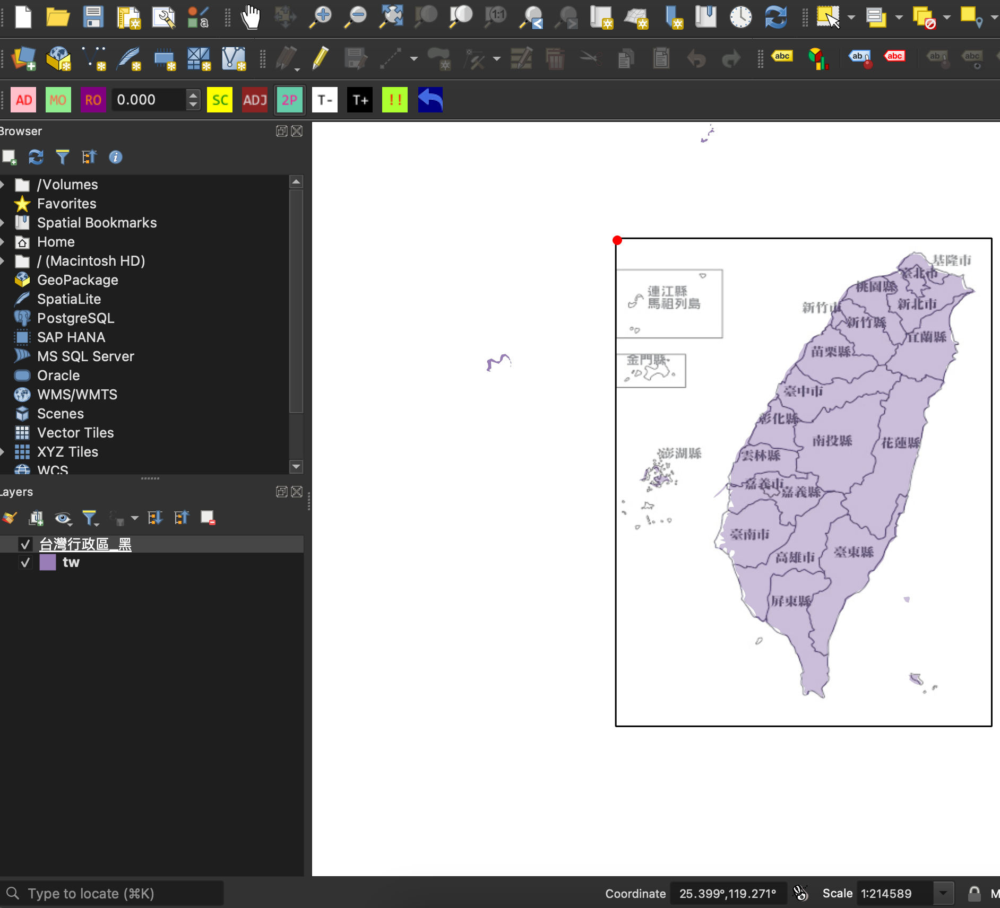

## Dependent Variable:

Haversine distance calculated from the residential postcode to the selected point (KM).

<!--  footer: SGIR Seminar Jul 2025 / Osbern Huang -->

---

# Results: RQ2

---

# Vignette Experiment: Average Marginal Effect

 
 
 
 
 
 
 
 
 
 
 
 
 

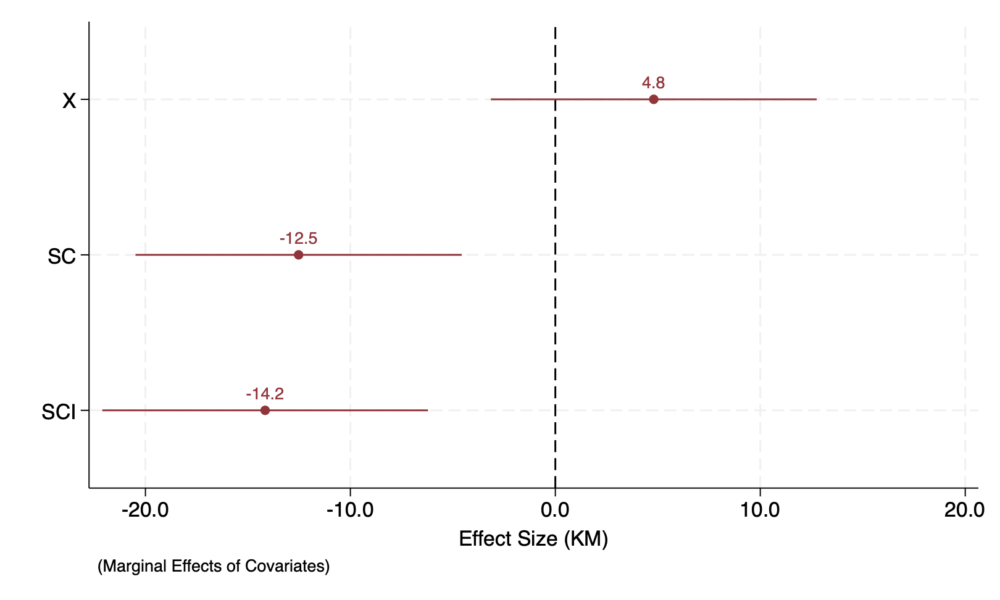

---

# Marginal Prediction: NOPE, NIMBY and YIMBY
 
 
 
 
 
 
 
 
 
 
 
 
 
 

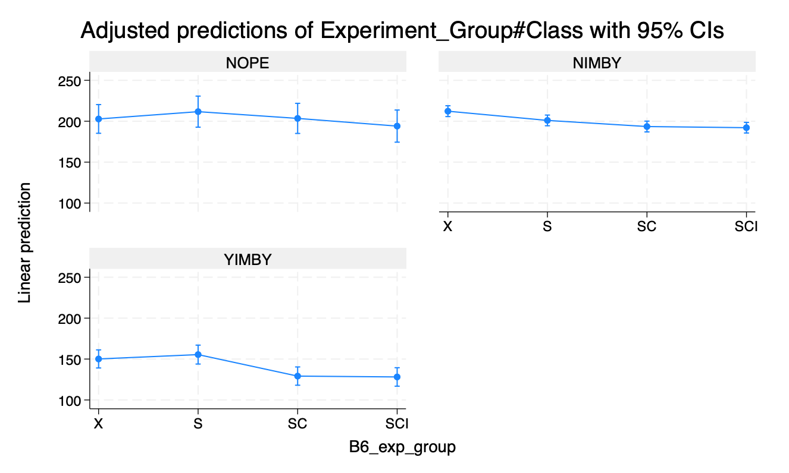

---

# Marginal Prediction: NOPE, NIMBY and YIMBY
 
 
 
 
 
 
 
 
 
 
 
 
 
 

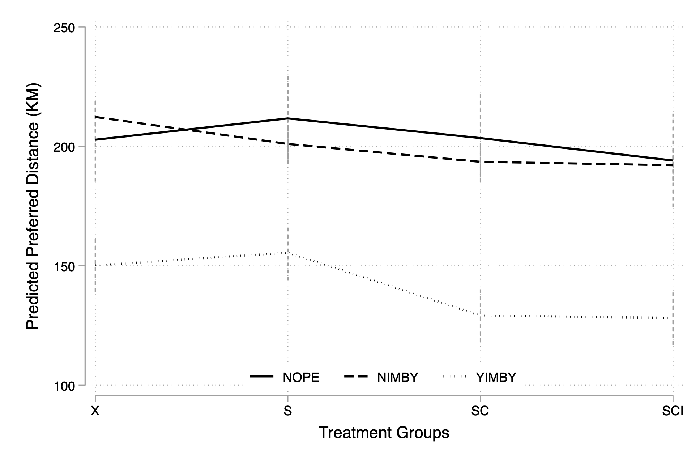

---

# Summary of Quantitative Findings

| RQ1 (Segmentation) | RQ2 (Policy Tools) |
|:--|:--|
|  1. (DPP) Partisanship as a key NOPE driver   2. Limited impact of power outages and perceived risk from China   3. True NIMBYism among nuclear *"supporters"*   4. EPZ residents: not anymore |  1. Safety claims only are ineffective   2. Cash benefit is the only effective tool, but   3. NOPEs can not be bought out   4. Segmentation matters   |

<!--
1. The categorization of "NOPE" (Not On Planet Earth), "NIMBY" (Not In My Back Yard), and "YIMBY" (Yes In My Back Yard) is meaningful for understanding public attitudes toward nuclear power in Taiwan.
2. Political partisanship strongly influences nuclear power attitudes, with supporters of the pro-independence DPP significantly more likely to fall into the "NOPE" category.
3. Ideological alignment with nuclear power can shift individuals from "NOPE" to "NIMBY" but is insufficient to move them into the "YIMBY" category.
4. Contrary to expectations, direct experiences with power outages have no significant effect on nuclear power support.
5. Concern about potential disruptions from a Chinese blockade significantly increases YIMBYism, showing geopolitical risks as a key motivator.
6. Residents currently living in Emergency Planning Zones (EPZs) for nuclear power plants exhibit strong NIMBY attitudes, opposing new developments in their vicinity again.

---

1. Efforts to reassure the public with transparency or safety guarantees have no measurable effect in reducing NIMBY attitudes.
2. Direct financial compensation works to mitigate NIMBY attitudes and increase support among "NIMBY" and "YIMBY" groups.

However, NOPEs remain resistant: Ideological opposition in the NOPE group cannot be addressed through cash incentives or other practical benefits.

-->

---

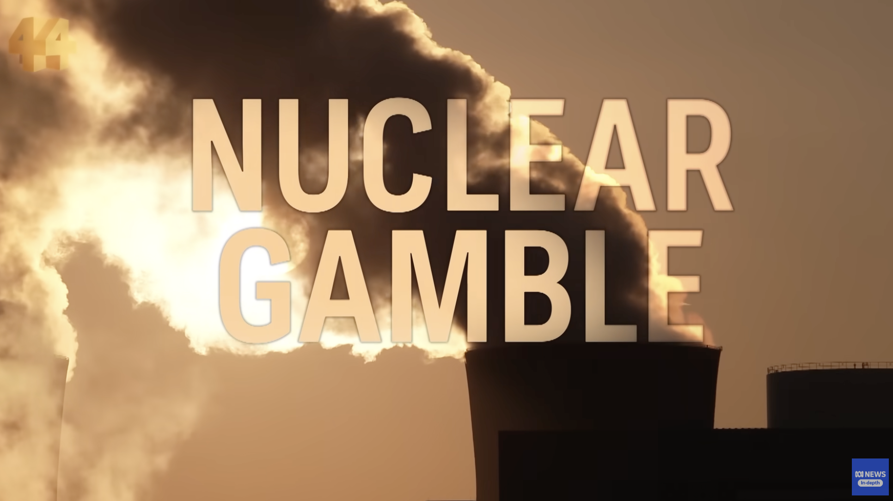

# Implications Beyond Taiwan

1. Nuclear power as a cultural and political issue
2. Geopolitical threats do not guarantee support: implication for Europe (and contrary to Polish experience)

<!--

1. Public attitudes toward nuclear power can be deeply polarized by partisanship, making it part of broader cultural and political divides.

Similar to Taiwan, nuclear power in Australia remains a divisive issue influenced by political alignments and ideological stances.
Geopolitical Threats Do Not Guarantee Support:

2. Despite Taiwan’s vulnerability to a Chinese military blockade, this threat has not translated into greater public support for nuclear power as a solution for energy self-reliance.

European countries under similar threats from Russia (e.g., energy crises due to gas cutoffs) should consider that geopolitical pressures alone may not foster public acceptance of nuclear energy.
The Double-Edged Nature of Nuclear Power:

3. Nuclear facilities can be both an asset and a liability during conflicts.
Example: The Zaporizhzhya Nuclear Power Plant in Ukraine demonstrates how nuclear infrastructure can become a strategic and humanitarian risk during military escalations.
Nations need to weigh the risks of nuclear plants becoming targets or liabilities in geopolitical conflicts.
-->

<!--  footer: Picture: ABC   ASQPS Conference 2025, Wellington / Osbern Huang & Yu-tzung Chang -->

---

# Methodology Implications

1. Heatmap Surveys with Georeferencing
  - Interactive maps capture spatial preferences. 
  - Enables precise analysis of concept like NIMBYism using distance metrics.

2. Segmented Analysis of Policy Effects
- Classifies respondents as NOPEs, NIMBYs, or YIMBYs before survey experiment.
- Reveals policy effect like cash benefits work for NIMBYs but fail to shift NOPEs.

<!--  footer: SGIR Seminar Jul 2025 / Osbern Huang -->

---

<!--
_color: 
-->

# Thanks for having me!

<!--  footer: Picture: Osbern Huang; Reactor coolant (sea water) discharge trench outside of Maanshan nuclear plant -->