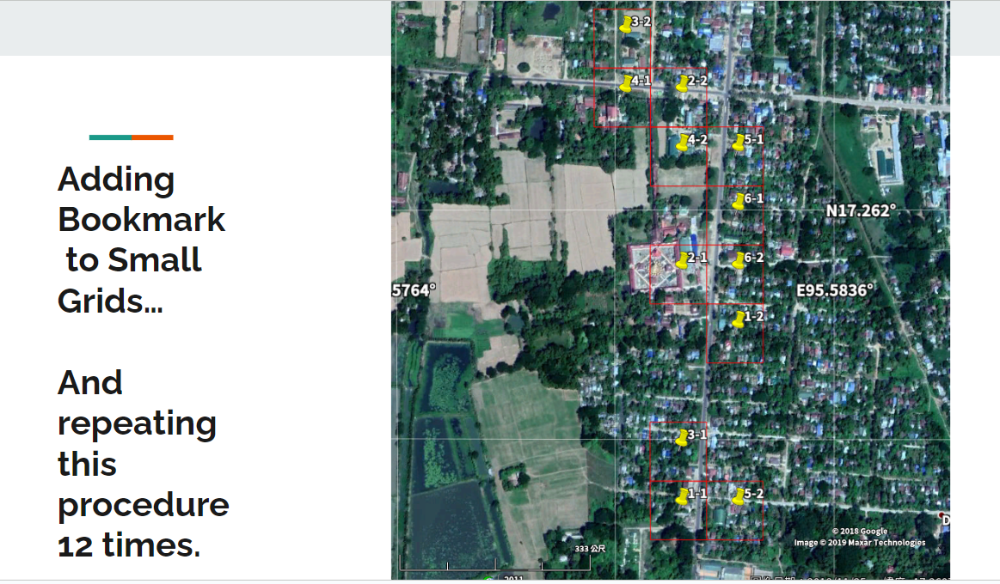

# Dr Osbern Haung

#### Visiting Fellow, CSRM   Research Fellow, Asian Barometer Survey

---

<!--  footer: SRC talk / Osbern Huang -->

---

---

---

# NTUWS (NTU web survey)

---

---

# Member Recruitment: 

- 100% opt-in, anonymous panels 
- Verification mechanism to avoid non-probability samples
- Users must read and agree to the informed consent and data usage rights
 - Input birth year, gender, education level, residence city, and a simple name
 - Verify phone number and email through confirmation messages
 - Become a registered test subject eligible for questionnaires and rewards (Figure 1)

---

# Our current challenges:

- Difficulties in shifting to a probability-based panel 
    - phone
    - in-person
    - sms invitations have all ended in failure
        - panel retention rate (registered at the first place but lost follow-up) is super low (~9%)

- Unable to conduct lengthy questionnaires
    - Success rate for surveys lasting over 30 minutes is less than 5%.

---

---

---

# Thanks for having me and hope to learn from the best practice!

