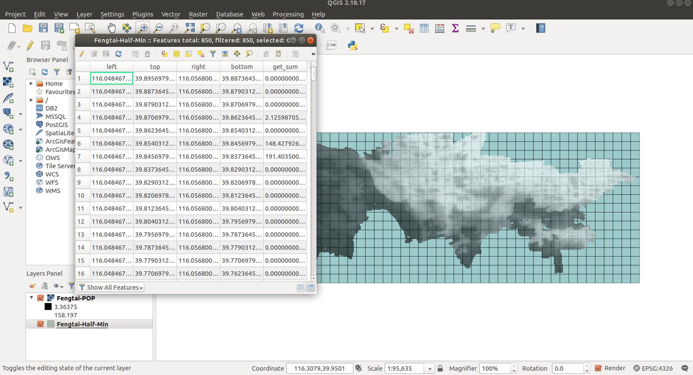
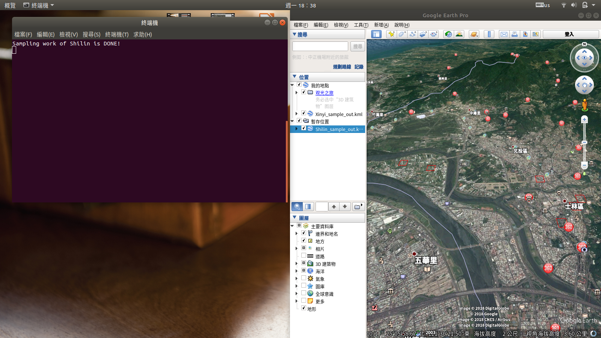
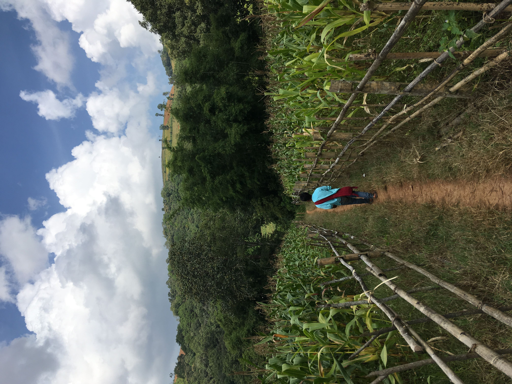
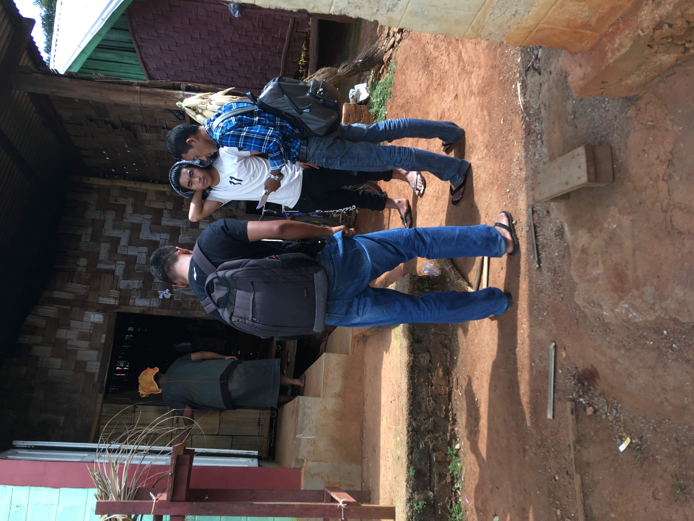
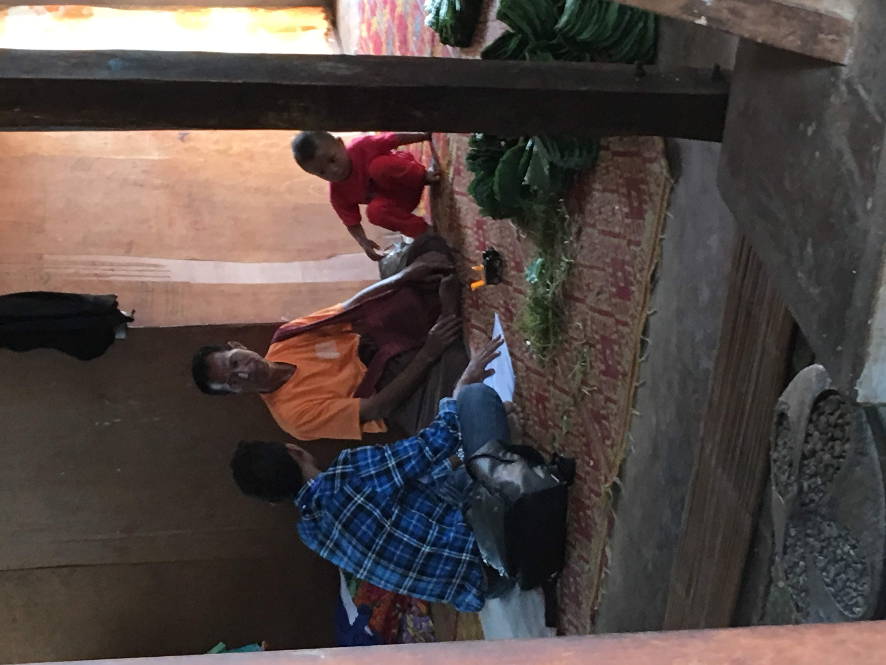

# Overcoming Sampling Challenges in Hostile Environments: Asian Barometer Survey's Experience in Myanmar and China


## Osbern Huang

#### Visiting Fellow, Centre for Social Research & Methods, ANU <br> Associate Research Fellow, Asian Barometer Survey, NTU

<!--  footer: WAPOR Annual Meeting, Salzburg / Osbern Huang -->


<!--

'I begin today by acknowledging the Ngunnawal people, Traditional Custodians of the land on which we gather today, and pay my respects to their Elders past and present.

---

# Outline 
- Background: Asian Barometer Survey Wave 5 (2017-2019)
- Context: Myanmar, China and beyond
- Exisitng GIS/GPS sampling methods
- Our methodology innovation: 
- Results
- Discussion and survey sampling in the future

-->

---


- 2001 W1: 8 countries $\Rightarrow$ 2021 W5: 17 countries
- PPS sampling used in fourth wave (2015):

| Mainland China | Myanmar |
|----------------------------|---------------------|
| PSU: Province/City (125) <br> SSU: Town/County (2) <br> TSU: Village/Neighborhood <br> - *Hukou data* |  PSU: Townships (36) <br> SSU: Villages/Wards (3) <br> - *landmark sampling*  |

- Within household selection with Kish table

---


# Diffiiculties Surfaced During Wave 4 (2018)...

- In most places, electoral registers and postcode addresses were used as sampling frames (Lynn & Taylor, 1995).
- People DO move (Landry & Shen, 2005; Chen et al., 2018)
    - Migrants, temporary or seasonal workers, students, etc.
- Government officials DO NOT want to share household registration data anymore.
    - Or, they simply don't have it.


<!--
In the first model, we discovered that the variables capturing elements of "Worthiness" – specifically "LDV," "Diffuse regime support," and "NLD supporter" – are all significant. These variables, which represent people's attitudes toward democratic governance and the legitimacy of the incumbent NLD administration, act as positive predictors for attending a demonstration or protest march.

In the second model, which concerns the willingness to take action for a political cause regardless of the associated risks, both "LDV" and "NLD supporter" remain significant. However, "Diffuse regime support" does not significantly predict the dependent variable in this model. This suggests that public support for Myanmar's semi-democratic political system isn't robust enough to drive their willingness to take political actions despite potential risks.

The variables "Social group participant" and "Trust most people" represent the "Unity" element of the WUNC concept in both models. Both are significant predictors for attending demonstrations and taking risky actions for a political cause. This suggests that individuals who are more socially involved and have a greater trust in others are more inclined to participate in collective political actions.

Regarding the control variables, factors such as age, ethnicity, and religion influence the dependent variables to varying extents. In the second model, Buddhism emerges as a significant predictor (coefficient 0.661, p<0.05), implying that Buddhists might be more likely to take risky actions for a political cause. This is consistent with observations of increased riots against the military rule after the coup, especially in the Burmese heartland (Pedersen, 2023).

-->

---

# Objective of the Research

- Emergency problem-solving-oriented project.
- Without...
    - Electoral/household registers and postcode addresses in China and Myanmar.
    - Long-term guarantee for the survey permission from the GAD or government officials.
 - We won't have a reliable sampling frame for the last stage of the PPS sampling.
 - With emerging resources of GIS data, we have a chance to utilize it for survey sampling.


---

# Referencing Existing GIS/GPS Sampling Method

<center>


</center>

- (Landry & Shen, 2005): Had been used in waves of nationwide surveys in China.
- PSU: Province/City
- SSU: Town/County
- TSU: Half-minute grid (about 900m $\times$ 900m) or $\frac{1}{8}$ minute grid (225m $\times$ 225m)
- (QSU: Small grid (about 90m $\times$ 90m) )
- Collect *all adresses* within small grids
- Within household selection

---

<center>


</center>

- An R package generating primary sampling units (PSUs) for household surveys using gridded population data.
- Useful when census data are outdated or inaccurate.
- Supports stratification, oversampling, and spatial sampling.
- Replicate the 2010 Rwanda Demographic and Health Survey sample using WorldPop 100 m x 100 m gridded population data, and compares the results with the original survey sample.

<!--  footer: ""  -->


---

# Shortfalls of the Existing Method:


 - Sampling must be performed manually, lacking automation: manual exclusion of empty grids leads to increased time and cost.
 - The need to gather country-specific data is cumbersome; a universal solution is desired.
 - The entire process is notably time-consuming, particularly when under tight time constraints.

<!--  footer: WAPOR Annual Meeting, Salzburg / Osbern Huang -->

---

# Our Aimbition

- Conduct PPS **directly** using geo-information of population distribution.
- **Automate** the calculation and exclusion processes through programming.
- Develop an easy-to-use program utilizing **FREE** resources.


---

# Resources We were utilizing

- Employed OSM Boundaries (OpenStreetMap) for sourcing```.shp files```


---

# Resources We were utilizing

- Employed WorldPop 100 m x 100 m gridded population data for sourcing gridded population data.


---


# Work Flow

1. Manually download UN-adjusted gridded population estimates from Worldpop.
2. Batch download administrative boundary ```.shp``` files using ```curl``` from OSM boundaries.
3. Utilize the administrative boundary as a frame and apply the ```GDAL``` function in QGIS to segment Worldpop estimates into sub-administrative files.
4. Grid the sub-administrative population file and compute the population count within each half-minute grid.
5. Repeat the process to produce corresponding smaller grids (100m x 100m).
6. Review and verify the results.

---


Using ```QGIS``` to calculate population within small grids over certain district.
- Illustration with Beijing-Fentai country




---

Finish the sampling precedure with ```Linux shell``` scripts, automatically.




---


<video src="抽樣程式說明.mp4" controls width="100%"></video>


---

# Fieldwork Supplies for Supervisors/Interviwers

In every TSU, our fieldwork supervisors and interviewers will be provided with:


---

# Tools Utilized On-Site


- GPS devices (basic smartphone works!) for precise location tracking.
- Google Earth/Maps for navigational guidance.
- Pen and paper for documentation.

---


# Finally, we put everything together in China (2018) & Myanmar (2019).


---


---




---






---


---


---

# Sample Representativeness and Weighting

- Raking procedure applied to our data, adjusting the weights based on three key variables: gender, age, and geographical distribution.
- Goodness-of-fit tests with Stata module```mgof```


---

##  China
  - Education: Highlighting those with College education and above.

|    |  Sample |  Population |   |
|:---:|:---:|:---:|:---:|
| No college degree   | 81.48 | 81 | P>.05
| College $\Uparrow$ | 18.52 | 19 |

  - Party membership status

|    |  Sample |  Population |   |
|:---:|:---:|:---:|:---:|
| CCP member  | 11.58 | 9 |  <font color = "cranberry"> P<.01 </font> |
| Not CCP member| 88.42 | 91 |

---


##  Myanmar
  - Education: Highlighting those with College education and above.

|    |  Sample |  Population |   |
|:---:|:---:|:---:|:---:|
| No college degree  | 90.17 | 90 | P>.05
| College $\Uparrow$ | 9.83 | 10 |

  - Buddhism Religion

|    |  Sample |  Population |   |
|:---:|:---:|:---:|:---:|
| Buddhism  | 86.78 | 88 | P>.05
| Not Buddhism | 13.22 | 12 |


---


# Discussion and Conclusion

- **Feasibility in Developing Countries**:
  - GIS and GPS-assisted sampling emerges as a potent and feasible solution for conducting face-to-face surveys in developing nations.

- **Credible Sample Frame**:
  - One of the fundamental advantages is its ability to provide a credible and robust sampling frame, particularly in places where traditional means might fall short.

---


# Discussion and Conclusion (Cont'd)

- **Automation Through Programming**:
  - The integration of this method with programming languages facilitates easy automation, making the entire process efficient and scalable.

- **Ensuring Sample Representativeness**:
  - Drawing from our experience with the Asian Barometer Survey (ABS), we affirm that this approach doesn't just simplify the sampling process but also significantly aids in achieving a representative sample.


---


# Thanks for having me!


