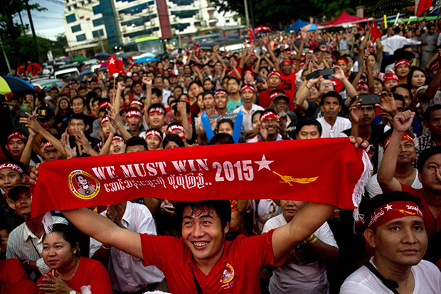
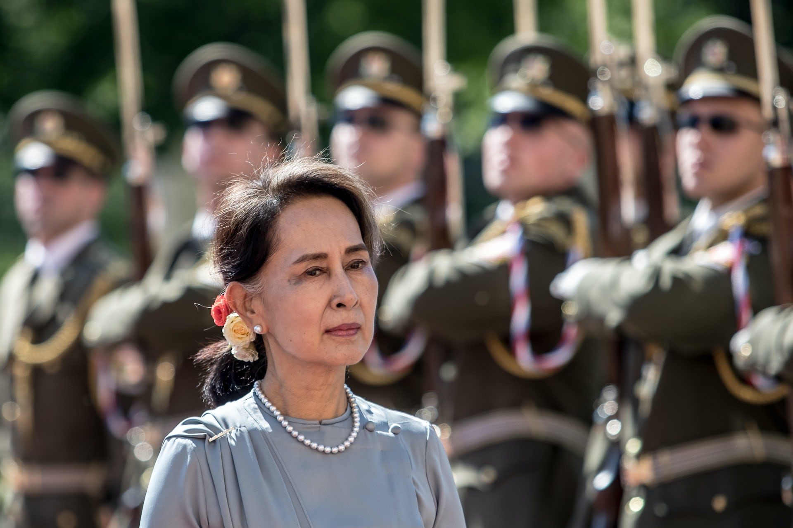
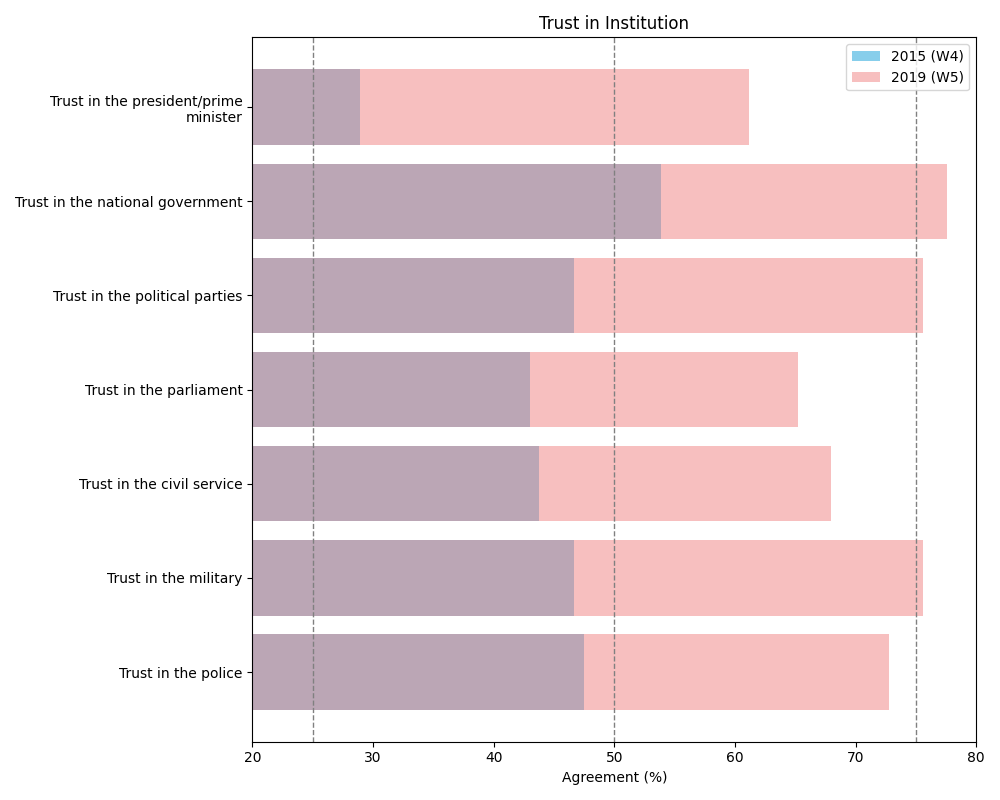
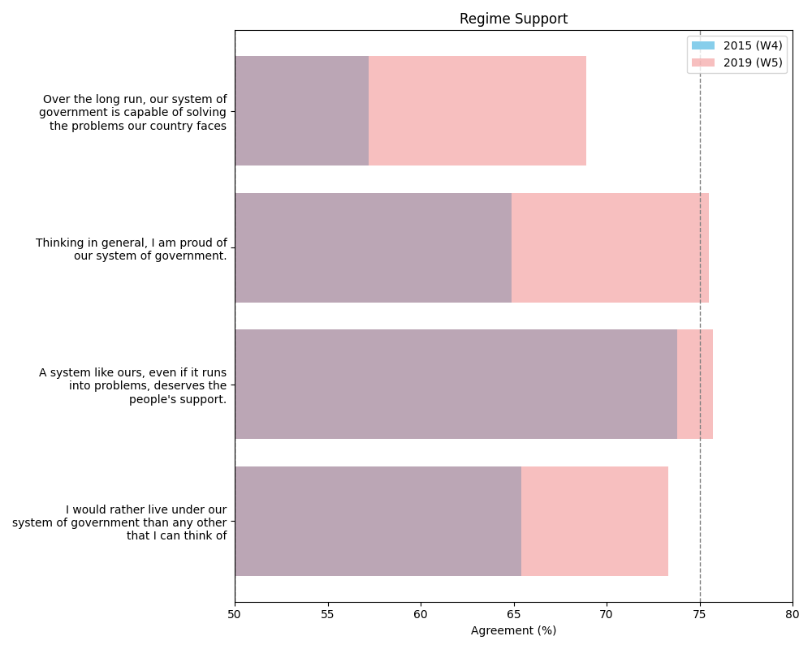
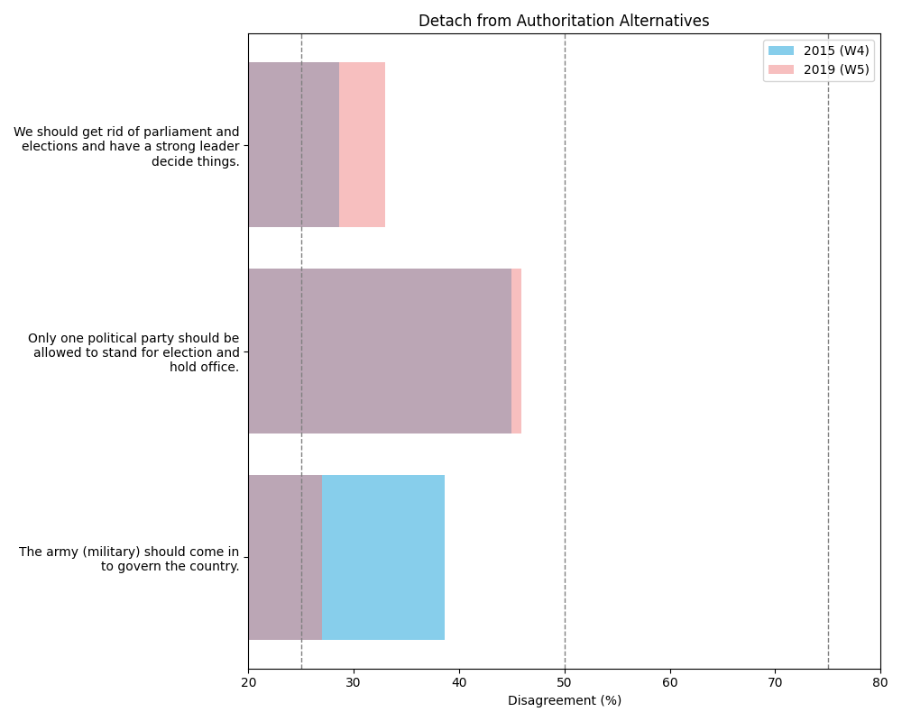
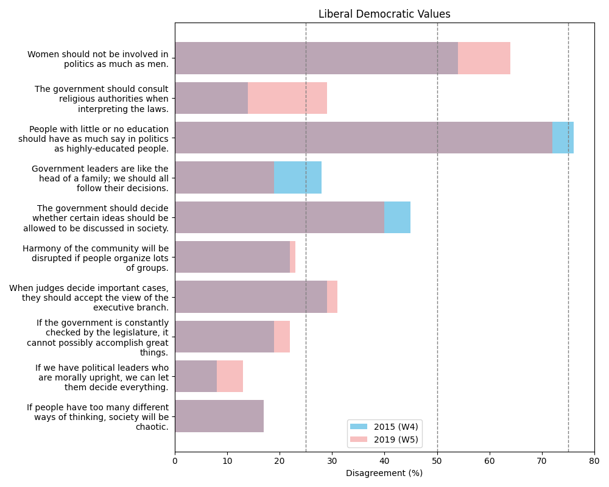
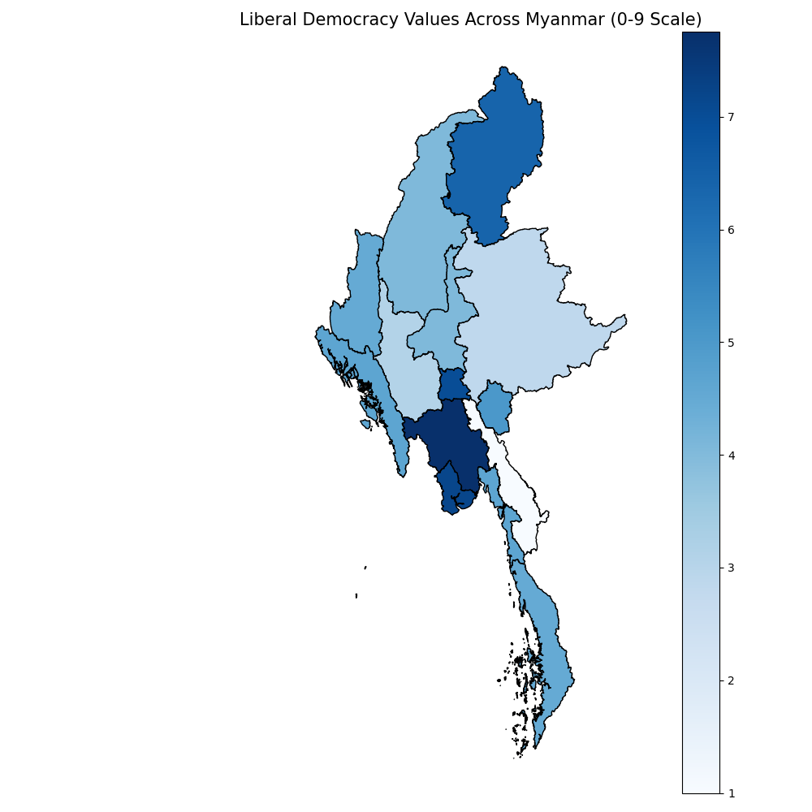
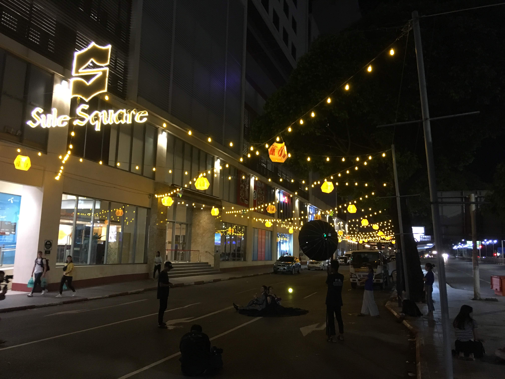

# The Evolution of Attitudes Towards Liberal Democracy in Myanmar Under the NLD Administration

## Osbern Huang

###### Assistant Research Fellow,   Asian Barometer Survey / Hu Fu Centre for East Asian Democracy   National Taiwan University

<!--  footer: WAPOR Asia-Pacific Annual Conference, Canberra / Osbern Huang -->

<!--

'I begin my speech today by acknowledging the Ngunnawal people, Traditional Custodians of the land on which we gather today, and pay my respects to their elders, past, present and emerging.

-->

---

# 
#
#
#
#
#
## &emsp;&emsp;2007 &emsp;&emsp;&emsp;&emsp;&emsp; 2010 &emsp;&emsp;&emsp;&emsp;&emsp; 2015 &emsp;&emsp;&emsp;&emsp;&emsp; 2020

<!--  footer: Images from (left to right): The Guardian/Bangkok Post/AsiaSociety/The Conversation-->

<!--

Before I dive into numbers and digits, I believe it would be quite helpful for me to give some background briefing the distressful political history.

2007
Saffron Revolution: Widespread protests led by monks against the military regime, named for the color of the monks' robes.
2010
General Election: The first elections in two decades; the military-backed Union Solidarity and Development Party (USDP) wins amid allegations of fraud and voting irregularities.
Aung San Suu Kyi's Release: The pro-democracy leader and Nobel Peace Prize laureate is released from house arrest.
2011
Transition to Civilian Government: Thein Sein, a former general, becomes president in a move towards a civilian government.
Economic and Political Reforms: Initiatives to open up the economy and increase political freedoms begin.
2015
General Election: Aung San Suu Kyi's National League for Democracy (NLD) wins a landslide victory, leading to the first non-military president since the 1962 coup.
2017
Rohingya Crisis: Military operations against the Rohingya minority in Rakhine State lead to accusations of ethnic cleansing and a major humanitarian crisis.
2020
General Election: The NLD wins again, but the military disputes the results, alleging electoral fraud.

-->

---

# 2021 Military Coup

>On February 1, the military detains Aung San Suu Kyi and other NLD leaders, seizing power and sparking international condemnation and widespread protests (Civil Disobedience Movement, CDM).

<!--  footer: Image from GettyImages -->

<!--
2021
Military Coup: On February 1, the military detains Aung San Suu Kyi and other NLD leaders, seizing power and sparking widespread protests and international condemnation.
Civil Disobedience Movement: Mass protests and strikes against the military coup ensue.
-->

---

# Questions

1. Under the NLD intellectual government, **have the people of Myanmar become more inclined towards a democratic system?** 
2. Is there enough **political culture/democratic values** to support democratic transition?
3. **What factors influence the democratic values** of the people?

<!--  footer: WAPOR Asia-Pacific Annual Conference, Canberra / Osbern Huang -->

---

<!--  footer: Source: V-dem -->

---

# Data

- Individual level survey data for assessing political support and liberal-democratic values:
  - Asian Barometer Survey: Myanmar

- Snapshot into Burmese populace's perspectives pre-coup
  - 2015 / 2019 two waves of survey
  - National representative, 1,620 respondents per wave
  - Data collection in 15 states/regions except conflict areas

<!--  footer: WAPOR Asia-Pacific Annual Conference, Canberra / Osbern Huang -->

---

# Indicators We Used To Understand Democratic Support in Myanmar

### Support for the current democratic regime
- Regime Performance
- Trust in Political Institution
- Regime Support
### Recognition of the values of liberal democracy
- Detach From Authoritarian Alternatives
- Liberal Democratic Values

<!--
After 2015, the NLD civilian 

-->

---

| Regime Performance |
| --- |
| All citizens from different ethnic communities in Myanmar are treated equally by the government. | |
| Rich and poor people are treated equally by the government. | |
| How would you rate the overall economic condition of our country today? | |
| How well do you think the government responds to what people want? | |
| How satisfied or dissatisfied are you with the ruling government? | |

---

| Trust in Political Institution |
| --- | 
| Trust in the president/prime minister | |
| Trust in the national government | |
| Trust in the political parties | |
| Trust in the parliament | |
| Trust in the civil service | |
| Trust in the military | |
| Trust in the police | |

---

| Regime Support |
| --- | 
| Over the long run, our system of government is capable of solving the problems our country faces | |
| Thinking in general, I am proud of our system of government. | |
| A system like ours, even if it runs into problems, deserves the people's support. | |
| I would rather live under our system of government than any other that I can think of | |

---

| Detach From Authoritarian Alternatives |
| --- | 
| We should get rid of parliament and elections and have a strong leader decide things. | |
| Only one political party should be allowed to stand for election and hold office. | |
| The army (military) should come in to govern the country. | |

---

| Liberal Democratic Values |
| --- |
| Liberal Democratic Values (Average Agreement Rate) | |
| Women should not be involved in politics as much as men. | |
| The government should consult religious authorities when interpreting the laws. | |
| People with little or no education should have as much say in politics as highly-educated people. | |
| Government leaders are like the head of a family; we should all follow their decisions. | |
| The government should decide whether certain ideas should be allowed to be discussed in society. | |
| Harmony of the community will be disrupted if people organize lots of groups. | |
| When judges decide important cases, they should accept the view of the executive branch. | |
| If the government is constantly checked by the legislature, it cannot possibly accomplish great things. | |
| If we have political leaders who are morally upright, we can let them decide everything. | |
| If people have too many different ways of thinking, society will be chaotic. | |

---

### Support for the current democratic regime
- Regime Performance
- Trust in Political Institution
- Regime Support

---

---

---

---

### Recognition of the values of liberal democracy
- Detach From Authoritarian Alternatives
- Liberal Democratic Values

---

---

---

# Quick Summary to W4/W5 Comparison

1. Trust in government institutions has greatly risen under a "well-performing" regime, reinforcing support for the current political system.

2. However, individual democratic values, including liberal-democratic ideals and a shift away from authoritarian alternatives, have not notably improved. Instead, the patriarchal concept of political values has been reinforced.

<!--

1. Under the premise of a "well-performing" regime, **trust in government institutions has significantly increased while simultaneously strengthening support for the existing political system**.
2. 
3. However, **individual democratic values (reflected in liberal-democratic values and detachment from authoritarian alternatives) have not significantly improved**; instead, the patriarchal concept of political values has been reinforced.

-->

---

# Quick Summary to W4/W5 Comparison

Under the leadership of the NLD in Myanmar, the most significant change has been the *support for ongoing democratic reforms*. However, the **intrinsic values of freedom and democracy have not improved simultaneously, and there is a substantial disparity between different States/Regions** (see right). 

What are the reasons behind this phenomenon?

<!--

However, that is not the full story for today. 

-->

---

# Hypotheses

**Hypothesis 1**: Those who believe that citizenship should be defined by religion tend to have lower levels of support for democracy.
**Hypothesis 2**: Those who believe that minority groups should not have the right to autonomy tend to have lower levels of support for democracy.
**Hypothesis 3 (racial threat theory)**: Those who believe that minority groups should not have the right to autonomy tend to have lower levels of support for democracy.

- Use Wave 5 (2019) data for fixed-effect model

---

---

---

---

# Discussion and Conclusion

- **Towards Reform Consolidation Without a Cultural Shift:**
  - During the NLD government's tenure, public support for the semi-democratic system grew significantly. However, the political culture did not shift towards greater liberalism and democracy.

- **"The Toxicity of "National Religion" to Democratic Values**:
  - The concept of a "national religion" or religious-based distinctions in national identity or even citizenship hampers Myanmar's democratic transition.

<!--

  - Under the NLD government's leadership, the most notable change in public sentiment was the robust backing for the existing semi-democratic system. Nonetheless, the political culture itself did not undergo a shift towards greater liberalism and democracy.

  - The presence of a "national religion" or the use of religious-based distinctions in national identity or citizenship is harmful to Myanmar's democratic transition.

-->

---

# Discussion and Conclusion (Cont'd)

- **State Differences Shouldn't Be Overlooked:**
  - Explaining the significant regional disparities is challenging with national surveys or statistical models alone. Deeper local knowledge is needed to understand these differences.

- **A Long Road Ahead for a Liberal and Inclusive Democracy (if still attainable)**:
  - Myanmar's political climate makes achieving a peaceful democratic transition difficult. The success of movements like NUG or CDM could be key to establishing a more inclusive democracy, shaping Myanmar's democratic future.

<!--

  - However, the significant disparities between regions are challenging to explain through national surveys or statistical models alone. It requires a deeper understanding of local knowledge to interpret the regional differences behind the numbers.

  - In the current political environment in Myanmar, achieving a peaceful democratic transition has become quite challenging. However, the success of new resistance movements like the NUG or CDM may be pivotal in establishing a more inclusive democratic system in the future, ultimately determining the success of Myanmar's democratic transition.

-->

---

# Thanks for having me!

---

